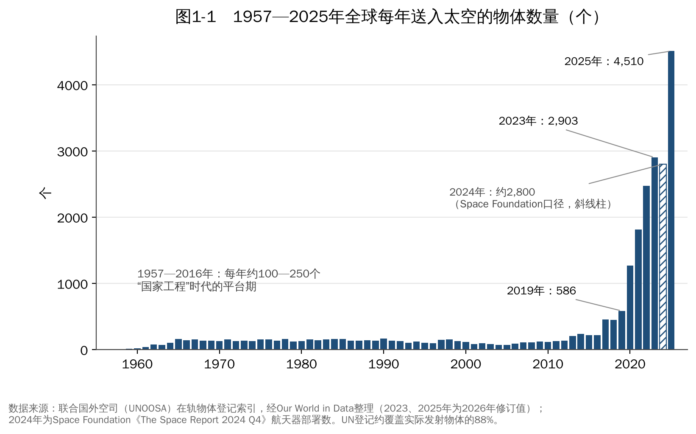
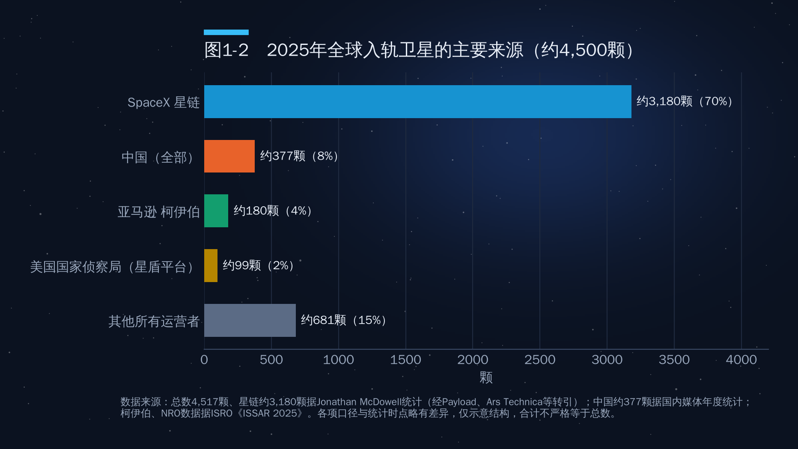
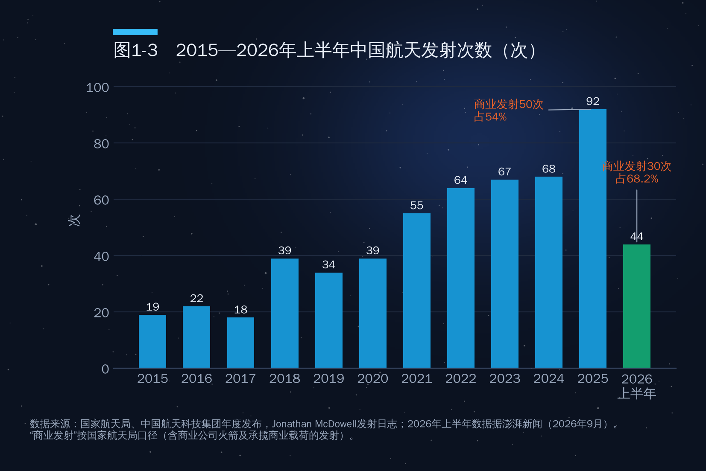
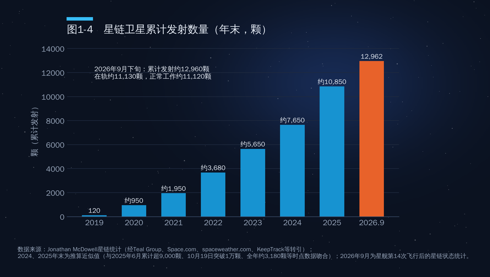

## 第1章　卫星发射数量：非线性增长

2025年，人类平均每天往太空送去12个以上的物体。这个数字在1990年代是平均每两三天一个。更值得注意的是，其中约七成来自同一家公司、同一个星座。理解今天的太空经济，第一步就是看懂这条曲线：它不是匀速爬坡，而是在2019年之后突然"起飞"。

### 1.1　从每年一百个到每年四千五百个

#### 六十年的平台期与五年的爆发

联合国外层空间事务办公室（UNOOSA）维护着全球最权威的"在轨物体登记索引"，各国按《登记公约》向其报送发射的卫星、探测器、载人飞船和空间站舱段。如图1-1所示，从1957年到2016年的整整六十年里，全球每年送入太空的物体基本稳定在100—250个之间。冷战高峰的1960—1980年代与"后冷战低谷"的2000年代相差并不大：发射是政府行为，数量取决于国家预算，而国家预算不会指数增长。

转折发生在2017年前后。2017年数量首次突破400个，2019年达到586个；2020年星链开始批量组网，一跃到1274个；2022年约2478个；2023年约2903个（2026年修订值）；2025年达到4510个，创历史纪录（来源：UNOOSA，经Our World in Data整理）。换言之，2025年一年送入太空的物体，相当于1957—1990年代中期近40年的总和。

#### 2024年其实是"持平略降"，不是"增长"

作者提纲中写道"从2023年约2900颗增长到2024年约2800颗"。这句话的数字本身大体不错，错在"增长"二字。按美国太空基金会（Space Foundation）的统计，2024年全球航天器部署数量为2802个，比2023年**下降约3%**；但同年入轨总质量却增长了约40%，达到约1900吨。原因是星链从约300公斤级的V1.5卫星全面换代为约800公斤级的V2 Mini卫星——卫星变少了，但每颗更大、更强。这是一个很有意思的信号：衡量太空活动，"颗数"并不总是最好的尺度，"质量"和"容量"同样重要。

2025年则是真正的跳跃：各机构统计的全年入轨卫星数在4200—4650之间，比2024年增长约50%—60%。之所以口径差异这么大，是因为有的统计"送入太空的物体"（含探测器、舱段），有的只算"卫星"，有的只算"可工作的卫星"（表1-1）。

**表1-1　2025年全球入轨航天器数量：不同口径对照**

| 统计来源 | 口径 | 2025年数值 | 对比 |
|---|---|---|---|
| UNOOSA登记（Our World in Data） | 送入太空的物体 | 4510个 | 2023年2903个（此前峰值） |
| Jonathan McDowell（经Payload转引） | 入轨卫星 | 4517颗 | 比2024年增长约58% |
| ISRO《印度空间态势感知报告2025》 | 已知可工作卫星 / 新增在轨物体 | 4198颗 / 4651个 | 2024年新增在轨物体2963个 |
| ESA《2026年空间环境报告》 | 新入轨有效载荷 | 4000余个 | 全年发射300余次 |

本书统一采用"2025年全球入轨卫星约4500颗"的表述。作者提纲中"2025年4526颗，比2024年增长约58%"与此基本一致；而"入轨航天器约4026颗、其中商业卫星4434颗"属于不同口径混用（商业卫星数不可能大于总数），应予删除。

### 1.2　谁在发射：一家公司占七成

如图1-2所示，2025年全球入轨的约4500颗卫星中，SpaceX的星链卫星约3180颗，约占70%。再加上亚马逊柯伊伯（Kuiper）约180颗、美国国家侦察局基于星盾平台的侦察卫星约99颗，以及行星实验室（Planet）等美国商业公司的卫星，美国运营者合计约占全球的八成。作者提纲中"美国2025年发射约3720颗、占82%"与此量级相符。中国全年入轨航天器约377颗（国内媒体统计；官方表述为"超过300颗"），约占8%，位居第二。

这张图揭示了当前太空格局最突出的特征：**高度集中**。在航天史上，从没有一家企业能占据全球七成的年度新增卫星。这种集中度既是SpaceX成本优势的结果，也是后来者焦虑的根源——第二部分将讨论，轨道和频谱资源"先到先得"，规模领先会转化为长期的资源占位。

### 1.3　中国速度

中国是全球第二大航天发射国，增长速度也在加快。如图1-3所示，中国年发射次数从2015年的19次增长到2024年的68次，2025年跃升至92次，比2024年增长约35%，创历史新高（来源：国家航天局）。

结构变化比总量变化更值得关注：

- **商业力量过半**。2025年中国商业发射50次，占全国发射总数的54%，首次超过一半；全年商业卫星入轨约311颗，占全年入轨卫星的八成以上。海南商业航天发射场2024年底投入使用，2025年即执行9次发射。
- **2026年继续提速**。2026年上半年全球共完成153次轨道发射（2025年同期145次）；中国完成44次，同比增长25.7%，其中商业发射30次，占68.2%；同期入轨商业卫星206颗，约占全部入轨卫星的92.4%（来源：澎湃新闻，2026年9月）。据"你好太空"统计，上半年中国共将223颗卫星送入预定轨道，较2025年同期的153颗增长约46%。前三季度中国共实施发射70次，比2025年同期多11次，创历史同期新高（来源：新浪新闻等，2026年10月）。
- **业界预期更高**。中科宇航董事长杨一强等业内人士预计，2026年中国全年发射次数有望突破100次，乐观估计达到140次左右——这属于业内预测，最终以官方年度统计为准。

作者提纲中"上半年入轨卫星218颗、同比增长43.4%"与上述数字相近，差异应源于统计时点或口径。

### 1.4　为什么会这么快：五个驱动力

卫星数量的非线性增长，是五个因素叠加的结果。

**第一，低轨巨型星座组网。**这是最主要的驱动力。卫星互联网要实现全球无缝覆盖，需要成千上万颗低轨卫星：SpaceX星链的申请总规模约4.2万颗（美国联邦通信委员会已分阶段批准其中一部分）；中国星网（GW）星座向国际电信联盟申报约1.3万颗，上海垣信的千帆星座规划约1.4万颗，两者合计超过2.5万颗；亚马逊柯伊伯计划3236颗。单是这几个星座的规划总量，就是人类1957—2019年发射卫星总数的四倍以上。

**第二，一箭多星与拼车发射。**卫星小型化之后，一枚火箭可以同时发射几十颗卫星。猎鹰9号每次可携带20多颗星链V2 Mini卫星；SpaceX的"Transporter"拼车任务2021年1月一次发射143颗卫星，创下当时世界纪录。中国在这方面同样进步很快：2023年6月，长征二号丁一次发射41颗卫星，刷新中国一箭多星纪录。作者提纲说"中国已实现一箭20星甚至更多"，表述偏保守，应更新为"一箭41星"。一箭多星使卫星数量增速远远快于发射次数增速：2015—2025年，全球发射次数增长不到4倍，而入轨卫星数增长了约20倍。

**第三，商业航天的爆发。**过去卫星由政府订购、按"一星一议"的方式研制，周期长达五到八年；今天的星座运营商像造汽车一样批量造卫星。SpaceX在华盛顿州的工厂据报道每天可下线多颗星链卫星；中国的千帆、星网也在建设卫星"脉动式"生产线。

**第四，卫星制造成本下降。**传统地球静止轨道通信卫星单颗造价通常在1亿—4亿美元；而低轨星座卫星采用商用级元器件、标准化平台和流水线生产，单颗成本已降到数十万至数百万美元量级（业界估算，SpaceX未公布星链卫星单价）。立方星（CubeSat）更是把一颗科研卫星的门槛降到几十万美元，使大学、初创企业和发展中国家都能拥有自己的卫星。

**第五，发射成本下降。**这是一切的前提，也是第2章的主题：可重复使用火箭把进入近地轨道的单位成本从航天飞机时代的每公斤约5万美元压到了今天的每公斤约2000美元，而星舰的目标是再降一个数量级。

### 1.5　在轨卫星有多少

截至2026年中，全球在轨工作卫星约1.4万—1.6万颗，不同统计机构因口径与时点不同而有差异（Jonathan McDowell统计2025年约1.4万颗；ESA基于MASTER模型的估计略低）。其中星链约占三分之二。

如图1-4所示，星链卫星累计发射量从2019年的120颗增长到2025年底的约1.08万颗；2026年9月下旬星舰第14次飞行之后，累计发射约1.296万颗，在轨约1.113万颗，正常工作约1.112万颗。2026年上半年，SpaceX发射了1589颗星链卫星，高于2025年同期的1489颗。

与之形成对照的是，联合国登记数据显示，人类自1957年以来累计送入太空的物体约2.5万个，其中六成以上是2020年之后发射的。太空的"人口结构"已经被彻底改写：今天在轨的卫星，大多数年龄不到五岁。

### 1.6　卫星的类型与功能

#### 按功能分类

卫星按用途通常分为五大类（表1-2）。按在轨数量计，通信卫星已经占到在轨工作卫星的七成左右，这主要是星链等互联网星座造成的；在星座兴起之前（2015年前后），通信、对地观测、导航、科学和军事卫星的结构要均衡得多。

**表1-2　卫星的主要功能类型**

| 类型 | 主要用途 | 典型轨道 | 代表系统 |
|---|---|---|---|
| 通信卫星 | 宽带互联网、电视广播、移动通信、直连手机 | 低轨（星座）、地球静止轨道 | 星链、千帆、星网、OneWeb；卡塔尔Es'hailSat、阿联酋Yahsat |
| 导航卫星 | 定位、导航、授时 | 中地球轨道、倾斜地球同步轨道 | GPS、北斗、伽利略、格洛纳斯 |
| 对地观测（遥感）卫星 | 气象、资源、测绘、农业、灾害、城市管理 | 太阳同步轨道 | 风云、高分、吉林一号、Planet、哨兵系列 |
| 科学与技术试验卫星 | 天文、空间物理、基础科学、新技术验证 | 各类轨道 | 悟空号、墨子号、哈勃 |
| 军事卫星 | 侦察、预警、军用通信、电子侦察 | 各类轨道 | 美国国家侦察局星座、天基红外系统 |

海湾国家正是从通信卫星起步进入太空产业的。卡塔尔的Es'hailSat公司于2013年和2018年先后发射Es'hail-1和Es'hail-2两颗地球静止轨道通信卫星，后者搭载了世界首个地球静止轨道业余无线电转发器；阿联酋的Yahsat与Thuraya是区域性卫星通信运营商。这说明一个规律：对于后发国家，**通信卫星是最先形成商业闭环的太空资产**。

#### 按质量分类

卫星按质量通常分为以下几级（表1-3）。小卫星的兴起是近十年最重要的技术趋势之一：在轨卫星的平均质量下降，单位质量的功能密度上升。

**表1-3　卫星按质量分级（国际通行划分，不同机构界限略有差异）**

| 级别 | 质量范围 | 典型例子 |
|---|---|---|
| 大型卫星 | 1000公斤以上 | 地球静止轨道通信卫星（3—7吨）、星链V3（约2吨） |
| 中型卫星 | 500—1000公斤 | 星链V2 Mini（约800公斤） |
| 小卫星 | 100—500公斤 | 早期星链V1.0（约260公斤）、多数遥感小卫星 |
| 微卫星 | 10—100公斤 | 多数科研、技术试验卫星 |
| 纳卫星 | 1—10公斤 | 立方星（1U约1.3公斤） |
| 皮卫星、飞卫星 | 1公斤以下 | 教学与试验载荷 |

有意思的是，星链本身的演进方向是"由小变大"：V1.0约260公斤，V2 Mini约800公斤，V3约2吨。原因在于，当发射成本足够低时，更大的卫星（更大的天线、更多的太阳能电池、更强的激光链路）带来的容量增长，会超过它多消耗的发射成本。这正是星舰与V3卫星"捆绑设计"的逻辑。

### 1.7　星链V3：一次代际跃迁

星链V3是SpaceX为星舰量身设计的新一代卫星。按SpaceX公开的参数，每颗V3卫星下行容量可达1Tbps、上行160Gbps，下行容量约为V2 Mini的10倍，上行提升20余倍。V3卫星质量约2吨，只能由星舰发射。

2026年的两次星舰飞行是V3部署的起点：

- **第13次飞行（2026年7月24日，亚轨道）**：星舰首次携带真正可工作的星链V3卫星，在约190公里高度释放了20颗，SpaceX随后通过现有星链网络与其建立联系；这些卫星按计划在释放后约20分钟再入大气层烧毁。这是星舰前12次飞行（只携带质量模拟器）之后第一次部署功能性载荷，其中2颗卫星加装了相机，用于拍摄星舰隔热瓦状态。
- **第14次飞行（2026年9月28日）**：星舰首次进入地球轨道，约在起飞后35分钟开始释放卫星，26颗星链V3卫星全部入轨，星链随后与全部26颗卫星建立了联系；其中3颗加装了相机，用于在轨拍摄星舰上面级的热防护系统，为星舰完全重复使用积累数据。上升段6台发动机中有1台失效，SpaceX在约22分钟时评估后决定继续入轨；原计划约10小时、6圈的飞行被缩短，飞船在起飞约3小时后溅落于北太平洋（来源：Space.com、Interesting Engineering等报道）。

按SpaceX的口径，星舰满载一次可发射约60颗V3卫星，为星座新增约60Tbps容量，约为猎鹰9号一次发射V2 Mini所增容量的20倍。据此推算，第14次飞行的26颗V3约新增26Tbps，大致相当于猎鹰9号发射V2 Mini八到十次的总和，作者提纲中"相当于10次"的说法在量级上成立。提纲中"总带宽达到当前星座的100倍"出自马斯克在2026年8月SpaceX首次财报电话会上的预测（V3单星能力约为V2的10倍，数量也将多10倍以上），属公司愿景；管理层也承认约需1000颗V3在轨，用户才会明显感到改善。而"运力约为猎鹰9号的40倍"与官方"20倍"不符，"2029年前完成12000颗V3部署"未见官方出处，不宜引用。

V3的经济意义在于：**卫星互联网的单位带宽成本将再下一个台阶**。如果星舰实现高频次复用，每Gbps在轨容量的成本可能下降一个数量级，这将使卫星宽带从"偏远地区的补充"变成可以与地面光纤和5G正面竞争的基础设施，同时为"直连手机"、机载与海事宽带以及未来的在轨数据中心打开空间。

### 1.8　卫星能活多久

#### 三种"寿命"

讨论卫星寿命时，需要区分三个概念：

- **设计寿命**：任务书规定的正常工作年限。地球静止轨道通信卫星通常按15年左右设计，低轨星座卫星通常为5年左右（星链约5年）。
- **工作寿命**：实际在轨工作的时间，常常超过设计寿命。例如中国的暗物质粒子探测卫星"悟空"号2015年12月发射，设计寿命3年，至今已在轨工作近11年；哈勃望远镜设计寿命15年，已工作超过36年。
- **轨道寿命**：从入轨到再入大气层陨落的时间，即卫星"在天上能待多久"，与卫星是否还在工作无关。

#### 决定寿命的四个因素

**轨道高度是决定轨道寿命的首要因素。**低轨卫星受稀薄大气的阻力持续减速。大致而言，在400公里左右，无动力的卫星一般数月到数年内就会再入；550公里约5年；800公里左右可达数十年；1000公里以上则可停留数百年甚至更久。这正是星链选择550公里以下轨道、并在2026年将部分卫星降至约480公里的原因之一：失效卫星能在较短时间内自然坠毁，不会长期成为太空垃圾（详见第7章）。

**燃料（推进剂）决定了多数卫星的工作寿命上限。**卫星需要定期点火维持轨道和姿态，推进剂耗尽往往就意味着退役，地球静止轨道卫星尤其如此。这也催生了"在轨加注"和"延寿服务"的新产业：美国诺斯罗普·格鲁曼公司的任务延寿飞行器（MEV）自2020年起已为在轨通信卫星成功对接延寿。

**太阳活动会显著缩短低轨卫星寿命。**太阳活动剧烈时，高层大气受热膨胀、密度上升，卫星阻力陡增。2022年2月，SpaceX刚发射的49颗星链卫星遭遇地磁暴，其中约38颗因阻力骤增未能升轨而再入烧毁，这是太阳活动影响卫星的经典案例。2024—2025年正处于第25太阳活动周的高峰期，低轨卫星的轨道衰减明显加快。中国科学院国家空间科学中心等单位对澳大利亚Binar立方星的研究给出了量化案例：Binar-2/3/4恰逢太阳活动高年，实际在轨仅约68天，而按低活动期参数估算应约7个月，寿命缩短约七成。作者提纲"寿命缩短70%"可以此为据，但应表述为个案而非普遍规律。

**元器件老化。**空间辐射导致电子器件的累积损伤和单粒子翻转，极端温差（向阳面与背阳面可相差200摄氏度以上）造成材料疲劳，太阳能电池效率逐年衰减。有时推进剂尚有余量，电子系统已经难以为继，卫星也只能提前退役。

低轨星座的"短寿命"其实是一种经济选择：与其造一颗昂贵的、能用15年的卫星，不如造便宜的、用5年就换代的卫星——技术迭代越快，这种策略越划算。代价是，星座需要持续补网发射，形成一个"发射—服役—再入—再发射"的工业循环。这也是为什么发射需求在可见的未来不会下降。

### 本章要点

1. 全球每年送入太空的物体，从1957—2016年的每年100—250个，跃升到2025年的约4500个；增长集中发生在2019年之后，是典型的非线性增长。
2. 2024年入轨卫星数量实际比2023年略降约3%，但入轨质量增长约40%；2025年再增长约55%。"颗数""质量""容量"三个尺度需要同时看。
3. 格局高度集中：星链约占2025年全球新增卫星的70%，约占在轨工作卫星的三分之二；中国以年发射92次、商业发射过半位居第二，2026年前三季度发射70次、同比增长约19%，上半年商业发射占比升至68%。
4. 驱动力是"五力叠加"：巨型星座、一箭多星与拼车、商业化批量制造、卫星成本下降、可复用火箭带来的发射成本下降。
5. 低轨卫星"短寿命、快迭代"是经济选择，意味着持续的补网发射需求，也意味着轨道碎片治理的长期压力。
