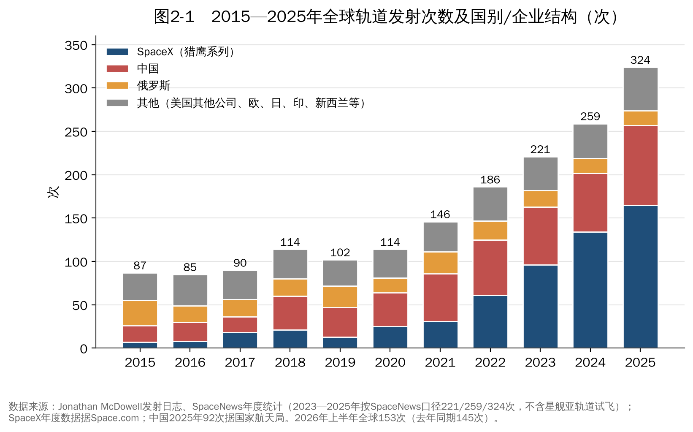
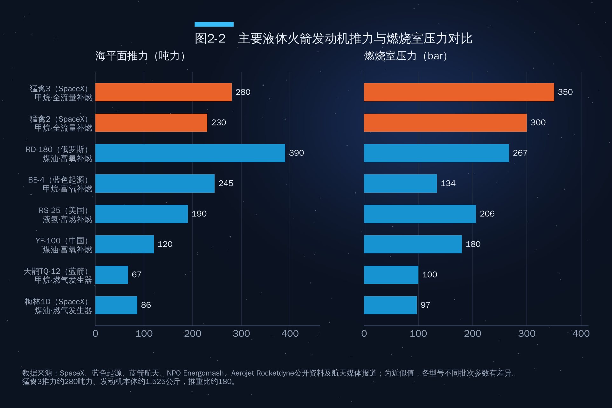
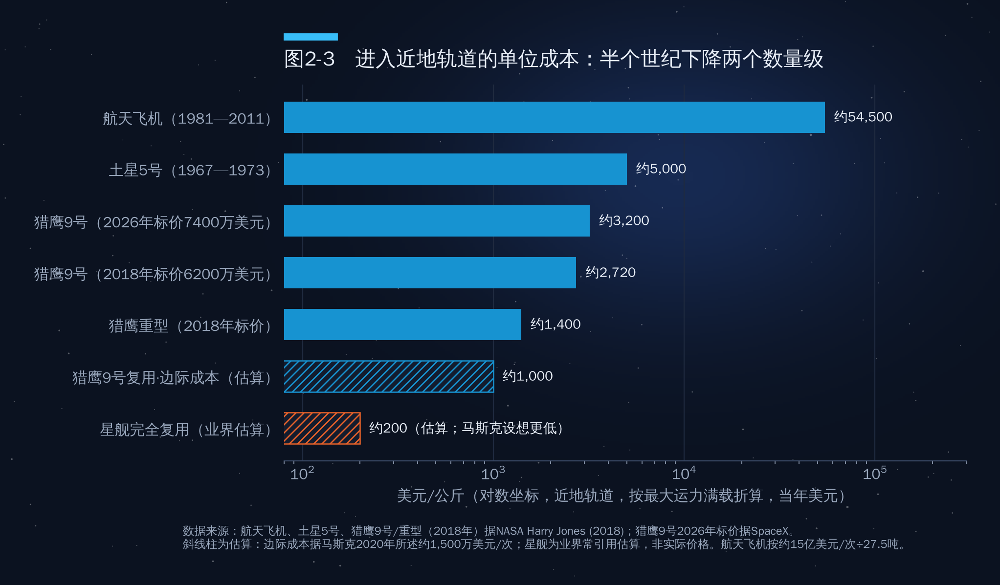

## 第2章　火箭技术：成本曲线的主宰者

如果只能用一个变量解释过去十年太空经济的变化，那就是"每公斤送入轨道的成本"。航天飞机时代，把1公斤物体送入近地轨道大约要花5万美元；今天搭乘猎鹰9号，标价约为每公斤2600美元；SpaceX的目标是用星舰再降一个数量级。火箭是太空经济的"运费"，运费决定了什么样的生意可以成立。

### 2.1　发射次数：年均增长两成，美国一家独大

如图2-1所示，2015—2020年全球轨道发射次数在每年85—115次之间徘徊，此后逐年创新高：2021年146次，2022年186次，2023年221次，2024年259次，2025年324次（SpaceNews口径，不含星舰亚轨道试飞；Jonathan McDowell口径为329次，其中321次入轨或接近入轨）。也就是说，十年间增至约3.7倍，年均增长约14%，最近三年年均增长约20%。

**2024年**：全球259次发射，平均每34小时一次。SpaceX猎鹰系列发射134次，加上4次星舰试飞共138次。

**2025年**：全球324次发射。SpaceX猎鹰9号165次（另有星舰飞行5次），一家公司占全球发射次数的一半以上；中国92次；俄罗斯17次；欧洲8次；印度5次；日本4次；火箭实验室从新西兰发射17次。按发射场所在国统计，美国约194次；按McDowell按火箭国籍的统计约181次；作者提纲中的"美国193次"属于按企业国籍的口径（把火箭实验室在新西兰的发射也计入美国），均可成立，但引用时应注明口径。作者提纲中"俄罗斯15次"与主流统计（17次）不符，建议更正。

**2026年至今**：上半年全球完成153次轨道发射（2025年同期145次），其中5次失败；第二季度全球81次发射中美国企业占47次，约58%（来源：BryceTech）。截至9月14日全年已达约212次，到9月下旬约230次（不同统计源差异在10次以内），其中中国前三季度70次。作者提纲"截至9月28日已超170次"明显偏保守。

两个结构性事实值得强调。其一，**SpaceX的发射次数超过了世界其他所有发射者之和**——这在航天史上前所未有。其二，中国的发射次数虽然远少于SpaceX，但发射主体最为多元：国家队（航天科技集团、航天科工集团）与十余家民营火箭公司同时活跃，是全球唯一与美国形成"体系对体系"竞争的国家。

### 2.2　火箭的分类

#### 按推进原理：化学、核与电

- **化学火箭**：依靠燃料与氧化剂燃烧产生高温燃气、从喷管高速喷出获得推力，是目前唯一能把载荷从地面送入轨道的成熟方式。
- **核火箭**：用核反应堆加热工质（通常是液氢）产生推力，比冲约为最好化学火箭的两倍。美国在1960年代的NERVA计划中进行过大量地面试车，但至今没有一台核热火箭在太空飞行过。它的潜在用途是地月空间和载人火星的轨道转移，而非从地面发射。
- **电推进（电火箭）**：用电能加速带电粒子（离子推力器、霍尔推力器），比冲极高、推力极小（通常以毫牛计）。它无法用于发射，却是卫星的主力"在轨发动机"：星链卫星全部采用氪或氩工质的霍尔推力器；全电推通信卫星可以节省数吨推进剂。

需要澄清的是，严格意义上的"运载火箭"目前全部是化学火箭；核推进与电推进属于"空间推进"范畴。

#### 按推进剂形态：液体、固体、固液混合

- **液体火箭**：推进剂分别储存，可调节推力、可多次点火、比冲较高，是大型运载火箭和可回收火箭的主流，如猎鹰9号、长征五号、星舰。
- **固体火箭**：推进剂预先浇注在壳体内，结构简单、可长期储存、准备时间短，但比冲较低、点火后难以关机，适合快速响应发射和助推器，如中国的快舟、谷神星一号、力箭一号、引力一号，以及航天飞机的固体助推器。
- **固液混合火箭**：通常采用固体燃料加液体（或气体）氧化剂，兼具一定的安全性和可控性，代表是维珍银河"太空船二号"的发动机，以及澳大利亚吉尔摩航天公司（Gilmour Space）的Eris火箭。

作者提纲把"长征一号第三级"作为固液混合火箭的例子，这是错误的。长征一号是中国第一型运载火箭（1970年发射东方红一号），前两级为液体，第三级为**固体**发动机；它是"液固组合的多级火箭"，而不是"固液混合发动机"。两个概念需要区分：前者指不同级使用不同类型的发动机，后者指同一台发动机内同时使用固、液两种推进剂。

#### 按级数与用途

- **单级入轨**：工程上极难实现，因为现有推进剂的能量密度不足以在一级内达到约7.8公里/秒的轨道速度并保留有效载荷，至今没有实用的单级入轨火箭。
- **多级火箭**：逐级抛掉空壳以减轻质量，是现实中唯一可行的方案。主流为两级或三级，加上捆绑助推器。
- **按用途**：运载火箭（把载荷送入轨道或更远）、探空火箭（亚轨道飞行，用于高层大气和微重力实验）、军用火箭与导弹。
- **按运力**：通常把近地轨道运力2吨以下称为小型，2—20吨为中型，20—50吨为重型，50吨以上为超重型。

### 2.3　发动机：猛禽为什么强

火箭的性能主要由发动机决定。图2-2比较了几型代表性液体火箭发动机的海平面推力和燃烧室压力。

SpaceX的猛禽（Raptor）发动机有四个突出特点。

**第一，全流量分级燃烧循环。**液体火箭发动机需要用涡轮泵把推进剂加压送入燃烧室，驱动涡轮的燃气从哪里来，决定了发动机的"循环方式"。最简单的"燃气发生器循环"（如梅林、天鹊TQ-12）把一小部分推进剂单独燃烧来驱动涡轮，然后直接排掉，造成浪费；"分级燃烧（补燃）循环"（如RD-180、YF-100、BE-4）把驱动涡轮后的燃气再送入主燃烧室燃烧，效率更高；猛禽采用的"全流量分级燃烧"更进一步，把全部燃料和全部氧化剂分别通过富燃和富氧两路预燃室，驱动两套涡轮后全部进入主燃烧室。好处是没有推进剂浪费，而且两台涡轮都工作在较低温度，有利于提升寿命与可复用性。苏联的RD-270和美国的集成动力演示器曾做过地面试验，猛禽是第一台实现飞行的全流量分级燃烧发动机。

**第二，极高的燃烧室压力。**燃烧室压力越高，同样尺寸的发动机推力越大、效率越高。猛禽2的燃烧室压力约300巴，猛禽3约350巴，超过了此前保持纪录的俄罗斯RD-180（约267巴）。为承受富氧高温燃气的侵蚀，SpaceX自研了专用高温合金。

**第三，以甲烷为燃料。**与煤油相比，液态甲烷燃烧后几乎不积碳，便于发动机重复使用；比冲高于煤油；储存温度与液氧接近，简化了贮箱设计。更具战略意义的是，甲烷可以在火星上用大气中的二氧化碳和地下水冰通过萨巴蒂尔反应制取——这为"在火星加注、返回地球"提供了可能。全球新一代主力发动机正在集体转向甲烷：蓝色起源BE-4、蓝箭航天天鹊系列、欧洲普罗米修斯发动机都是如此。

**第四，快速迭代。**猛禽从第一代到第三代，推力从约185吨力提升到约280吨力，而发动机本体质量从约2吨降到约1525公斤，推重比约180，在液体火箭发动机中名列前茅。猛禽3还大幅减少外部管路和传感器，把它们集成进发动机结构，以减少故障点、省去防护罩。作者提纲中"推力280吨、重量约1525公斤、推重比180多倍"的说法与SpaceX 2024年8月公布的海平面型参数一致（另计箭体侧附件约1720公斤）。

超重型助推器底部装有33台猛禽发动机。按猛禽2计算，起飞推力约7590吨力；第三代星舰（V3）换装猛禽3后，按33台×约280吨力估算，起飞推力超过9000吨力，是土星5号（约3500吨力）的两倍多。提纲中"超过8000吨"的表述成立。

### 2.4　材料：为什么星舰用不锈钢

2019年初，SpaceX宣布星舰放弃此前研发的碳纤维复合材料方案，改用不锈钢。这个反直觉的选择后来被证明是星舰快速迭代的关键之一。

**成本。**马斯克2019年在接受采访时给出过一组对比：航天级碳纤维预浸料约每公斤135美元（且加工废品率高），而所用的不锈钢约每公斤3美元，相差约45倍。作者提纲"约20元/公斤"与"每公斤约3美元"大致相当。但需要说明，SpaceX此后改用的"30X"是自研的专有合金，其实际价格并未公开，"比家用锅具的316不锈钢还便宜"一说无法核实，演讲中不宜作为确定事实使用。

**性能。**奥氏体不锈钢在液氧（约-183摄氏度）、液态甲烷（约-162摄氏度）的低温下强度反而上升、韧性良好；在高温下，不锈钢的熔点约1400—1500摄氏度，能在七八百摄氏度时仍保持相当强度，而铝合金和碳纤维树脂基体在两三百摄氏度就会失效。因此，不锈钢箭体对再入加热有更大的容错余量。但这并不意味着星舰可以"裸奔"再入：再入时迎风面温度可达1400摄氏度以上，星舰仍然需要覆盖数千块六边形陶瓷隔热瓦。提纲"在重返大气层时能承受上千度高温"的说法需要加上这个限定。

**可制造性。**不锈钢可以在露天环境下焊接，工厂不需要大型热压罐，失败了可以快速重造。星舰"造一个、试一个、炸一个、改一个"的研发方式，在碳纤维方案下几乎不可能负担。从经济学角度看，材料选择体现了一种新的工程哲学：**接受更重一点的结构，换取低得多的成本和快得多的迭代速度**。

### 2.5　可重复使用：把成本曲线压低两个数量级

#### 每公斤成本的历史

图2-3是理解全书主线的关键图。按美国战略与国际问题研究中心（CSIS）与NASA研究人员Harry Jones的整理（2021年美元，按最大近地轨道运力折算），航天飞机的单位成本约为每公斤5.45万美元，土星5号约5400美元；猎鹰9号约2600美元；猎鹰重型约1500美元。星舰如果实现完全快速复用，SpaceX的目标是降至每公斤200美元以下，马斯克还多次提出过更激进的远期目标。

需要注意三点。第一，上面是"标价"或"项目成本折算"，并不等于SpaceX的内部成本。猎鹰9号的公开标价2026年为7400万美元，但据Ars Technica估算，复用猎鹰9号的内部发射成本约1500万美元，用于发射自家星链卫星时，每公斤内部成本可能已接近或低于1000美元。第二，按"满载"折算的单价偏乐观，实际任务往往装不满。第三，星舰的数字仍是目标而非现实，取决于能否实现助推器和飞船的快速、完全复用。

#### 猎鹰9号做对了什么

猎鹰9号一级助推器约占整枚火箭成本的六到七成。SpaceX于2015年12月首次实现一级陆上回收，2017年3月首次复飞，此后复用成为常态：单枚助推器的复飞纪录已超过30次，绝大多数发射使用复用助推器，整流罩也实现了回收复用。复用之所以成立，靠的是三件事：高可靠的发动机（可多次点火、可深度节流）、精确的制导与着陆技术、以及足够高的发射频次——只有发射足够多，翻修成本和固定成本才能被摊薄。星链恰恰为猎鹰9号提供了稳定的"自有需求"，这是SpaceX模式最精妙之处：**火箭为星座降成本，星座为火箭提供订单**。

#### 星舰：完全复用的豪赌

星舰是两级完全可复用的超重型运载器，总高约120米以上（V3更高），设计近地轨道运力在完全复用状态下100吨以上。2024年10月起，超重型助推器已多次实现由发射塔"筷子"机械臂空中捕获；2026年9月第14次飞行首次入轨并部署26颗星链V3卫星。下一个里程碑是飞船本身的回收与复用，以及在轨推进剂加注——后者是NASA阿尔忒弥斯载人登月方案的前提（详见第三部分）。

### 2.6　新玩家：新格伦与中国民营火箭

#### 新格伦

蓝色起源的新格伦火箭直径7米，一级采用7台BE-4甲烷发动机，设计为一级可复用，近地轨道运力约45吨。2025年1月首飞即成功入轨（一级回收失败）；2025年11月第二次飞行将NASA的ESCAPADE火星探测器送上转移轨道，并首次在海上平台成功回收一级。作者提纲称新格伦"已进入常态化商业发射阶段"，这一表述偏乐观：截至本文写作时，新格伦的累计飞行次数仍是个位数，尚处于提升发射频率的早期阶段，演讲时建议改为"开始进入商业服务"。

#### 中国民营火箭

中国民营火箭企业2015年后陆续成立，目前已形成固体与液体两条路线、十余家活跃企业的格局（表2-1）。

**表2-1　中国主要民营（商业）运载火箭企业与代表型号（截至2026年中）**

| 企业 | 代表型号 | 技术路线 | 主要进展 |
|---|---|---|---|
| 蓝箭航天 | 朱雀二号、朱雀三号 | 液氧甲烷；朱雀三号为不锈钢箭体、一级可回收设计 | 朱雀二号2023年7月成为全球首枚入轨的液氧甲烷火箭；朱雀三号2025年12月首飞入轨，一级回收未成功；2026年8月19日遥二任务一子级在甘肃民勤软着陆，实现中国首次入轨级火箭一子级陆地回收 |
| 中科宇航 | 力箭一号、力箭二号 | 固体起步，转向液体中型 | 力箭一号多次一箭多星发射；力箭二号液体中型火箭推进首飞 |
| 东方空间 | 引力一号、引力二号 | 固体（海上发射）、液体可复用 | 引力一号2024年1月海上首飞成功，为当时全球最大的全固体运载火箭 |
| 天兵科技 | 天龙二号、天龙三号 | 液氧煤油；对标猎鹰9号的中型可复用火箭 | 天龙二号2023年4月首飞成功；天龙三号推进入轨首飞与复用验证 |
| 星河动力 | 谷神星一号、智神星一号 | 固体小型、液体可复用 | 谷神星一号累计发射次数居民营火箭前列，含海上发射 |
| 星际荣耀 | 双曲线一号、双曲线三号 | 固体、液氧甲烷可复用 | 2019年实现中国民营火箭首次入轨 |

此外，国家队也在全力推进可复用：航天科技集团的长征十二号甲于2025年12月首飞，同样尝试一级回收；长征十号系列正在为载人登月做准备。2025年底到2026年，"谁先实现中国首次入轨级火箭一级回收"成为中国商业航天最受关注的竞赛。从技术路线看，中国企业普遍跳过了"先做一次性、再改可复用"的阶段，直接按可复用设计新一代液体火箭，后发优势明显；但在发动机可靠性、复用翻修经验和发射频次上，与SpaceX仍有数年差距。

### 2.7　关于"2026年中国商业航天市场3.5万亿元"

作者提纲引用"2026年商业航天市场预计可达3.5万亿元"。经检索，这一类数字主要来自国内咨询机构和券商研报的预测，口径通常包括卫星制造、发射、地面设备、卫星运营与应用以及相关下游产业，统计边界很宽，并非政府统计。作为参照，美国太空基金会估算2024年**全球**太空经济总规模约6130亿美元（约合4.4万亿元人民币）。如果按国际通行口径，中国商业航天在2026年达到3.5万亿元，意味着其规模相当于全球太空经济的八成左右，这显然不合理。

因此，演讲中建议这样使用：要么明确注明"据某机构预测、含下游应用的广义口径"，要么改用国际可比的口径（如Space Foundation、Novaspace或OECD的数据），以免在国际听众面前引起质疑。太空产业规模的口径问题将在第14章详细讨论。

### 本章要点

1. 全球轨道发射次数从2015年的87次增长到2025年的324次；SpaceX一家的发射次数超过世界其他发射者之和，中国以92次居第二。
2. 化学火箭仍是进入太空的唯一实用手段；核推进与电推进属于空间推进。长征一号第三级是固体发动机，不是固液混合的例子。
3. 猛禽发动机代表了液体动力的前沿：全流量分级燃烧、约350巴燃烧室压力、甲烷燃料、推重比约180；全球新一代发动机集体转向甲烷。
4. 可重复使用把进入近地轨道的成本从航天飞机时代每公斤约5万美元降到猎鹰时代约2000美元，星舰的目标是再降一个数量级。成本下降是太空经济化的第一推动力。
5. 中国民营火箭已形成多路线追赶格局，可复用竞赛正在白热化；"3.5万亿元"等市场规模数字需注明口径。
