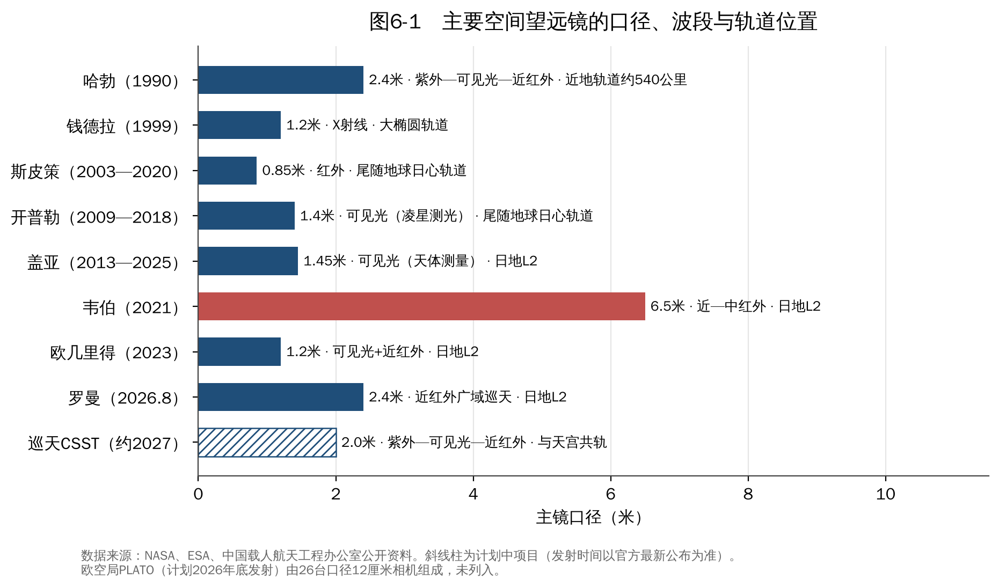

## 第6章　太空望远镜：把眼睛搬到大气层之外

太空经济不只是通信和发射的生意。太空望远镜代表着另一种回报：它不直接创造营收，却持续改写人类对宇宙的认识，并把成像、探测、精密制造等技术推向极限。

### 6.1　为什么望远镜要上天

地球大气对天文观测有三重限制：一是**吸收**，X射线、大部分紫外线和红外线被大气挡住，在地面根本看不到；二是**湍流**，大气抖动使星像模糊，限制了分辨率；三是**背景与时间**，天光、昼夜、天气和地球自身的红外辐射都会干扰观测。把望远镜放到太空，等于同时摘掉了"滤镜""毛玻璃"和"窗帘"。

当然，地面望远镜也在进步：自适应光学技术已能部分抵消大气湍流，口径39米的欧洲极大望远镜正在建设中。今天的格局是**分工互补**：可见光与近红外的超大口径观测越来越多在地面完成，而地面看不到的波段、需要极高稳定性的精密测量和大视场巡天，必须依靠太空。

### 6.2　三大旗舰：哈勃、韦伯、钱德拉

**哈勃空间望远镜**于1990年4月由航天飞机发现号送入约540公里的近地轨道，主镜口径2.4米，覆盖紫外、可见光和近红外波段。它刚上天时因主镜磨制误差导致成像模糊，1993年航天员在轨加装校正光学后才重获清晰视力。此后共五次维修升级，使它工作至今已超过36年。以哈勃数据发表的同行评议论文已超过2万篇（NASA口径），宇宙膨胀速率测量、暗能量的发现都离不开它。

**詹姆斯·韦伯空间望远镜**于2021年12月25日由阿丽亚娜5号发射，部署在距地球约150万公里的日地第二拉格朗日点（L2），主镜由18块六边形镜片拼成，口径6.5米，主攻近红外与中红外波段，能看到宇宙诞生后数亿年的早期星系，并分析系外行星大气成分。项目全寿命成本约100亿美元，是史上最昂贵的科学航天器之一。

**钱德拉X射线天文台**于1999年7月由航天飞机哥伦比亚号发射，运行在大椭圆轨道上，专攻X射线波段，观测黑洞、中子星、超新星遗迹和星系团中的高温气体。近年来它多次面临NASA预算削减的压力，是"科学设施能否持续获得资金"的一个缩影。

### 6.3　2026年的新面孔

**南希·格雷斯·罗曼空间望远镜**于2026年8月30日由猎鹰重型火箭从肯尼迪航天中心39A发射台发射，比计划提前约8个月，前往日地L2点（来源：NASA）。它的主镜口径与哈勃相同（2.4米），但广域相机视场约为哈勃红外相机的100倍、像素约3亿，巡天效率极高；它的科学目标包括研究暗能量与暗物质、用微引力透镜方法普查系外行星，并用日冕仪验证直接拍摄系外行星的技术。NASA预计2027年初发布首批图像，五年主任务期内将产生约2万TB数据。作者提纲关于罗曼的描述与官方信息一致。

**欧几里得望远镜**（欧空局，2023年7月发射）口径1.2米，在可见光和近红外波段绘制覆盖约三分之一天区的三维宇宙地图，研究暗物质与暗能量。提纲提到"2026年6月发布银河系中心迄今最大最详细的可见光图像"，本书未能核实，请作者确认。

**PLATO**（欧空局）由26台小口径相机组成，计划于2026年底由阿丽亚娜6号发射，将长期监测大量明亮恒星，寻找类太阳恒星宜居带中的类地行星。

**中国巡天空间望远镜（CSST）**口径2米，视场约为哈勃先进巡天相机的300多倍，将与天宫空间站共轨飞行，必要时可与空间站对接，接受航天员的维护和升级——这是它区别于其他空间望远镜的独特优势。作者提纲称"预计2026年末发射"，而近期公开信息多指向2027年前后，请作者以官方最新安排为准。

如图6-1所示，空间望远镜正在从"单一旗舰"走向"多台协同"：韦伯负责"看得深"，罗曼、欧几里得和巡天负责"看得广"，PLATO负责"盯得久"。

### 6.4　太空望远镜的经济学

太空望远镜是典型的"高固定成本、长回报周期、强外溢效应"的公共品。韦伯约100亿美元、罗曼约40亿美元（含运营的项目总成本），单看账面并不"划算"，但它的回报体现在三个层面：一是基础科学突破带来的长期知识存量；二是技术外溢——红外探测器、精密光学、低温制冷与波前传感技术后来进入医学成像、半导体检测和遥感领域；三是公众与人才效应，哈勃和韦伯的图像激励了几代青少年选择科学与工程。

成本下降的逻辑同样在改变天文学。罗曼直接使用了美国国家侦察局捐赠的2.4米主镜，大幅节省了研制费用；巡天望远镜借助空间站实现在轨维护；星舰如果投入使用，其9米级整流罩和百吨级运力将允许发射更大、更重而设计更简单的望远镜——"用便宜的质量换昂贵的轻量化"，这与星舰选择不锈钢的逻辑如出一辙。

### 本章要点

1. 大气的吸收、湍流和背景干扰决定了X射线、紫外、红外观测和高精度巡天必须上天；地面与太空望远镜是互补关系。
2. 哈勃（2.4米）、韦伯（6.5米）、钱德拉（X射线）构成过去三十年的旗舰体系；罗曼已于2026年8月30日发射，中国巡天望远镜将与天宫共轨并可在轨维护。
3. 太空望远镜是高投入、长周期、强外溢的公共品；发射成本下降正在改变望远镜的设计哲学。
