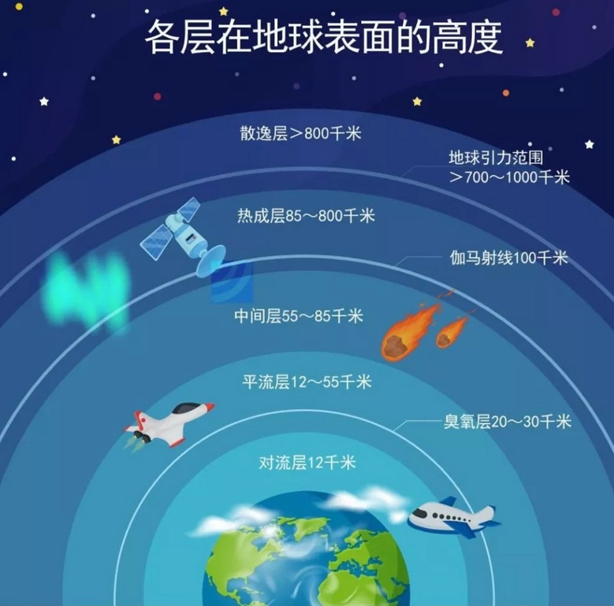
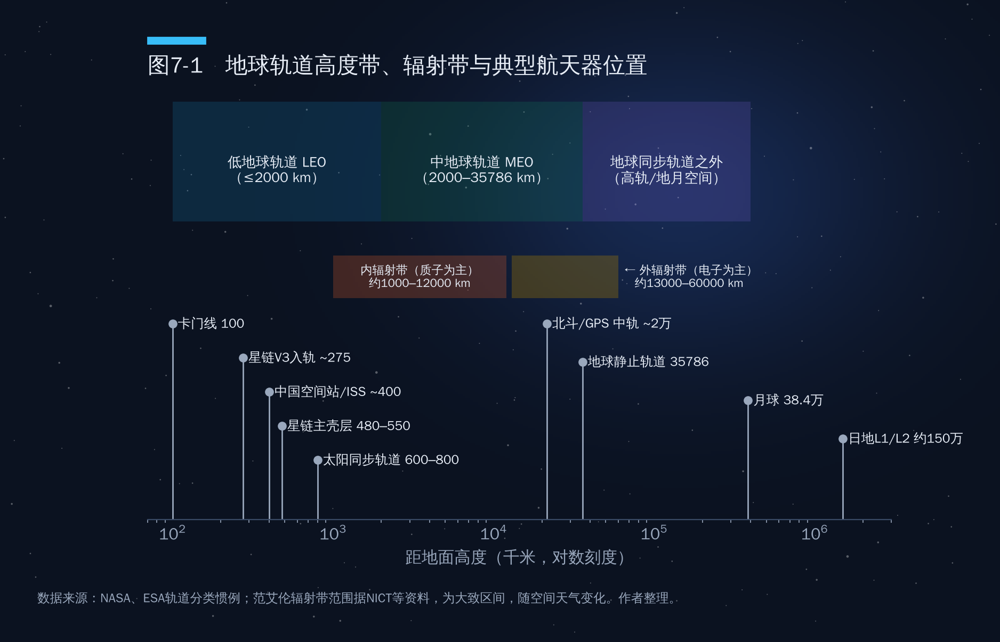
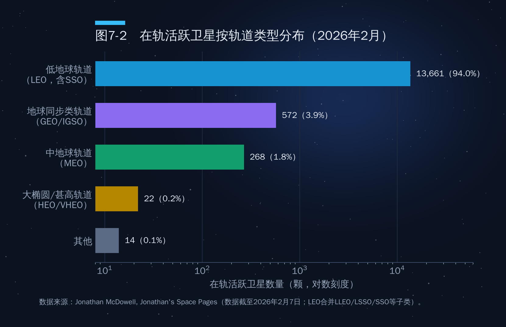
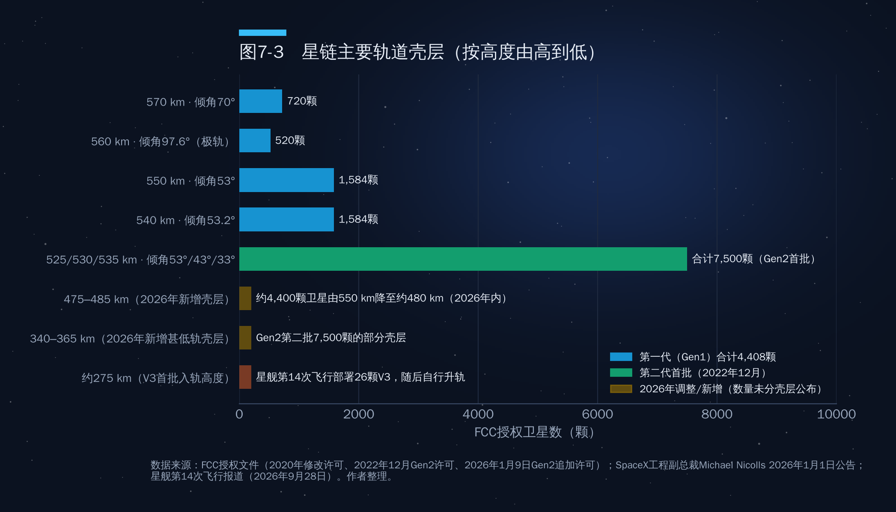
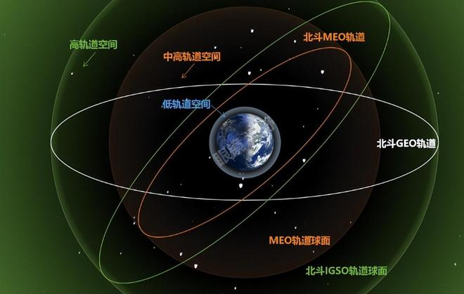
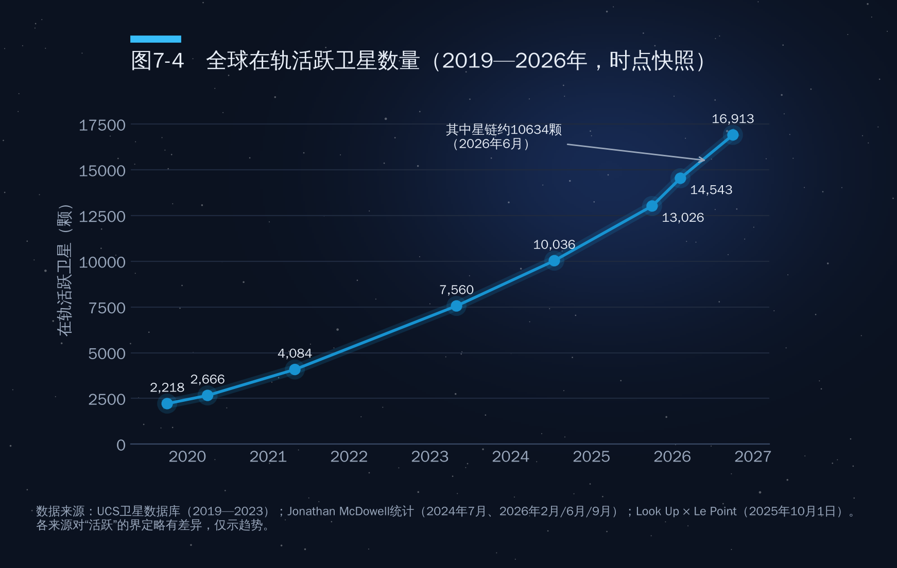
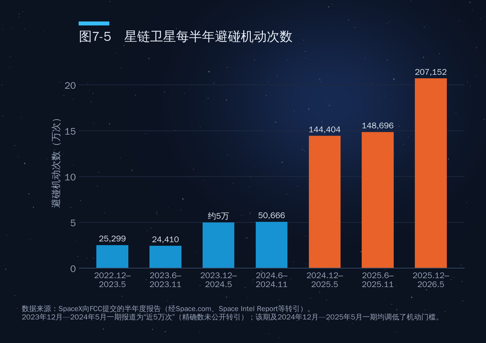

## 第7章　太空轨道

2026年1月1日，SpaceX负责星链工程的副总裁迈克尔·尼科尔斯在社交媒体上宣布：公司将在2026年内把运行在约550公里高度的约4400颗卫星，逐步降到约480公里。这几乎是当时星链在轨卫星的一半。理由并不是信号更好，而是"更安全"：太阳活动正走向低谷，高层大气变稀薄，550公里高度上一颗失控卫星可能要四年多才会坠落；降到480公里，自然衰减时间可缩短80%以上，而且500公里以下的碎片和其他星座也少得多。

一家公司要为上万颗卫星"搬家"，本身就说明了一件事：太空并不是无限的空旷。真正安全、好用、不互相干扰的位置是有限的，而且正在被迅速占据。

### 7.1　太空并非无限：为什么轨道"位置有限"

说轨道稀缺，不是说太空里"没有地方"，而是说**能满足特定用途、又能安全运行、还不和别人互相干扰的位置有限**。约束主要来自四个方面。

#### 物理条件决定了"可用高度带"

卫星的轨道由高度和速度唯一决定，不能像飞机那样随意悬停。高度太低，大气阻力会迅速把卫星拖下来：200公里以下的卫星往往只能存活几天到几周，300公里左右也只有数月；高度太高，通信时延和信号衰减随之增加，发射成本也更高。再加上范艾伦辐射带对电子器件的持续"轰击"（见7.6节），地球周围真正适合大规模部署的高度带只有几段：300—1200公里的低轨、约2万公里的导航中轨，以及35786公里的地球静止轨道。

#### 安全间隔要求每颗卫星占据"一片空间"

在低轨，卫星和碎片的相对速度可达每秒10公里以上，一颗1厘米的碎片就可能击穿卫星舱体。运营者必须在卫星周围保留足够的安全余量，并在预测到碰撞风险时进行机动规避。同一高度、同一倾角的卫星越多，交会次数越多，所需的规避机动也越多。卫星不是"点"，而是需要一片安全空间的"体"。

#### 频率干扰让"位置"和"频谱"捆绑在一起

卫星要为地面服务，必须用无线电发射信号。两颗使用相同频段的卫星如果在地面接收天线看来靠得太近，就会相互干扰。正因为如此，轨道位置从来不是孤立的资源，而是与频率绑定的"频轨资源"。国际电信联盟（ITU）分配的不是一块"空间"，而是"某一轨道位置上某一频段的使用权"。这一规则的具体内容将在第四部分第13章展开。

#### 需求集中在少数"黄金地段"

通信卫星偏爱地球静止轨道，遥感卫星偏爱太阳同步轨道，低轨宽带星座集中在500—600公里——这里时延低、阻力适中，失效卫星能在数年内自然再入，也因此成为低轨最拥挤的区域之一。需求集中，稀缺就产生了。

### 7.2　从大气层到外太空：大气分层与卡门线

讨论轨道之前，先要回答一个看似简单的问题：太空从哪里开始？

如作者原图（图7-A）所示，地球大气自下而上通常分为五层：对流层（地面至约8—18公里，赤道厚、两极薄，平均约12公里）、平流层（至约50—55公里，臭氧层位于其中的约20—30公里）、中间层（至约85公里，流星大多在这里燃尽）、热层（又称热成层，约85公里至500—1000公里，上界随太阳活动变化，常取约800公里）、散逸层（800公里以上，大气粒子逐渐逃逸到行星际空间）。各层边界随纬度和太阳活动变化，不同教材数字略有差异。

值得注意的是，约400公里的空间站和约480—550公里的星链卫星其实都在"热层"之内。这里的稀薄空气仍会对高速卫星产生阻力，所以低轨卫星必须定期点火"抬轨"。

关于太空的边界，最常用的是**卡门线**——海拔100公里，由国际航空联合会（FAI）用于纪录认定，但并非国际法规定的边界。美国空军、NASA等习惯以80公里（50英里）为界；麦克道尔2018年在《宇航学报》撰文论证，约80公里的中间层顶是更合理的物理边界。国际上至今没有具有法律效力的"太空边界"。（原图100公里处的"伽马射线"应为"卡门线"之误。）

### 7.3　轨道"地图"：六类轨道的定义、用途与经济价值

作者提纲中"高地球轨道为35786公里以上"的说法需要修正：35786公里是地球静止轨道（GEO）这一特定圆轨道的高度；航天界所说的HEO多指"大椭圆轨道"，近地点低、远地点高。表7-1对主要轨道类型做了对照。

**表7-1　主要轨道类型及其用途与经济特点**

| 轨道类型 | 高度/形状 | 周期 | 典型用途 | 代表系统 | 经济特点 |
|---|---|---|---|---|---|
| 低地球轨道（LEO） | 约160—2000公里，近圆 | 约90—127分钟 | 宽带互联网、遥感、载人航天、科学实验 | 星链、千帆、国网、中国空间站、国际空间站 | 单星成本低、时延低（20—50毫秒），但需成百上千颗组网；当前商业航天主战场 |
| 太阳同步轨道（SSO） | 约600—800公里，倾角约97°—98° | 约96—100分钟 | 对地观测、气象 | 高分系列、哨兵系列、Planet | 每天同一地方时过境，光照条件一致，遥感数据可比性强 |
| 中地球轨道（MEO） | 2000—35786公里，常见约2万公里 | 约2—24小时 | 卫星导航、中轨宽带 | 北斗、GPS、伽利略、格洛纳斯、O3b mPOWER | 二三十颗卫星即可覆盖全球，导航星座的"标准高度" |
| 地球静止轨道（GEO） | 赤道上空35786公里，圆轨道，倾角约0° | 约23小时56分（与地球自转同步） | 广播电视、通信、气象、导弹预警、数据中继 | 卫星电视、风云四号、Es'hail-2 | 相对地面静止，三颗即可覆盖除两极外的全球；轨位与频率高度稀缺 |
| 倾斜地球同步轨道（IGSO） | 约35786公里，倾角不为0 | 约23小时56分 | 区域导航增强 | 北斗IGSO、日本准天顶 | 星下点轨迹呈"8"字，适合服务中低纬度特定区域 |
| 大椭圆轨道（HEO） | 如近地点约500公里、远地点约4万公里，倾角63.4° | 约12小时（闪电轨道）或约24小时（冻土带轨道） | 高纬度通信、预警 | 俄罗斯闪电系列 | 在远地点附近停留时间长，弥补GEO对高纬度地区覆盖不足 |
| 拉格朗日点轨道 | 日地L1/L2约距地150万公里；地月L2在月球背面外侧约6万公里 | 绕平动点运行的晕轨道 | 太阳观测、深空望远镜、月背中继 | SOHO、阿迪蒂亚-L1、韦伯、欧几里得、鹊桥号 | 引力平衡、热环境稳定，是科学和深空基础设施的"港湾" |

图7-1把这些轨道放在一张对数刻度的"高度地图"上。

从经济价值看，各类轨道遵循不同的逻辑。

**低轨卖的是"规模"。**单颗卫星便宜，但要覆盖全球必须成千上万颗。它的竞争力来自发射成本和批量制造能力，这正是SpaceX的优势所在。低轨也是数量增长最快的区域。按麦克道尔统计，截至2026年2月7日，全球在轨活跃卫星约14540颗，其中约13661颗位于低轨，占94%（图7-2）。

**中轨卖的是"精度和韧性"。**导航星座只需二三十颗卫星，商业价值主要体现在下游的定位、授时服务上。

**静止轨道卖的是"位置"。**一个好的静止轨道位置可以让一颗卫星连续服务十几年，覆盖一个大洲。截至2026年2月，同步类轨道上的活跃卫星约572颗，数量不到低轨的5%，但单星价值高、寿命长，传统卫星通信产业的大部分收入仍来自这里。

**拉格朗日点卖的是"稀缺的科学视角"。**韦伯、欧几里得等望远镜选择日地L2点，中国鹊桥号2018年进入地月L2点附近为嫦娥四号提供月背中继。未来地月空间的平动点可能成为中继站、补给站的选址热点。

### 7.4　地球静止轨道：最稀缺的"黄金地段"

地球静止轨道是轨道稀缺性最典型的例子。它只有一条：赤道正上方35786公里、与地球自转同步的圆轨道。卫星在这里绕地球一圈恰好一个恒星日，从地面看就像"钉"在天上，地面天线不需要跟踪就能对准。

这条环形轨道能放多少颗卫星？常见说法"约1800个"需要说明口径。赤道一圈360°，若按0.2°的间隔划分，理论上是1800个"格子"；但实际运营中，为避免同频干扰，同一频段相邻卫星通常要相隔2°—3°，按2°计算只有约180个可用轨位，按3°只有约120个。现实中，同一经度位置可以通过不同频段、甚至"共位"技术安放多颗卫星，所以在轨卫星数（约570颗）多于单频段的轨位数。换言之，**几何上的格子不稀缺，"某一频段、某一服务区域上空"的轨位才稀缺**。

不同经度的价值也天差地别，人口稠密、经济发达地区上空的轨位最抢手。卡塔尔的Es'hailSat公司是一个例子：其Es'hail-2卫星于2018年11月由猎鹰9号发射，定点在东经25.5°附近，为中东和北非提供电视广播与通信服务，并搭载了全球首个静止轨道业余无线电转发器。对一个人口不多的国家来说，这意味着在区域媒体与通信格局中拥有一席之地。

静止轨道还有一个特殊问题：这里没有大气阻力，失效卫星永远不会自己掉下来。国际惯例要求卫星在寿命末期用最后的燃料抬升到静止轨道上方至少约300公里的"坟墓轨道"，为后来者腾出位置。这也使"燃料耗尽"成为静止轨道卫星退役的主要原因。

### 7.5　星链：低轨"圈地"的样本

如果说静止轨道是"老城区"，那么低轨就是正在高速开发的"新城区"，而星链是其中规模最大的开发商。截至2026年6月15日，按麦克道尔统计，活跃的星链卫星约10634颗，约占全球活跃卫星总数的三分之二。

#### 许可总量：42000颗是"申报"，不是"批准"

作者提纲写道"SpaceX拿到监管许可的星座总上限为42000颗"，这一表述需要修正。42000颗是SpaceX向监管机构和国际电信联盟提出的规划总量，而非已获得的许可。梳理美国联邦通信委员会（FCC）的审批历程：

- 2018年3月，FCC批准第一代星座约4400颗（后经2020年修改许可，确定为4408颗，分布在540—570公里的五个壳层）；
- 2018年11月，FCC批准在约340公里甚低轨部署7518颗V频段卫星（后改由第二代卫星搭载V频段载荷实施）；
- 2019年10月，经FCC向国际电信联盟提交合计30000颗卫星的申报，加上已获批的约12000颗，构成了"42000颗"这一数字；
- 2022年12月，FCC对SpaceX近30000颗第二代星座的申请只批准了7500颗，部署在525、530、535公里三个壳层，倾角分别为53°、43°和33°；
- 2026年1月9日，FCC再批准7500颗第二代卫星，使第二代获批总数达到15000颗，同时批准了340—365公里和475—485公里等新的低高度壳层，要求2028年12月前完成50%部署、2031年12月前全部完成；其余14988颗（主要是600公里以上的部分）继续暂缓审批。

因此，比较准确的说法是：截至2026年10月，星链获FCC批准的规模为第一代4408颗加第二代15000颗，约1.9万颗（V频段系统已搭载于第二代卫星，不另计，以免重复）；"42000颗"是其向国际电信联盟申报的远期规划上限。此后申报仍在加码（2025年12月约1.5万颗甚低轨、2026年7月约10万颗第三代），均未获批。

#### 轨道壳层：从550公里到"下沉"

星链的卫星分布在多个"壳层"上，每个壳层由高度、倾角和轨道面数确定。图7-3按高度由高到低列出了主要壳层。

几点值得注意。

第一，**倾角决定覆盖范围**。53°壳层覆盖全球绝大多数人口聚居区，是主力；43°和33°壳层把容量集中到中低纬度；70°和97.6°壳层负责高纬度和极地。星链倾角范围应为33°至约97.6°，而非提纲所写的43°至97°。

第二，**星链正在整体"下沉"**。约4400颗卫星降至约480公里，新批壳层集中在485公里以下、低至340公里。好处是时延更低、失效卫星坠落更快，代价是需要更多推进剂抵抗阻力。

第三，**V3卫星的"275公里"是入轨高度，不是工作高度**。2026年9月28日，星舰第14次飞行首次进入地球轨道，部署了首批26颗星链V3卫星。据飞行前公布的计划和发射后报道，星舰此次运行在约275公里的低轨，卫星释放后将依靠自身推进器升至工作轨道。SpaceX公布的V3单星下行容量约1Tbps，约为V2 Mini的10倍。

#### 中国星座：从"申报"到"部署"的追赶

中国的低轨宽带星座主要有两个：中国星网的"国网"星座，规划约1.3万颗（向国际电信联盟申报的两个子星座分别为6080颗和6912颗）；上海垣信的"千帆"星座，规划约1.4万至1.5万颗。部署进度上，截至2026年9月，国网在轨低轨卫星约200颗，千帆在轨约256颗。与星链上万颗的规模相比，差距仍以数量级计。

2025年12月底，中国有关机构向国际电信联盟提交了CTC-1、CTC-2两个星座各96714颗、合计约19.3万颗卫星的申报，连同其他运营商的申报，总数约20万颗。这些申报尚处初步阶段，不等于建设计划，且须在规定期限内部署，否则权利失效；其意义在于锁定"先到先得"规则下的优先顺序。

### 7.6　范艾伦辐射带：看不见的"雷区"

作者提纲中关于范艾伦辐射带的一条没有写完，这里补全。

1958年，美国第一颗卫星"探险者1号"上的盖革计数器发现，在某些高度上读数异常饱和。物理学家詹姆斯·范艾伦据此确认：地球磁场像一个"磁瓶"，俘获了大量来自太阳风和宇宙射线的高能带电粒子，在地球周围形成两个甜甜圈状的辐射带。

**内辐射带**大致位于距地面约1000公里至12000公里（不同资料给出的下界在700—1000公里之间），以能量超过1亿电子伏的高能质子为主，相对稳定。**外辐射带**大致位于13000公里至60000公里，以0.1—10兆电子伏的高能电子为主，强度变化剧烈，太阳风暴期间通量可在几小时内变化几个数量级。两带之间有一个粒子较少的"槽区"。

辐射带对航天器的危害主要有四类：

- **单粒子效应**：高能粒子穿过芯片，可能翻转存储位、触发锁定甚至烧毁器件。电子器件越小越精密，越容易受影响；
- **总剂量效应**：长期累积的辐射使太阳能电池效率下降、电子器件性能退化，这是许多卫星"燃料还剩不少、电路先撑不住"的原因；
- **深层充放电**：高能电子钻入绝缘材料内部积累电荷，最终放电击穿，是外辐射带中通信卫星故障的重要原因；
- **传感器噪声**：哈勃望远镜等在穿越高辐射区时常常需要关闭部分探测器。

对人的威胁同样真实：阿波罗飞船以较快速度、沿辐射较弱的路径穿越辐射带；长期驻留的空间站则运行在内辐射带之下的约400公里。

辐射带并不是关于地球中心对称的。由于地磁轴与自转轴倾斜且偏离地心，内辐射带在南大西洋上空"下沉"到离地面仅约200公里的高度，形成**南大西洋异常区**。国际空间站和大量低轨卫星每天都会多次穿过这一区域，在此期间辐射剂量明显升高，卫星故障也更集中。许多卫星会在过境南大西洋时暂停敏感操作。

辐射带也影响轨道经济：约2万公里的导航卫星处在辐射较强的区域，必须采用抗辐射加固器件，这是其造价高的原因之一。1962年美国"海星一号"高空核试验曾人为增强辐射带，导致多颗卫星失效。

### 7.7　北斗：混合星座的中国方案

全球四大卫星导航系统中，美国GPS、俄罗斯格洛纳斯、欧洲伽利略都以中轨卫星为主，而中国北斗采用了独特的**混合星座**。按中国卫星导航系统管理办公室的公开资料，北斗三号基本星座由30颗卫星组成：24颗中圆地球轨道（MEO）卫星，轨道高度约21500公里，负责全球覆盖；3颗倾斜地球同步轨道（IGSO）卫星和3颗地球静止轨道（GEO）卫星，轨道高度约35786公里，重点增强亚太地区的服务。这30颗卫星于2017年11月至2020年6月23日间发射完毕，2020年7月31日北斗三号全球卫星导航系统正式开通。另有部分北斗二号卫星仍在轨服务，因此在轨北斗卫星总数多于30颗。

如作者原图（图7-B）所示，三类轨道各有分工：MEO卫星像一张覆盖全球的网；IGSO卫星的星下点在亚太上空画出"8"字形轨迹，持续增强区域可见星数量；GEO卫星定点在赤道上空，除导航信号外，还承载北斗特有的区域短报文通信和星基增强服务。

这种设计的经济逻辑是用较少卫星同时实现"全球可用"和"区域更优"；短报文功能则让北斗在海上、偏远地区和应急救灾中具备独特的通信能力。北斗的国际化合作见第9章。

### 7.8　太空碎片：被侵蚀的"公地"

轨道是一种"公地"：谁都可以用，但一方制造的碎片会威胁所有人。作者提纲提到"2万个直径超10厘米的太空碎片"，这一数字已经过时。

#### 最新数字：被跟踪物体超过4万个

按ESA《2025年空间环境报告》（数据截至2024年底），空间监视网络持续跟踪的物体约4万个，其中活跃载荷约1.1万个。基于模型估算，直径大于10厘米的物体约5.4万个，1—10厘米的约120万个，1毫米至1厘米的约1.3亿个。ESA空间环境统计在2026年7月31日的更新显示：被常规跟踪的物体约47070个，仍在太空的卫星约18840颗，其中仍在工作的约15900颗；不同机构的口径不同：NASA轨道碎片项目办公室2026年8月的统计中，美国空间监视网络正式编目的在轨物体约34054个。被"跟踪"与被"正式编目"并不是一回事，引用时应注明口径。

活跃卫星的增长速度更为惊人。如图7-4所示，全球在轨活跃卫星从2019年的约2200颗增长到2026年9月底的约16900颗，七年增长约7倍，主要由星链驱动。

#### 三次标志性事件

碎片总量中，相当一部分来自少数几次事件，见表7-2。

**表7-2　几次标志性碎片事件**

| 时间 | 事件 | 高度 | 编目碎片数量 | 影响 |
|---|---|---|---|---|
| 2007年1月 | 中国反卫星试验击毁风云一号C | 约865公里 | 3500余块 | 史上单次产生编目碎片最多的事件，高度高，大部分碎片将在轨数十年以上 |
| 2009年2月10日 | 美国铱星33号与俄罗斯宇宙2251号意外相撞 | 约790公里 | 约2300块 | 首次两颗完整卫星意外高速碰撞，凯斯勒预言首次"兑现" |
| 2019年3月 | 印度"沙克提任务"反卫星试验 | 约280公里 | 约400块（NASA估计，编目约100块） | 高度低，碎片大多在数月内再入，少数被抛至空间站轨道以上 |
| 2021年11月15日 | 俄罗斯反卫星试验击毁宇宙1408号 | 约480公里 | 1500余块 | 国际空间站乘员一度进入飞船避险；碎片已大部分再入 |

这些事件说明：**高度决定后果的持续时间**，800公里以上的碎片可在轨数十年乃至上百年；**反卫星试验是人为碎片的重要来源**。2022年美国宣布不再进行破坏性直接上升式反卫星试验，联合国大会随后通过决议呼吁各国作出类似承诺，但这一规范尚未成为普遍约束。

#### 凯斯勒综合征：会不会"连锁反应"？

1978年，NASA科学家唐纳德·凯斯勒和伯顿·库尔-帕莱在《地球物理研究杂志》上发表论文，指出当低轨物体密度足够高时，碰撞产生的碎片会引发更多碰撞，碎片数量将呈指数增长，**即使人类停止发射，这一过程也可能自我维持**。这被称为"凯斯勒综合征"。

需要客观看待的是，凯斯勒综合征不是"某一天突然发生"的灾难，而是一个缓慢的过程。ESA在2026年版空间环境报告中警告：即使把预测时间跨度从200年缩短到100年，低轨物体数量和碰撞次数的预测仍在"失控式"上升；其衡量长期影响的"空间环境健康指数"一年内从约4升至约50（1为可持续阈值）。这是模型推演而非碰撞计数，但趋势值得警惕。

#### 避碰机动：看得见的"拥堵成本"

拥挤的直接成本，是越来越频繁的避碰机动。SpaceX每半年向FCC报告一次星链的避碰机动次数，图7-5整理了检索到的几期数据。

从2022年12月至2023年5月的25299次，到2025年12月至2026年5月的207152次，三年间半年度机动次数增长约8倍，快于星链卫星数量的增长。其中2023年12月至2024年5月翻倍至近5万次、2024年12月至2025年5月跃升至144404次，据报道都与SpaceX调低触发机动的碰撞概率门槛有关（2024年起为百万分之一），因此机动次数不完全等同于碰撞风险的上升。机动越多，消耗的推进剂越多，卫星寿命越短，对运营者之间的数据共享和协调要求也越高。2025年12月，一颗星链卫星在约418公里高度发生异常，产生少量碎片并失去联系，这也是SpaceX决定整体降轨的直接背景之一。

### 7.9　低轨承载力：轨道到底能装多少卫星？

讨论到这里，一个核心问题浮出水面：低轨的"承载力"有多大？

这个问题没有简单答案，因为承载力不是固定的物理常数，而取决于三个变量。

**一是管理水平。**卫星能否及时机动、失效后能否快速离轨，决定了同样的空间能容纳多少卫星。2022年FCC把低轨卫星任务结束后离轨的期限从25年缩短到5年；ESA推动的"零碎片宪章"提出到2030年基本不再产生新的长期碎片。星链主动降轨，本质上是用更低的高度换取更短的"自清洁"时间。

**二是空间天气。**太阳活动高峰时高层大气膨胀，碎片清除更快，但卫星也更难维持轨道；低谷时则相反。

**三是运营者的协调意愿。**同一高度带部署数以万计卫星时，缺乏数据共享和交通规则，任何一方的失误都会成为所有人的风险，这是第四部分第13章讨论的"太空交通管理"问题。

把轨道看作"土地"，可以得出一个有用的推论：土地的价值不仅取决于面积，更取决于规划和治理。没有规则的低轨，最终会像没有规划的城市一样陷入拥堵；有了规则的低轨，才能容纳更多的经济活动。

### 本章要点

- 太空不是无限的：真正"安全、好用、不干扰"的位置有限，稀缺的是与频率绑定的频轨资源。
- 低轨卖规模、中轨卖精度、静止轨道卖位置。截至2026年2月，94%的活跃卫星位于低轨；静止轨道按2°间隔单一频段仅约180个轨位，"约1800个"是按0.2°计算的理论格子数。
- 星链获FCC批准的规模约1.9万颗（第一代4408颗加第二代15000颗），"42000颗"是申报上限；星链正整体降轨至480公里以下，V3卫星在约275公里入轨后自行升轨。
- 北斗三号采用24颗MEO加3颗IGSO加3颗GEO的混合星座，兼顾全球覆盖与亚太增强，并具备独有的短报文功能。
- 被跟踪的在轨物体已超过4.7万个（ESA，2026年7月），星链半年避碰机动超过20万次，低轨承载力最终取决于治理水平。
