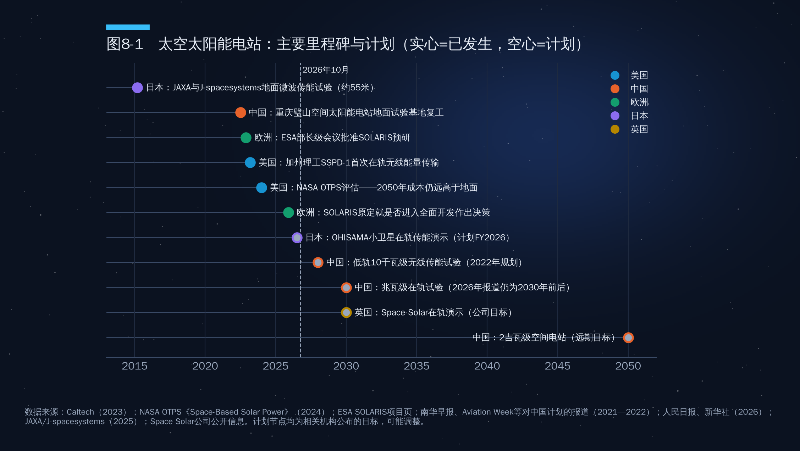
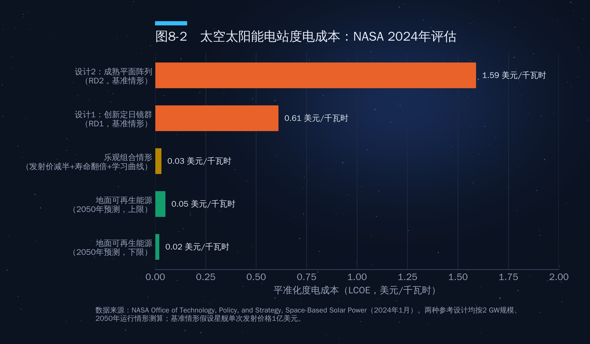
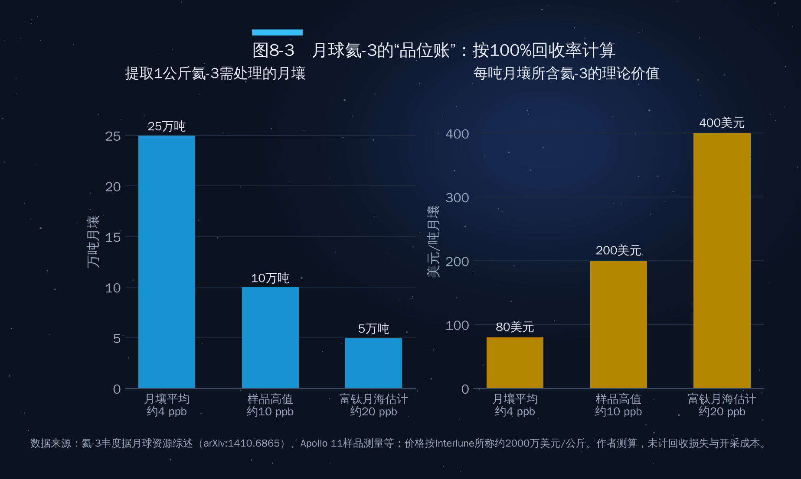

## 第8章　太空资源

2025年9月，芬兰低温设备公司Bluefors与美国初创企业Interlune签下一份合同：从2028年到2037年，每年最多采购1万升从月球开采的氦-3。在此之前，美国能源部已于2025年5月与Interlune签约，采购3升月球氦-3，交付期限为2029年4月前。这是人类历史上第一批"预购地外资源"的商业合同，而此时Interlune还没有一台设备登上月球。

这件事的意义不在于金额，而在于它标志着太空资源第一次从科幻和学术论文，走进了企业的采购清单。但它同样提醒我们：合同签了，账算得过来吗？本章按资源类型、主要路线和经济性三个层次展开。

### 8.1　太空资源的四种类型

作者提纲把太空资源分为物质、能量、环境、信息四类，这是一个有用的框架。表8-1在此基础上做了扩展，并标注了每类资源当前的开发成熟度。

**表8-1　太空资源分类与开发成熟度**

| 类别 | 主要内容 | 典型用途 | 开发成熟度（2026年） |
|---|---|---|---|
| 物质资源 | 月球极区水冰、月壤中的氧和金属（铁、钛、铝、硅）、氦-3；小行星的铁、镍、铂族金属、水和有机物；火星大气二氧化碳和地下水冰 | 推进剂、生命保障、建筑材料、核聚变燃料、稀有金属 | 勘探与技术验证阶段，尚无商业化开采 |
| 能量资源 | 太空太阳能（无大气遮挡、几乎全天候）；月球极区"永昼峰"的持续光照 | 太空太阳能电站向地面输电、月球基地供能 | 小规模在轨演示阶段 |
| 环境资源 | 微重力、高真空、极端温度、强辐射；高远位置（轨道、拉格朗日点） | 药物晶体与特种材料制备、天文观测、生物实验、卫星部署 | 微重力实验已有数十年积累，在轨制造进入早期商业化 |
| 信息资源 | 通信、导航、遥感卫星构建的全球信息网络；空间望远镜获取的宇宙数据 | 宽带接入、定位授时、地球观测、科学研究 | 已高度商业化，是当前太空经济的主体 |

这张表揭示了一个常被忽视的事实：**今天太空经济的绝大部分收入来自"信息资源"和"环境资源"中的轨道位置**——卫星通信、导航、遥感。物质资源和能量资源虽然最具想象力，但商业化程度最低。因此，讨论太空资源时，既要看到远期潜力，也要分清"已经在赚钱的"和"仍在讲故事的"。第7章讨论的轨道和频谱属于前者，本章重点讨论的物质与能量资源大多属于后者。

### 8.2　月球、小行星与火星：典型天体的资源分布

#### 月球：水冰是"头号资源"

月球资源中，最具现实意义的不是氦-3，而是**水冰**。水可以饮用，电解后得到的氧可供呼吸，氢和氧又是性能最好的火箭推进剂之一。在月球上就地获得水，意味着不必从地球运送每一公斤补给。

月球水冰主要存在于两极的"永久阴影区"——一些撞击坑底部数十亿年不见阳光，温度低于零下200摄氏度，水分子一旦落入便被"冻结"保存。主要证据有两项。一是2009年NASA的LCROSS任务撞击月球南极的卡比厄斯撞击坑，在溅射物中探测到水，研究团队估计溅射物含水约5.6%（质量比，误差较大）。二是印度"月船1号"搭载的NASA微型合成孔径雷达在月球北极发现40多个疑似含冰的小型撞击坑，NASA估计其中至少含有约6亿吨水冰。此外，2020年NASA的SOFIA机载望远镜还在月球向阳面探测到微量水分子。

冰的埋藏深度、纯度和形态仍不清楚，这也是各国都把月球南极作为下一阶段探测重点的原因（详见第三部分第10章）。

#### 月球：氧、金属与氦-3

月壤本身就是一座"矿"。按质量计，月壤中氧约占40%以上，以氧化物形式存在于硅酸盐和钛铁矿等矿物中；此外还含有铁、钛、铝、硅、钙等元素。钛铁矿（FeTiO3）在月海玄武岩中含量较高，用氢气还原即可得到水和金属铁、钛，是月面制氧的候选原料之一。2022年，中国科学家在嫦娥五号月壤样品中发现了一种新矿物"嫦娥石"，这是人类在月球上发现的第六种新矿物。

**氦-3**是最常被提及的月球资源，也最需要冷静看待。氦-3是一种稀有的氦同位素，太阳风在数十亿年间把它"注入"月壤表层，而地球因有磁场和大气保护几乎没有。早在1986年，美国威斯康星大学的研究者就估计月壤中可能储存约100万吨氦-3。但这是一个量级估计：月壤中氦-3的平均丰度只有约4ppb（十亿分之四，质量比），实测高值约10ppb，富钛月海地区的模型估计可超过20ppb。

氦-3的远期价值在于"氘-氦3"核聚变：这种反应几乎不产生中子，放射性远低于主流的"氘-氚"聚变。但它所需的温度远高于氘-氚聚变，目前全球还没有任何装置实现氘-氦3聚变的能量增益。因此，**氦-3的近期市场不是聚变，而是量子计算和低温物理**：稀释制冷机需要氦-3把温度降到接近绝对零度，而地球上的氦-3主要来自氚的衰变，供应极其有限。Interlune给出的市场价格约为每公斤2000万美元（约每升3000美元），这正是本章开头那几份合同的商业逻辑。

#### 小行星：分清"科学价值"与"媒体估值"

小行星按光谱特征大致分为三类：**C型**（碳质，约占已知小行星的四分之三，富含水和有机物）、**S型**（石质，含硅酸盐和铁镍金属）、**M型**（金属质，以铁镍为主，可能含铂族金属）。对太空经济而言，C型小行星的水可能比M型小行星的金属更早具有价值，因为水可以在太空中直接用作推进剂。

近年来的采样返回任务大大加深了对小行星的了解：日本"隼鸟2号"2020年12月带回约5.4克"龙宫"样品；NASA的OSIRIS-REx于2023年9月带回约121.6克"贝努"样品；中国"天问二号"于2025年5月发射，前往近地小行星2016 HO3（卡莫奥阿雷瓦）采样，计划在2027年前后返回地球。

媒体最爱引用的，是"灵神星价值1万京美元"。灵神星是主带中最大的M型小行星之一，这个天文数字的来源是该任务首席科学家林迪·埃尔金斯-坦顿2017年按金属市场价格做的一个"思想实验"。她本人多次强调这个数字"在任何意义上都毫无意义"：第一，人类根本没有把灵神星运回地球的技术；第二，即便运回，如此巨量的金属会让市场价格瞬间崩溃；第三，最新密度测量显示灵神星并非纯金属，而是含有大量岩石和孔隙。**资源的价值不等于"储量乘以今天的价格"，而取决于开采成本、运输成本和需求弹性**。这是理解一切太空资源估值的第一课。

#### 火星：为人类驻留而准备的资源

火星大气中约95%是二氧化碳，地表以下和极冠中有大量水冰。这两样东西组合起来，可以通过萨巴蒂尔反应生产甲烷和氧气——这正是SpaceX星舰选择液氧甲烷推进剂的原因之一：未来可以在火星上就地生产返程燃料。火星资源的意义不在于运回地球，而在于让人类在火星上"活得下去、回得来"，详见第三部分第11章。

### 8.3　原位资源利用：从"全部带过去"到"就地取材"

原位资源利用（ISRU）是太空资源开发中最务实的一条路线。它的逻辑来自火箭方程：从地面每向月面运送1公斤物资，需要消耗数十公斤的推进剂和运载器质量。NASA通过"商业月球有效载荷服务"（CLPS）向商业着陆器采购运输服务，单位价格仍以每公斤数十万到上百万美元计。在这种成本下，月球上的一公斤水，其"等价价值"远高于地球上的一公斤水。

原位资源利用目前已有几个关键验证。

**火星制氧：MOXIE实验。**NASA"毅力号"火星车搭载的MOXIE装置，利用固体氧化物电解从火星大气的二氧化碳中分离出氧气。2021年至2023年8月，MOXIE共运行16次，累计生产约122克氧气，最高产率约每小时12克，纯度达98%以上，产率是最初设计目标的两倍。122克氧气只够一只小狗呼吸约10小时，但它首次证明了在另一颗行星上就地制氧是可行的。

**月壤制氧与建材。**各国实验室已开展月壤模拟物的氢还原、碳热还原、熔盐电解等多种制氧路线试验，部分路线还能同时得到金属副产品。月壤烧结、3D打印建造着陆坪和防护墙的研究也在推进。中国在探月工程四期中把月球资源原位利用列为重要验证内容，嫦娥八号计划开展相关技术试验。

**月球水冰开采。**这是最受期待、也最不确定的一环：需要先通过就位勘探搞清冰的分布和形态，再验证在零下200摄氏度的阴影区中挖掘、加热、提纯的工程可行性。

原位资源利用的经济学可以概括为一句话：**最先有价值的地外资源，是在太空中就地使用、替代从地球发射的那部分**。推进剂、水、氧和建材，会比运回地球的贵金属早得多地进入"算得过账"的区间。

### 8.4　太空太阳能电站：能量资源的远期答案

太空太阳能电站的设想由来已久：在太空中用大面积太阳能电池板收集阳光，转换为微波或激光，无线传输到地面接收站，再转换为电力。它的优势在于：太空中没有大气吸收和云层遮挡，太阳辐照强度约每平方米1361瓦；在地球静止轨道上，除春分、秋分前后的短暂地影期外几乎全天候光照，可以提供稳定的"基荷"电力。

#### 各国进展

图8-1梳理了主要国家的里程碑与计划。

**美国**的加州理工学院"空间太阳能演示器"（SSPD-1）于2023年1月发射入轨，同年3月其MAPLE实验首次在太空中完成了无线能量传输，随后又把微波能量定向发射到加州理工学院校园内的接收器并被检测到。这是一次原理验证，传输的功率仅够点亮LED，但它证明了柔性轻质发射阵列可以在真实太空环境中工作。

**中国**是规划最系统的国家之一。据2022年公开报道，中国空间技术研究院的分步设想是：2028年在低轨开展10千瓦级无线传能试验（传输距离约400公里），2030年在地球静止轨道实现兆瓦级，2035年10兆瓦级，2050年2吉瓦级。重庆璧山地面试验基地由重庆大学、中国空间技术研究院、西安电子科技大学等合作建设，2022年复工。2026年5月，西安电子科技大学段宝岩院士团队的"逐日工程"地面验证系统在百米级距离实现约1.2千瓦输出、直流到直流效率20.8%（新华社）。该报道和《人民日报》（2026年3月）提到的下一步是2030年前后开展兆瓦级在轨试验，未再提2028年节点。在轨节点均为规划目标。

**欧洲**航天局在2022年11月部长级会议上批准了SOLARIS预研项目，目标是为2025年部长级会议是否启动全面开发提供依据。但关于2025年11月不来梅会议的公开报道未提及空间太阳能进入全面开发，本文也未检索到相关决定。

**日本**是最早开展微波无线传能地面试验的国家之一，2015年曾在约55米距离上完成微波传能演示。日本的OHISAMA项目计划在2026财年用小卫星开展对地传能演示，由Space One的Kairos火箭发射；而Kairos在2026年3月第三次发射再告失败，截至本稿检索未见OHISAMA发射的报道。

**英国**的Space Solar公司提出了CASSIOPeiA设计方案，并以2030年前后完成在轨演示为目标。

#### 经济性：最大的障碍是发射成本

技术可行不等于经济可行。2024年1月，NASA技术、政策与战略办公室发布了一份详尽的评估报告，对两种2吉瓦级参考设计在2050年运行情形下的平准化度电成本进行了测算（图8-2）。

结果相当冷峻：在基准假设下（星舰单次发射价格1亿美元），设计1（创新定日镜群）的度电成本约0.61美元/千瓦时，设计2（成熟平面阵列）约1.59美元/千瓦时，分别是2050年地面可再生能源预测成本（0.02—0.05美元/千瓦时）的12—31倍和32—80倍。成本构成中，发射占71%—77%，制造占18%—22%。

但报告也给出了一个乐观情形：如果发射价格再减半、硬件寿命翻倍，再叠加规模化带来的学习曲线效应，度电成本可降至约0.03美元/千瓦时，与地面可再生能源相当。换言之，**太空太阳能电站的经济性几乎完全取决于发射成本**。这正是本书主线的又一个注脚：发射成本下降，是一切太空资源从"不可能"变成"可以讨论"的前提。

从中东视角看，这个问题尤为有趣：海湾地区拥有全球最好的地面太阳能资源之一，阿联酋和沙特的地面光伏电价已屡创全球新低。对这些国家而言，太空太阳能电站的价值不在于"替代地面光伏"，而可能在于为太空基础设施本身供电，或作为远期能源技术储备。

### 8.5　微重力制造：环境资源的商业化

微重力是太空独有的环境资源。在地面，重力引起的对流和沉降会干扰晶体生长和材料凝固；在微重力环境下，晶体可以长得更大、更均匀，某些材料可以形成在地面难以获得的结构。

**药物晶体**是最接近商业化的方向。默沙东公司曾在国际空间站上研究抗癌药物帕博利珠单抗（商品名Keytruda）的结晶，获得了更均匀的晶体悬浮液，为改进制剂提供了参考。美国初创企业Varda Space Industries把这一思路做成了商业模式：用小型自主卫星在轨完成药物结晶，再用返回舱带回地面。其W-1任务于2023年发射，在轨生长了抗艾滋病药物利托那韦的晶型；2025年W-2、W-3相继在南澳大利亚着陆。2025年7月，Varda完成1.87亿美元C轮融资，累计融资约3.29亿美元。

**特种光纤**是另一个方向。ZBLAN是一种氟化物玻璃光纤，理论损耗远低于传统石英光纤，但在地面拉制时容易析晶。微重力环境可以抑制析晶，多家公司已在国际空间站上开展拉丝试验。

微重力制造不需要"开采"，只需要"进入"，瓶颈是往返成本和在轨时间，而两者都在随发射成本下降快速改善。它可能是物质领域最早形成规模市场的方向；中国空间站上的大量材料与生命科学实验也为此积累了基础。

### 8.6　资源开发企业与资本：先行者的成败

太空资源领域的商业探索经历过一轮"泡沫—破灭—再出发"。2012年前后成立的行星资源公司和深空工业公司曾高调宣布开采小行星，但都在数年后因融资困难被收购或转型。2020年代的新一代企业更加务实，表8-2列出了部分代表。

**表8-2　部分太空资源与在轨制造企业**

| 企业 | 国家 | 方向 | 进展与挑战 |
|---|---|---|---|
| Interlune | 美国 | 月球氦-3开采 | 已与美国能源部（3升）、Maybell Quantum（2029—2035年每年数千升）、Bluefors（2028—2037年每年最多1万升）签约；已公开原型挖掘设备，尚未开展月面作业 |
| AstroForge | 美国 | 小行星金属勘探与开采 | 2023年Brokkr-1立方星未实现在轨精炼验证；2025年2月随IM-2发射的Odin探测器失联（整星成本约350万美元）；下一任务Vestri计划随IM-3发射；累计融资约5500万美元 |
| ispace | 日本（含卢森堡子公司） | 月面运输与资源 | 2023年4月、2025年6月两次月面着陆尝试均失败；美国子公司参与NASA商业月球有效载荷服务（CLPS）月球背面任务 |
| Varda Space Industries | 美国 | 微重力药物制造与返回舱 | 已完成多次在轨制造与返回；2025年C轮融资1.87亿美元 |
| 中国商业航天企业 | 中国 | 小行星观测、太空资源技术 | 部分企业已发射小行星观测试验星；"天工开物"专项论证为其提供方向（详见第9章） |

这些企业的经历说明了三点。第一，**失败率很高**，月面着陆对小公司仍是"高难度动作"。第二，**先找到地球上的买家**，Interlune先锁定量子计算需求再倒推开采方案。第三，**政策是关键变量**：美国（2015年）、卢森堡（2017年）、阿联酋（2019年）、日本（2021年）先后立法承认企业对所获太空资源的权利，其与《外层空间条约》"不得据为己有"原则的关系见第四部分第12章。

### 8.7　资源经济学：什么时候算得过账？

把前面的讨论汇总起来，可以给出一个判断太空资源经济性的简单框架：**一种太空资源是否值得开发，取决于"使用地点的替代成本"减去"开采加运输成本"是否为正**。

这个框架可以推出几个结论。

**第一，在太空中使用的资源，比运回地球的资源更早具有经济性。**月球上的一公斤水，替代的是从地球运上去的那一公斤，其价值以数十万美元计；而运回地球的一公斤铂，只值数万美元，还要扣除高昂的返回成本。因此，推进剂、水、氧、建材会率先跨过经济门槛，"太空采矿运回地球"排在最后。

**第二，单位价值越高、品位越高，越可能先被开发。**以氦-3为例（图8-3）：按月壤平均丰度4ppb计算，即便100%回收，提取1公斤氦-3也需要处理约25万吨月壤；在20ppb的富集区，也需要约5万吨。按每公斤2000万美元计算，每吨月壤中氦-3的理论价值只有80—400美元。这意味着，开采者必须能以远低于这一数字的成本完成挖掘、加热、分离，还要分摊着陆器、能源和运输成本。这也是Interlune选择"大规模、低单位成本"挖掘设计的原因。

**第三，发射成本是整条成本曲线的"总开关"。**无论是太空太阳能电站（发射占成本70%以上），还是月面资源开采（设备运输成本），成本曲线都随发射价格下移。星舰等完全可重复使用火箭如果能把近地轨道发射成本降到每公斤数百美元，太空资源开发的经济边界将被整体推前。

**第四，需求方的出现比技术突破更关键。**月球资源的第一个大买家，很可能是在月球和地月空间活动的各国航天机构和企业本身：阿尔忒弥斯计划、国际月球科研站、月球基地和地月空间燃料补给站。只有当月面上有持续的人类活动，月球水冰才有稳定的"市场"。

综合看，太空资源的商业化大致会沿着这样的顺序推进：信息资源（已成熟）→ 微重力制造（2020年代后期起逐步规模化）→ 地月空间推进剂与生命保障物资（2030年代，取决于月球基地进展）→ 太空能源（2040年代以后，取决于发射成本）→ 地外物质运回地球（更远期，且仅限于极高单位价值的物质，如氦-3）。这是本文作者基于现有资料的判断，各阶段时间存在很大不确定性。

### 本章要点

- 太空资源分为物质、能量、环境、信息四类；今天太空经济的主体收入来自信息资源，物质和能量资源仍处在勘探与验证阶段。
- 月球最现实的资源是极区水冰（北极估计至少约6亿吨），而非氦-3；氦-3的近期市场是量子计算制冷，每公斤约2000万美元，但月壤丰度仅约4—20ppb。
- "灵神星价值1万京美元"是一个连提出者本人都称为"毫无意义"的思想实验：资源价值取决于开采、运输成本和需求，而不是储量乘以今天的价格。
- 太空太阳能电站在技术上已完成原理验证，但NASA测算其2050年基准度电成本仍是地面可再生能源的12—80倍，发射成本占70%以上，是决定性变量。
- 最先算得过账的是"在太空中就地使用"的资源（推进剂、水、氧、建材）和微重力制造，运回地球的采矿排在最后。
