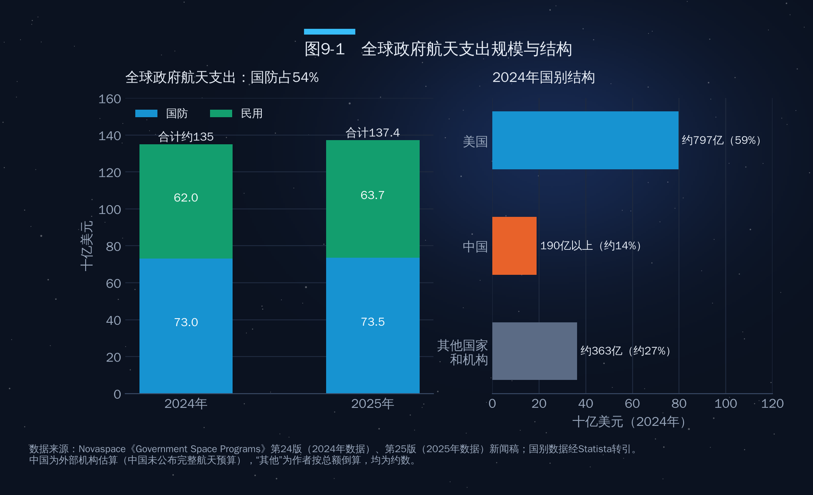
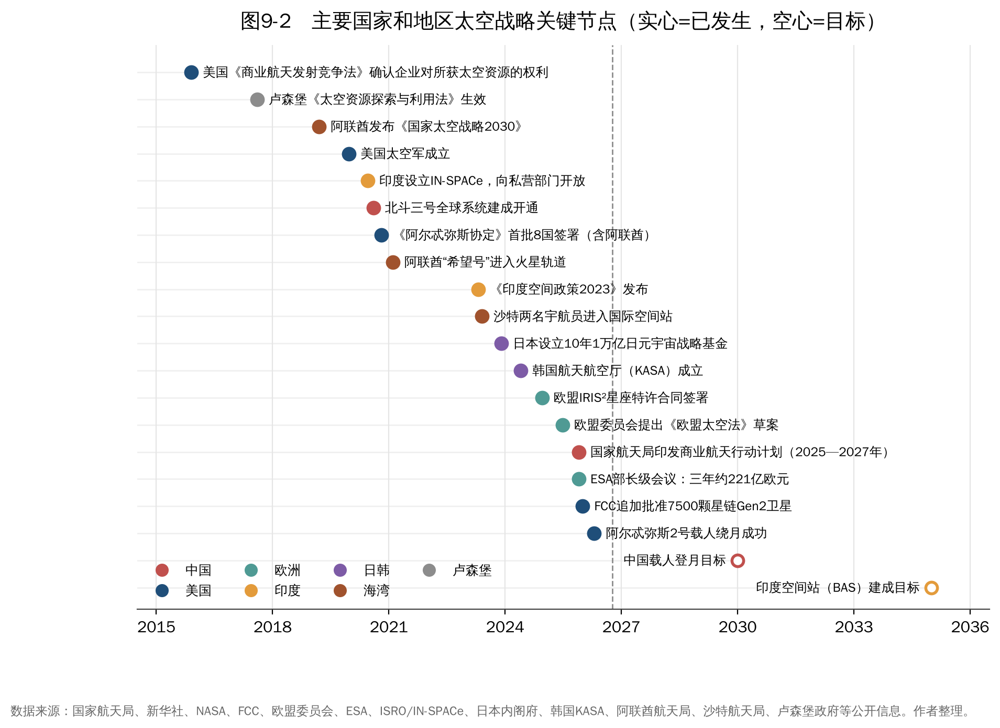

## 第9章　各国太空战略

2025年11月26日至27日，欧洲航天局在德国不来梅召开部长级会议，成员国承诺未来三年出资约221亿欧元，比上一轮增加约32%，创下历史纪录。几乎同一时间，中国国家航天局印发《推进商业航天高质量安全发展行动计划（2025—2027年）》；两个月后，美国联邦通信委员会追加批准7500颗星链卫星。轨道、频谱和地外资源的竞争，最终都会落到各国的预算、制度和战略选择上。

本章先看全球政府航天支出的总盘子，再分别梳理美国、中国、欧洲、俄罗斯、印度、日本、韩国以及卢森堡和海湾国家的战略取向，最后做横向比较。

### 9.1　全景：政府航天支出创新高，国防过半

按欧洲咨询机构Novaspace的统计，2025年全球政府航天支出约1374亿美元，创历史新高；其中国防约735亿美元，占54%，民用约637亿美元。2024年这一数字约为1350亿美元，国防占比同样为54%（图9-1）。

结构上有三个特点。

**第一，美国一家独大，但份额在下降。**2024年美国政府航天支出约797亿美元，占全球59%；而在2000年，这一比例超过75%。份额下降不是因为美国花得少了，而是中国和其他国家增长更快。

**第二，中国稳居第二。**外部机构估算中国2024年政府航天支出超过190亿美元。需要说明的是，中国并未公布完整的航天预算，这类数字均为外部机构的估算，口径与美国不完全可比。

**第三，国防驱动明显。**导弹预警和"金穹"计划等推高了军事航天投入，Novaspace预计全球政府航天预算将在2028—2029年前后达到高峰。

如果用航天支出占GDP的比重衡量"国家投入强度"，按上述估算和两国2024年GDP（美国约29.2万亿美元，中国约134.9万亿元人民币、约18.7万亿美元）粗略测算，美国约为0.27%，中国约为0.10%。这是本文作者的粗算，仅供参考。

### 9.2　美国：商业优先、重返月球、太空军事化

美国的太空战略可以概括为三根支柱。

**第一根支柱是"商业优先"。**从2008年起NASA向SpaceX等公司购买国际空间站货运服务，到2014年起采购商业载人服务，美国逐步把近地轨道运输交给市场，NASA从"运营者"转为"采购者"。2015年《商业航天发射竞争法》确认美国企业对其获得的太空资源享有所有权。特朗普第一任期发布了一系列"太空政策指令"，包括2017年的第1号指令（重返月球）、2018年的第2号指令（简化商业航天监管）和第3号指令（太空交通管理）等。2025年以来的政策延续并强化了这一方向：在发射和频谱许可上进一步"松绑"，FCC在2026年1月追加批准7500颗星链卫星，就是监管提速的体现。

**第二根支柱是阿尔忒弥斯计划。**2026年4月1日，阿尔忒弥斯2号搭载四名宇航员发射，完成载人绕月飞行后于4月10日在加州圣迭戈外海溅落，这是1972年以来人类首次飞抵月球附近。与之配套的《阿尔忒弥斯协定》于2020年10月由首批8国签署（阿联酋是其中之一），此后沙特、巴林等国陆续加入，成为美国构建月球规则"朋友圈"的主要工具。

NASA的预算则经历了一番波折。白宫提交的2026财年预算申请仅约188亿美元，科学任务预算拟削减近一半；国会最终拒绝了大部分削减，2026年1月通过的拨款法案给予NASA约244亿美元，科学任务约72.5亿美元，较2025财年仅减少约1.1%。但火星采样返回任务仍被取消。

**第三根支柱是太空军事化。**美国太空军于2019年12月成立。2026财年，太空军基础预算申请约263亿美元，加上2025年7月通过的预算协调法案中划拨的约138亿美元，总额超过400亿美元。其中相当部分用于"金穹"导弹防御系统的天基拦截和跟踪卫星。美国国会预算办公室估计，仅天基拦截器一项的长期成本就可能在1610亿至5420亿美元之间。

其核心逻辑是：**用商业力量降成本，用国家任务造需求，用国防投入保优势**。

### 9.3　中国：国家工程带动，商业航天快速补位

中国的太空战略呈现"国家队主导重大工程、商业力量快速补位"的格局。

**重大工程方面**，中国已建成北斗全球卫星导航系统和天宫空间站，完成了嫦娥五号月球采样返回、嫦娥六号月背采样返回和天问一号火星着陆巡视。按公开规划，中国计划在2030年前实现载人登月；嫦娥七号、嫦娥八号将前往月球南极，开展资源勘查和原位资源利用技术试验；中国与俄罗斯等国共同倡议建设国际月球科研站；天问二号已于2025年5月发射，前往小行星采样。

**商业航天方面**，2025年11月国家航天局印发的《推进商业航天高质量安全发展行动计划（2025—2027年）》是一份纲领性文件。它首次将商业航天纳入国家航天发展总体布局，提出五方面22项重点举措，包括：竞争性地向商业航天主体开放国家科研项目，推动国家投资形成的科技成果商业化应用，设立国家商业航天发展基金，推动民用与商业航天标准体系融合，以及加强全链条安全监管。目标是到2027年基本实现商业航天高质量发展。

**太空资源方面**，作者提纲提到的"天工开物"需要澄清两点。第一，提出方是中国航天科技集团：2026年1月29日，中国航天科技集团在上海召开的商业航天器及应用产业链共链行动大会上表示，将在"十五五"期间谋划太空资源开发等新领域，开展"天工开物"重大专项论证，建设太空资源开发综合实验和地面支持系统，重点攻关小天体资源勘查、智能自主开采、低成本转移运输、在轨处理等关键技术。截至本稿检索时，它仍处于"论证"阶段，未见正式立项和预算信息。第二，关于时间表，2025年8月中国航天科技集团专家在学术会议上提出的长期设想，以2035年、2050年、2075年、2100年为节点，分"勘、采、用"等阶段推进。作者提纲中"2030年前形成深空勘探能力，2040年前实现小规模开发"的表述，本文未能找到出处，建议作者核实或改用上述公开节点。

**频轨资源方面**，中国星网的国网星座和上海垣信的千帆星座已进入批量部署阶段，2025年底约20万颗卫星的国际电信联盟申报更显示出"先占位、后建设"的战略意图（见第7章）。

### 9.4　欧洲：在自主与预算之间寻找平衡

欧洲的太空治理有两个主体：欧洲航天局（ESA，政府间组织，22个成员国）和欧盟（拥有伽利略导航、哥白尼对地观测等旗舰项目）。

2025年的不来梅部长级会议是欧洲太空战略的一次"加码"：约221亿欧元的三年承诺中，德国出资最多，约51亿欧元。会议也有"输家"：载人与机器人探索项目及英国的出资均低于ESA最初提议。

欧盟层面的两件大事分别是IRIS²和《欧盟太空法》。IRIS²是欧盟的多轨道安全通信星座，2024年12月与由SES、欧洲通信卫星公司等组成的财团签署特许合同，总投资约106亿欧元，计划部署约290颗卫星，2030年前后提供服务，被视为欧洲对星链的"主权回应"。2025年6月，欧盟委员会提出《欧盟太空法》草案，拟在安全、韧性和环境可持续性方面对在欧盟提供服务的航天运营者（包括非欧盟运营者）提出统一要求，这将对全球卫星运营者产生外溢影响。

欧洲的核心矛盾是：**科研和工业基础强，但发射能力和商业化速度落后于中美**。阿丽亚娜6号2024年首飞，ESA正扶持新兴商业火箭企业。

### 9.5　俄罗斯：传统强国的收缩与转向

俄罗斯拥有完整的航天工业体系和最长的载人航天经验，联盟号飞船至今仍是国际空间站的重要运输工具。但近十年来，俄罗斯在全球发射市场的份额持续萎缩，2023年8月的月球25号着陆失败也暴露出深空能力的断层。俄罗斯的战略重点正在转向：一是规划建设自己的俄罗斯轨道站，接替国际空间站；二是与中国合作推进国际月球科研站；三是在国防领域保持导弹预警、反卫星等能力。2021年的反卫星试验（见第7章）表明，俄罗斯仍把太空视为重要的战略博弈领域。

### 9.6　印度、日本、韩国：亚洲的"第二梯队"加速

**印度**是近年来改革力度最大的国家之一。2020年设立印度国家空间促进与授权中心（IN-SPACe），作为私营企业进入航天领域的"单一窗口"；2023年发布《印度空间政策2023》，明确私营部门可参与从卫星制造到发射的全产业链；2024年放宽航天领域外商直接投资限制。IN-SPACe提出到2033年将印度航天经济规模提升至约440亿美元。在国家任务上，印度2023年8月以月船3号实现月球南极附近着陆，2025年6月印度宇航员搭乘Axiom-4任务进入国际空间站；政府目标是2035年建成印度空间站，2040年实现印度人登月。

**日本**的特点是"技术精细、预算集中、绑定美国"。2023年，日本决定设立规模约1万亿日元、为期约10年的宇宙战略基金，通过JAXA支持企业和大学的技术开发。2024年1月，日本SLIM探测器实现了"精准着陆"；同年4月，日美达成协议，由日本提供载人加压月球车，换取日本宇航员登月的机会。

**韩国**于2024年5月27日成立韩国航天航空厅（KASA），将分散的航天职能整合到一个机构，并以自主研发的"世界号"运载火箭和"赏月号"月球轨道器为基础，提出2032年前后实现月球着陆等目标。

### 9.7　卢森堡与海湾国家：小国的"杠杆战略"

**卢森堡**是"小国做大太空"的样本。这个人口约67万的国家早在1985年就参与创办了SES卫星公司，2016年推出"太空资源计划"，2017年成为欧洲首个以立法确认企业对太空资源所有权的国家，2018年成立卢森堡航天局。卢森堡的打法是"制度先行、吸引企业"：用法律确定性和投资基金吸引全球太空资源企业落户，ispace的欧洲子公司就设在卢森堡。

**海湾国家**则走出了一条"资本加合作"的路径，这对多哈的听众或许最有启发。

- **阿联酋**是海湾地区太空战略最系统的国家。2014年成立阿联酋航天局，2019年发布《国家太空战略2030》；"希望号"火星探测器于2021年2月进入火星轨道，使阿联酋成为第五个成功抵达火星的国家或地区；2023年宇航员苏尔坦·奈亚迪在国际空间站完成约6个月的长期驻留。穆罕默德·本·拉希德航天中心既负责卫星研制，也负责宇航员和深空任务。阿联酋还宣布将为NASA牵头的月球门户空间站提供气闸舱，并规划了飞越多颗小行星并着陆的探测任务。
- **沙特阿拉伯**在"愿景2030"框架下推动航天产业发展。2018年设立沙特航天委员会，后更名为沙特航天局；2023年5月，沙特两名宇航员（包括首位沙特女宇航员拉雅娜·巴尔纳维）搭乘商业载人任务进入国际空间站。沙特主权财富基金也在布局卫星通信等领域。
- **卡塔尔**的航天产业以Es'hailSat卫星公司为核心。该公司成立于2010年，运营Es'hail-1和Es'hail-2卫星，为卡塔尔及中东北非地区提供广播和通信服务（见第7章）。对卡塔尔而言，静止轨道轨位和卫星广播能力本身就是重要的"太空土地"。
- **阿曼**正在杜库姆建设航天发射场，力图在区域发射服务中占据一席之地。

海湾国家的共同特点是：**资本充裕、起步较晚、高度重视国际合作和人才培养**。它们既是美国阿尔忒弥斯协定的签署方，也与中国开展广泛合作。

**中阿航天合作**是其中的重要一环。自2017年起，中国与阿拉伯国家已举办多届中阿北斗合作论坛，中阿北斗/全球卫星导航系统中心于2018年在突尼斯揭牌，北斗系统在阿拉伯国家的交通、农业、测绘等领域得到应用。中国还为埃及建造了遥感卫星，阿联酋的"拉希德2号"月球车计划搭乘中国嫦娥七号任务前往月球。对海湾国家而言，在中美之间开展"多向合作"，是其太空战略的现实选择。

### 9.8　横向比较：五种战略模式

图9-2按时间顺序梳理了近十年各国太空战略的关键节点，表9-1则对主要国家的战略模式做了横向比较。

**表9-1　主要国家和地区太空战略模式比较**

| 国家/地区 | 战略模式 | 核心抓手 | 代表性数字 | 主要短板 |
|---|---|---|---|---|
| 美国 | 商业优先+国家任务+国防 | NASA采购商业服务、阿尔忒弥斯、太空军、宽松监管 | 政府航天支出约797亿美元（2024年）；NASA约244亿美元（2026财年） | 政策随政府更迭波动，科学预算承压 |
| 中国 | 国家工程带动+商业补位 | 重大专项、国家队、商业航天行动计划、星座组网 | 政府航天支出超190亿美元（2024年，外部估算） | 低轨星座规模与星链差距大，可重复使用火箭尚待成熟 |
| 欧洲 | 政府间合作+自主可控 | ESA计划、欧盟旗舰项目、IRIS²、太空立法 | ESA三年承诺约221亿欧元（2025年）；IRIS²约106亿欧元 | 发射能力弱，决策协调成本高 |
| 俄罗斯 | 传统优势保持+对外合作 | 载人航天、国防航天、对华合作 | 发射次数与市场份额持续下降 | 资金和产业链受限 |
| 印度/日本/韩国 | 改革开放或精准投入 | 印度私有化改革、日本1万亿日元基金、韩国KASA | 印度目标2033年航天经济约440亿美元 | 规模有限，依赖国际合作 |
| 卢森堡/海湾国家 | 资本与制度杠杆 | 立法、主权基金、国际合作、人才培养 | 阿联酋"希望号"抵达火星；卢森堡2017年太空资源立法 | 工业基础薄弱，技术依赖外部 |

比较这几种模式，可以看到三个趋势。

**第一，"国家主导"与"商业驱动"正在融合。**美国从商业起步走向更强的国防投入，中国从国家工程起步走向商业开放，单一模式都难以支撑大国太空竞争。

**第二，竞争焦点从"能力"转向"规则和资源"。**阿尔忒弥斯协定与国际月球科研站、国际电信联盟的频轨申报、各国太空资源立法，本质上都是对未来规则和资源分配的竞争。这将在第四部分展开。

**第三，中小国家的机会在"杠杆"而非"规模"。**卢森堡用法律、阿联酋用资本和合作、卡塔尔用卫星运营，各自找到了位置；对海湾国家而言，太空也是经济多元化的工具。

### 本章要点

- 2025年全球政府航天支出约1374亿美元，创历史新高，国防占54%；美国份额从2000年的75%以上降至2024年的59%。
- 美国以商业优先、阿尔忒弥斯计划和太空军为三大支柱；国会为NASA 2026财年拨款约244亿美元，否决了白宫的大部分科学预算削减。
- 中国2025年11月印发商业航天行动计划（五方面22项举措），"天工开物"是中国航天科技集团提出、仍处论证阶段的太空资源开发专项。
- 欧洲以ESA三年约221亿欧元的创纪录承诺和IRIS²星座强化自主；印度、日本、韩国通过改革和专项基金加速追赶。
- 卢森堡和海湾国家走"资本加制度加合作"的杠杆路线；中阿北斗合作和海湾国家的多向合作，是多哈视角下的重要看点。
