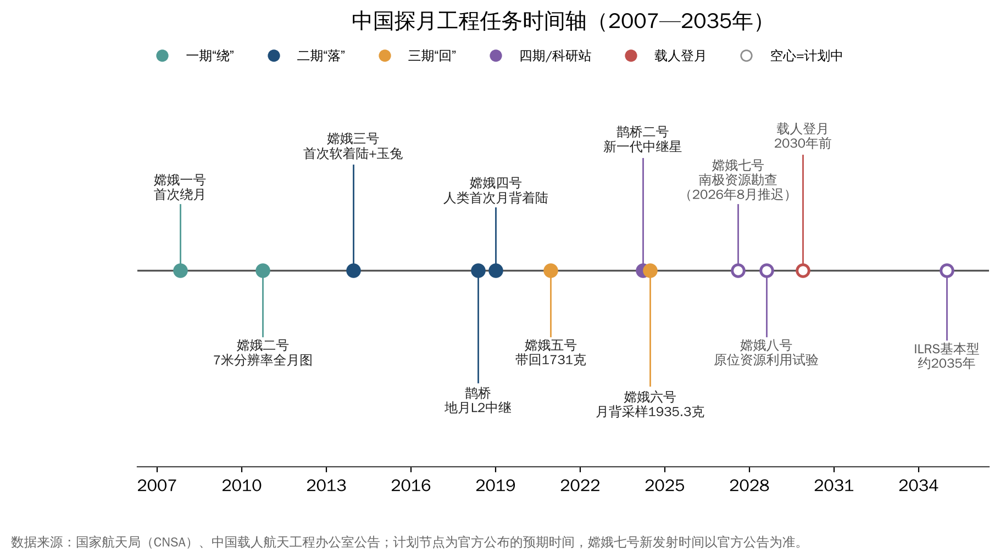
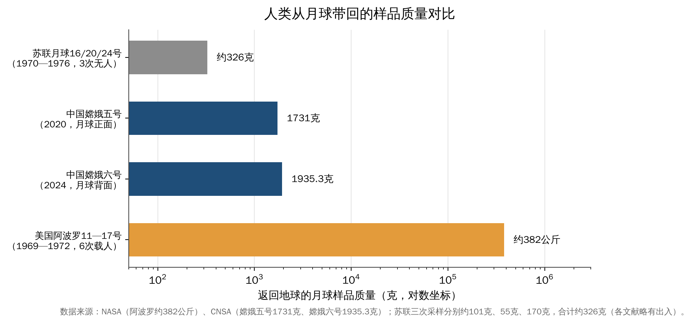
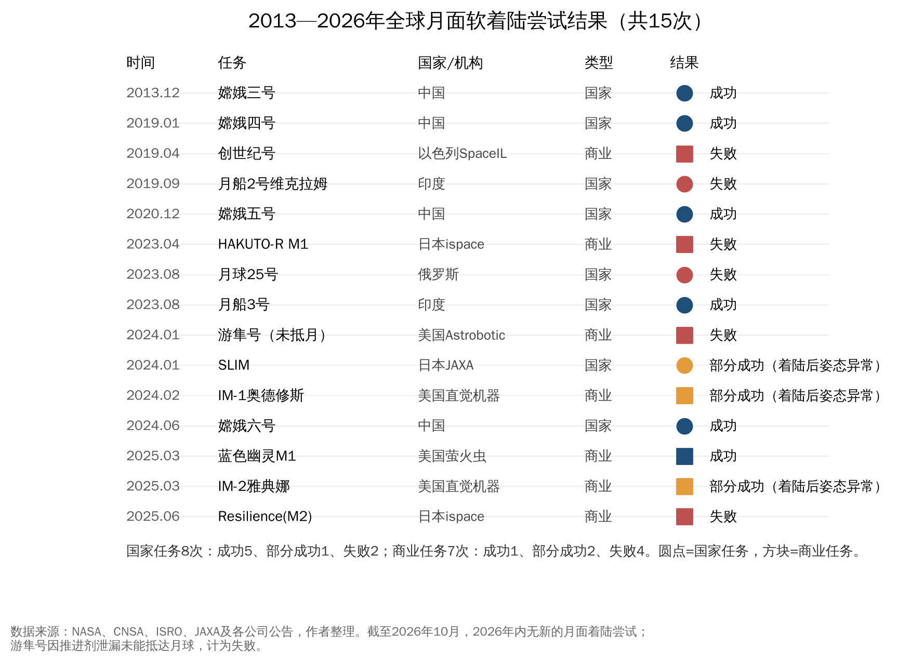
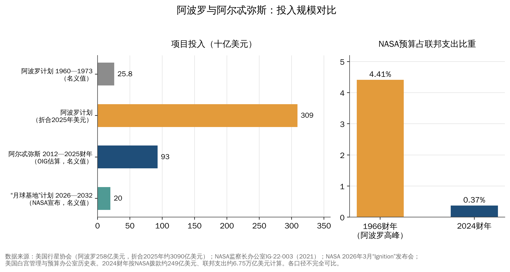
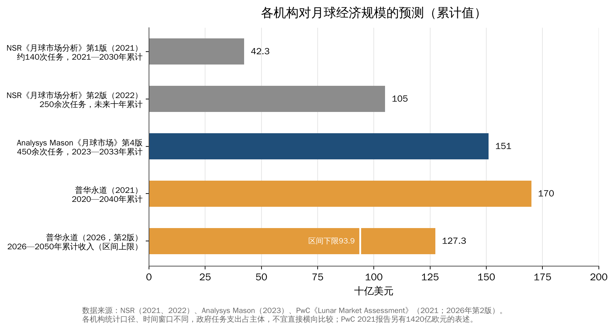

## 第10章　月球开发：历史、现状和未来计划

2026年4月10日晚，美国"猎户座"飞船"完整号"（Integrity）在圣迭戈外海溅落，四名宇航员——里德·怀斯曼、维克多·格洛弗、克里斯蒂娜·科赫和加拿大宇航员杰里米·汉森——安全返回。这是自1972年12月阿波罗17号以来，人类时隔53年再一次飞到月球附近。他们飞得比此前任何人离地球都更远，亲眼看到了月球背面的部分区域。

几乎同一时间，在海南文昌，中国用于载人登月的长征十号系列火箭已经完成低空飞行验证，"梦舟"飞船完成了最大动压逃逸试验；嫦娥七号探测器和长征五号火箭已在发射场"会师"。

半个世纪前，月球是两个超级大国的冷战赛场；半个世纪后，月球重新成为大国竞争的焦点，但比赛规则已经完全不同。本章先回顾历史，再看中国、美国和其他国家的现状与计划，最后讨论一个最现实的问题：月球经济到底有多大？

### 10.1　冷战中的月球竞赛（1959—1976）

#### 苏联：一连串的"第一"

月球探测的前十年，几乎每一个"第一"都属于苏联。1959年1月，月球1号成为第一个脱离地球引力、飞越月球的航天器；同年9月14日，月球2号撞击月面，人类制造的物体第一次到达另一个天体；10月，月球3号拍下了人类从未见过的月球背面。1966年2月，月球9号在风暴洋实现人类首次月面软着陆，传回第一张月面全景照片；同年4月，月球10号成为第一颗月球人造卫星。

载人登月竞赛失利之后，苏联转向无人采样。1970年9月，月球16号在丰富海钻取约101克月壤并返回地球，这是人类第一次用机器人从地外天体带回样品；两个月后，月球17号把"月球车1号"送上月面，这辆八轮遥控车累计行驶约10.5公里。月球20号（1972年，约55克）和月球24号（1976年，约170克）又带回两批样品，三次合计约326克。1976年8月的月球24号，也是苏联最后一次月球任务。

苏联的载人登月计划则因N1重型火箭连续四次发射失败（1969—1972年）而夭折。N1第一级有30台发动机并联，在当时的控制技术条件下难以协调，这一教训直到半个世纪后SpaceX用33台猛禽发动机的超重型助推器才算真正"翻篇"。

#### 美国：阿波罗的代价与遗产

1961年5月，肯尼迪在国会宣布"在这个十年结束之前，把人送上月球并安全返回"。此后八年，美国先后实施了"徘徊者"号撞月拍照、"勘测者"号软着陆、"月球轨道器"测绘等一系列无人先导任务，又通过水星号和双子座号积累了载人经验。1968年12月，阿波罗8号载三名宇航员首次绕月飞行；1969年7月20日，阿波罗11号的阿姆斯特朗和奥尔德林踏上静海。

从阿波罗11号到阿波罗17号，美国共实施7次登月飞行，其中阿波罗13号因服务舱氧气罐爆炸中止登月，其余6次成功着陆，共有12名宇航员在月面行走，带回月岩和月壤约382公斤。这批样品至今仍是行星科学最重要的实物资料，奠定了"大碰撞形成月球"等理论的基础。

阿波罗的代价是惊人的。据美国行星协会重建的数据，1960—1973年阿波罗计划共花费约258亿美元（名义值），按2025年美元折算约3090亿美元。1966财年NASA预算占联邦财政支出的4.41%，是历史最高点；高峰时期有约40万人直接或间接参与这一工程。作为对比，2024财年NASA预算约249亿美元，仅占联邦支出约0.37%（见图10-4）。

#### 冷战逻辑：为什么赛跑，又为什么停下

阿波罗本质上是一项政治工程，而非经济工程。它的目标是在全世界面前证明制度优越性，月球本身的科学和资源价值是次要的。这一逻辑决定了它的结局：一旦"第一个登月"的目标达成，继续投入的边际政治收益迅速下降。越南战争和国内社会项目挤占预算，公众兴趣下滑，阿波罗18—20号被取消，NASA转向航天飞机和空间站。苏联在输掉登月竞赛后也转向"礼炮"和"和平号"空间站。

**表10-1　冷战时期月球探测主要里程碑**

| 时间 | 任务 | 国家 | 意义 |
|---|---|---|---|
| 1959年9月 | 月球2号 | 苏联 | 首次撞击月面 |
| 1959年10月 | 月球3号 | 苏联 | 首次拍摄月球背面 |
| 1966年2月 | 月球9号 | 苏联 | 首次月面软着陆 |
| 1966年6月 | 勘测者1号 | 美国 | 美国首次月面软着陆 |
| 1968年12月 | 阿波罗8号 | 美国 | 首次载人绕月 |
| 1969年7月 | 阿波罗11号 | 美国 | 首次载人登月 |
| 1970年9月 | 月球16号 | 苏联 | 首次无人采样返回 |
| 1970年11月 | 月球17号 | 苏联 | 首辆月球车 |
| 1972年12月 | 阿波罗17号 | 美国 | 迄今最后一次载人登月 |
| 1976年8月 | 月球24号 | 苏联 | 冷战时期最后一次月球任务 |

### 10.2　沉寂与回归（1976—2007）

1976年8月到1990年1月，整整13年多，人类没有向月球发射过任何探测器。原因有三。其一，政治目标已经实现，"再去一次"缺乏国家层面的理由。其二，阿波罗样品显示月球"干燥、死寂"，科学界的兴趣转向火星、金星和外行星。其三，没有任何商业需求——当时的运载成本以每公斤数万美元计，月球上没有任何东西值得运回来。

回归是从"水"开始的。1990年日本发射"飞天"号，成为第三个探月的国家；1994年美国"克莱门汀"号的雷达回波暗示月球南极可能存在冰；1998年"月球勘探者"号在两极探测到氢元素富集。21世纪初，欧洲SMART-1（2003年）验证了电推进探月。

真正的拐点出现在2007—2009年：日本"月亮女神"（2007年9月）、中国嫦娥一号（2007年10月24日）、印度月船1号（2008年10月）先后发射；月船1号携带的NASA月球矿物绘图仪证实了月表存在水分子；2009年美国LCROSS撞击器撞向南极卡比厄斯撞击坑，在溅射物中检测到约5.6%（质量比）的水。月球从"死寂之地"变成了"可能有资源的地方"，新一轮探月由此启动。

按NASA的统计，1958—2023年全球共实施约111次月球任务，完全成功的只有62次，失败41次，部分成功8次——即便在今天，奔月也绝非易事。

### 10.3　中国探月工程："绕、落、回"三步走

中国探月工程2004年正式立项，被命名为"嫦娥工程"，确立了"绕、落、回"三步走战略。二十年来，中国以几乎每一次都成功的节奏，走完了美苏用十几年、数十次任务走过的路。

**表10-2　中国探月工程主要任务**

| 任务 | 发射时间 | 阶段 | 主要成果 |
|---|---|---|---|
| 嫦娥一号 | 2007年10月 | 一期"绕" | 首次绕月探测，获取全月影像 |
| 嫦娥二号 | 2010年10月 | 一期备份 | 7米分辨率全月图，后飞越图塔蒂斯小行星 |
| 嫦娥三号 | 2013年12月 | 二期"落" | 中国首次地外天体软着陆，"玉兔"月球车 |
| 鹊桥 | 2018年5月 | 二期 | 首颗地月L2点中继卫星 |
| 嫦娥四号 | 2018年12月 | 二期 | 2019年1月3日人类首次月球背面软着陆 |
| 嫦娥五号 | 2020年11月 | 三期"回" | 带回月球样品1731克 |
| 鹊桥二号 | 2024年3月 | 四期 | 新一代中继星，服务嫦娥六、七、八号 |
| 嫦娥六号 | 2024年5月 | 四期 | 人类首次月球背面采样，带回1935.3克 |
| 嫦娥七号 | 原定2026年8月，已推迟 | 四期 | 南极环境与资源勘查 |
| 嫦娥八号 | 计划2028年前后 | 四期 | 原位资源利用技术验证 |

如图10-1所示，中国探月的节奏是"一步一个台阶、每步都留备份"：嫦娥二号是嫦娥一号的备份，嫦娥四号是嫦娥三号的备份，嫦娥六号是嫦娥五号的备份。备份星在主任务成功后被赋予更难的新目标，这种"备份升级"模式既控制了风险，又提高了投入产出比，是中国航天工程管理的一大特色。

#### 嫦娥四号：月背第一

月球背面永远背对地球，着陆器无法与地面直接通信。2018年5月，中国先发射"鹊桥"中继卫星到地月拉格朗日L2点附近的晕轨道，再于当年12月发射嫦娥四号。2019年1月3日，嫦娥四号在南极—艾特肯盆地内的冯·卡门撞击坑着陆，"玉兔二号"月球车成为在月面工作时间最长的月球车。这是人类第一次在月球背面软着陆，也是中国航天第一次在一个重大方向上"领跑"而非"跟跑"。

#### 嫦娥五号和嫦娥六号：44年后的采样返回

2020年12月，嫦娥五号在风暴洋吕姆克山附近钻取和铲取样品，带回1731克月球样品，这是自1976年月球24号之后44年来人类首次获取新的月球样品。2024年6月，嫦娥六号在月球背面南极—艾特肯盆地的阿波罗撞击坑着陆，6月25日返回器带回1935.3克月背样品，人类第一次拥有了月球背面的实物样本。

从图10-2可以看到，就总量而言，阿波罗的382公斤仍然是无可替代的"大样本"；但嫦娥五号、六号带回的样品来自阿波罗从未到过的地质年代和区域，科学价值不能用重量衡量。

#### 科学成果：年轻的火山、新矿物与月球上的水

嫦娥五号样品测得的玄武岩年龄约20亿年，比阿波罗和月球号样品年轻约10亿年，说明月球的火山活动持续时间远比过去认为的长。2022年9月，中国科学家从嫦娥五号样品的14万个颗粒中分离出一颗约10微米的单晶，确认为新的磷酸盐矿物，命名为"嫦娥石"，这是人类在月球上发现的第六种新矿物，中国成为第三个发现月球新矿物的国家。2026年4月，国家航天局又宣布在嫦娥五号样品中发现镁嫦娥石与铈嫦娥石两种新矿物。

关于水，嫦娥五号着陆器的光谱仪首次在月表原位测得月壤含水量约120ppm；此后的样品研究在撞击玻璃珠中发现了太阳风成因的水，并发现了一种分子中含水的含铵矿物。中国科学家还提出了利用月壤中的钛铁矿与太阳风注入的氢反应、加热"产水"的方法——这些都是未来"就地取水"的科学基础。

嫦娥六号的成果更具突破性。2025年发表在《自然》上的系列论文显示：月球背面在约42亿年前和28亿年前都有火山活动，持续至少14亿年；背面月幔的含水量仅为每克1—1.5微克，不到正面的三分之一，提示月球正背面"二分性"可能与南极—艾特肯巨型撞击有关；古地磁数据显示月球磁场在约28亿年前可能出现过"反弹"。这批成果入选国家自然科学基金委发布的2025年度"中国科学十大进展"。

#### 嫦娥七号推迟：南极的"窗口"有多窄

探月四期的核心是嫦娥七号和嫦娥八号，二者与此前的嫦娥六号一起构成国际月球科研站的"基本型"。嫦娥七号由轨道器、着陆器、巡视器和一个可以"跳跃"进入永久阴影区的飞跃器组成，目标是月球南极沙克尔顿撞击坑附近，重点勘查水冰和挥发分。它搭载了7个国家和国际组织的6台国际载荷：意大利的激光角反射器、俄罗斯的月尘与电场探测仪、国际月球天文台协会的月基天文望远镜、埃及与巴林联合研制的月表物质超光谱成像仪、瑞士的地球辐射能谱仪和泰国的空间天气监测装置。其中**埃及—巴林联合载荷是阿拉伯国家首次以硬件参与中国探月任务**。

2026年4月，嫦娥七号探测器运抵文昌；7月，长征五号遥十四火箭运抵发射场；8月19日器箭组合体垂直转运至发射区。但8月23日晚，官方宣布"本着稳妥可靠、万无一失的原则，经综合研判，嫦娥七号任务不满足发射条件，不能在今年预定窗口实施"，器箭组合体随后返回总装厂房。官方没有公布具体原因，媒体普遍认为与当时文昌附近的热带风暴天气以及南极着陆区严格的光照条件有关，并预计将推迟到2027年。

这件事本身就很有说明意义：月球南极的太阳高度角极低，着陆区的光照、通信和温度条件只在一年中的少数时段同时满足，一旦错过就要等很久。南极是月球上资源最丰富的地方，也是工程上最难去的地方。

#### 嫦娥八号与国际月球科研站

嫦娥八号计划2028年前后发射，由着陆器、月球车和智能月面机器人组成，最受关注的是"原位资源利用"试验——用聚集的太阳能熔融月壤、以3D打印方式制造"月壤砖"，验证"就地取材盖房子"的可能性。嫦娥八号向国际社会提供了约200公斤的载荷搭载能力，2025年4月公布的10个入选合作项目中，包括巴基斯坦月球车和香港高校研制的月面多功能操作机器人。

国际月球科研站（ILRS）由中国发起，计划在2035年前后于月球南极建成"基本型"，此后扩展为更完整的设施。截至2025年4月，已有17个国家和国际组织、50多个国际科研机构加入合作。2024年4月，阿拉伯天文学和空间科学联盟（AUASS）加入国际月球科研站，这为海湾和阿拉伯国家参与中国主导的月球体系提供了制度化渠道。

### 10.4　其他国家与商业着陆器：月球不好"落"

如果说"绕"已经不难，"落"仍然是一道高门槛。图10-3汇总了2013年以来全球所有月面软着陆尝试。

如图10-3所示，2013年以来全球共有15次月面着陆尝试，国家任务8次中成功5次，商业任务7次中只有1次完全成功。

#### 国家队：印度、日本、俄罗斯

**印度**月船2号的"维克拉姆"着陆器2019年9月在最后阶段坠毁；四年后，月船3号于2023年8月23日在南纬约69度的高纬度地区成功着陆，印度成为第四个实现月面软着陆的国家、第一个在月球南极附近着陆的国家，任务成本约61.5亿卢比（约7500万美元），成为"低成本深空探测"的标杆。

**日本**"小型月球着陆探测器"（SLIM）2024年1月20日着陆，落点距目标约55米，验证了"想去哪里就落在哪里"的精确着陆技术，使日本成为第五个月面软着陆国家；但由于一台主发动机在下降中脱落，着陆器最终"倒立"在月面，太阳能电池板朝向不佳，只能间歇工作。

**俄罗斯**时隔47年重返月球的月球25号，2023年8月因轨道机动发动机异常而坠毁，暴露出俄航天在经费和人才断层上的困境。

#### 商业队：从"创世纪号"到"蓝色幽灵"

2019年4月，以色列非营利组织SpaceIL的"创世纪号"成为第一个尝试登月的私营项目，造价约1亿美元，因陀螺仪故障引发连锁反应而坠毁。日本ispace的HAKUTO-R M1（2023年4月）和"韧性"号（Resilience，2025年6月）两次尝试均因高度测量问题坠毁；M1上搭载的阿联酋"拉希德"号月球车也随之损失——这是阿联酋第一次尝试把硬件送上月面。

美国方面，Astrobotic的"游隼"号2024年1月因推进剂泄漏未能抵达月球；直觉机器公司的IM-1"奥德修斯"号2024年2月着陆，成为1972年以来第一个在月球上着陆的美国航天器和第一个商业着陆器，但着陆时一条腿折断、侧躺在月面；2025年3月的IM-2"雅典娜"号再次侧翻。真正意义上的第一次完全成功的商业着陆，属于萤火虫航天公司的"蓝色幽灵"M1：2025年3月2日它稳稳落在危海，完成了约两周的月面作业，甚至拍下了月面日落的画面。

#### CLPS：NASA的"多次射门"经济学

上述美国商业着陆器大多来自NASA的"商业月球有效载荷服务"（CLPS）。2018年启动的CLPS把NASA从"造着陆器的人"变成"买运输服务的人"：NASA只为把载荷送到月面付费，公司自行设计、拥有和运营着陆器，可以同时搭载商业客户。单次任务订单通常在1亿美元上下，远低于传统NASA主导任务。NASA对这种模式的失败率有心理准备，内部把它称为"多次射门"（shots on goal）——只要足够多的"射门"中有一部分成功，总体成本仍比传统模式低。

从结果看，这种模式确实以较低成本快速培育出了美国的商业着陆器产业，但商业着陆的成功率也表明，降低成本和保证可靠性之间存在真实的取舍。2026年，NASA把CLPS的后续任务并入新的"月球基地"计划：6月宣布向Astrobotic、萤火虫和直觉机器三家公司支付约5.9亿美元，执行四次货运任务。但商业运输也面临新的风险：2026年5月28日，蓝色起源"新格伦"火箭一级在静态点火测试中爆炸，严重损毁了其唯一的发射工位，原计划2026年秋发射的"蓝月"MK1着陆器被推迟到2027年初。截至2026年10月，全年尚无新的月面着陆尝试。

### 10.5　阿尔忒弥斯计划：从"插旗"到"建站"

#### 阿尔忒弥斯1号、2号：重回月球轨道

阿尔忒弥斯计划2017年正式启动，名字取自阿波罗的孪生姐姐。2022年11月16日，"太空发射系统"（SLS）首飞，把无人的猎户座飞船送入绕月轨道，飞行约25.5天后返回。这次任务基本成功，但返回后发现隔热罩出现了超出预期的烧蚀剥落，成为后续任务推迟的主要原因之一。

阿尔忒弥斯2号最终于2026年4月1日从肯尼迪航天中心发射，执行约10天的载人绕月飞行，4月10日溅落。NASA局长贾里德·艾萨克曼称其为"一次完美的任务"。四人乘组中包括第一位执行绕月任务的女性、第一位飞向月球的非裔宇航员和第一位非美国籍宇航员。

#### 2026年的大调整：阿尔忒弥斯3号不再登月

2026年上半年，NASA对阿尔忒弥斯架构做了自计划启动以来最大的一次调整。

**第一，登月推后一个任务。**阿尔忒弥斯3号改为2027年在近地轨道进行的载人试验，主要演练猎户座与商业载人着陆器（SpaceX星舰和蓝色起源"蓝月"的试验版本）的交会、对接和分离；首次载人登月顺延至阿尔忒弥斯4号，目标2028年，此后力争每年至少一次登月。NASA的说法是从"直接跳到着陆"转向"分阶段验证"，而背景是航天安全咨询委员会对载人着陆系统成熟度的严厉评估。

**第二，暂停"门户"月球轨道空间站。**2026年3月24日，艾萨克曼在NASA总部的"点火"（Ignition）发布会上宣布"暂停当前形式的门户站，聚焦支持月面持续运行的基础设施"，并表示将在未来七年投入约200亿美元，通过数十次任务建设月面基地，同时尽可能把门户站已有硬件和国际伙伴的承诺"转用"于月面和其他目标。按NASA后续披露，"月球基地"第一阶段持续到2028年，预计花费约100亿美元；第二、三阶段将在2030年代部署加压居住舱和供电设施。

门户站的暂停对海湾国家有直接影响。2024年1月，阿联酋宣布为门户站提供"乘员与科学气闸舱"，由穆罕默德·本·拉希德航天中心（MBRSC）负责，并以此换取未来一名阿联酋宇航员参加阿尔忒弥斯任务的机会；2025年初相关研制合同已经签署。门户站暂停后，这一气闸舱将被如何"转用"、阿联酋宇航员的月球座位如何兑现，截至本稿写作时尚无公开定论。这提醒中等国家：参与大国主导的旗舰工程，政治和预算的不确定性是必须计入的风险。

#### 成本：为什么美国必须改革

阿尔忒弥斯被批评最多的是成本。NASA监察长办公室2021年的审计报告估算，2012—2025财年阿尔忒弥斯的累计投入约930亿美元，前四次任务每次SLS加猎户座的生产与运行成本约41亿美元——其中SLS火箭约22亿美元，猎户座约10亿美元，欧洲提供的服务舱约3亿美元。

如图10-4所示，阿尔忒弥斯十多年的累计投入不到阿波罗折算后的三分之一，却还没有完成一次登月；而NASA预算在联邦支出中的比重只有阿波罗高峰期的十分之一左右。在这种约束下，美国只能把希望寄托在商业伙伴身上：SpaceX以约28.9亿美元（2021年）拿下首个载人着陆系统合同，后又获得追加任务；蓝色起源以约34亿美元（2023年）获得第二个着陆器合同。

但商业方案也有自己的难题。星舰着陆器需要在近地轨道先由多艘"油轮"星舰补加推进剂——外界估计约需10次左右的加注发射——才能飞往月球。截至2026年年中，两艘星舰之间的在轨推进剂转移尚未进行，较NASA监察长此前跟踪的2026年3月节点已经延误。2026年5月，第三代（V3）星舰首次试飞。

另一个变化来自马斯克本人。2026年2月，他宣布SpaceX的近期重点从火星转向在月球建设"自我生长的城市"，理由是月球每10天就有发射机会，迭代速度远快于每26个月才有一次窗口的火星。据《华尔街日报》报道，SpaceX向投资者表示目标是在2027年3月前实现无人月面着陆。

#### 阿尔忒弥斯协定：规则之争

与技术工程并行的是规则建设。2020年10月13日，美国与澳大利亚、加拿大、意大利、日本、卢森堡、阿联酋、英国共8国签署《阿尔忒弥斯协定》，就资源开采、"安全区"、遗产保护、数据共享等原则作出承诺。截至2026年9月25日圣马力诺签署，签署国已达76个；仅2026年就新增了拉脱维亚、马耳他、巴拉圭、毛里求斯、阿尔巴尼亚、克罗地亚等十余个国家。海湾国家中，阿联酋是创始签署国，巴林和沙特于2022年加入。

协定的核心争议在于：它承认开采出来的资源可以归开采者所有，并允许设立"安全区"以避免有害干扰。支持者认为这是对《外层空间条约》的合理细化，批评者则担心"安全区"在实践中会演变为事实上的占有。这一问题将在第四部分详细讨论。

### 10.6　中国载人登月：2030年前

#### 总体方案

2023年7月，中国载人航天工程办公室公布了2030年前实现中国人首次登陆月球的初步方案：用两枚长征十号运载火箭分别发射"梦舟"载人飞船和"揽月"月面着陆器，二者在环月轨道交会对接，两名航天员进入着陆器下降月面，完成科考后乘着陆器上升返回环月轨道，再乘飞船返回地球。配套的还有"望宇"登月服和"探索"载人月球车。

**表10-3　中美载人登月体系对比（截至2026年10月）**

| 项目 | 中国 | 美国 |
|---|---|---|
| 目标时间 | 2030年前 | 阿尔忒弥斯4号，2028年 |
| 运载火箭 | 长征十号（三芯级，地月转移运力约27吨） | SLS（发射猎户座）+星舰/新格伦（发射着陆器） |
| 载人飞船 | 梦舟 | 猎户座 |
| 着陆器 | 揽月（国家研制） | 星舰HLS、蓝月（商业公司研制，需在轨加注） |
| 飞行模式 | 两次发射，环月轨道交会 | 多次发射，近地轨道加注后飞往月球 |
| 已完成关键验证 | 梦舟零高度逃逸、揽月着陆起飞综合试验、长征十号系留点火、低空飞行与最大动压逃逸 | 阿尔忒弥斯1号、2号（载人绕月），星舰多次亚轨道试飞 |
| 主要风险 | 新火箭、新飞船首次入轨飞行尚未进行 | 着陆器在轨加注、隔热罩、预算与政治变动 |

#### 2025—2026年的关键试验

中国载人登月的研制节奏在2025年明显加快。2025年6月，梦舟飞船在酒泉完成零高度逃逸飞行试验；8月，揽月着陆器在河北怀来完成着陆起飞综合验证试验，这是中国首次开展地外天体载人着陆器的着陆和起飞验证；同月，长征十号在文昌完成系留点火试验。

2026年2月11日，长征十号系列火箭在文昌完成低空演示验证与梦舟飞船最大动压逃逸飞行试验：火箭上升到最大动压点时向飞船发出逃逸指令，飞船成功分离，返回舱和火箭一级分别受控溅落于预定海域。这次试验创下多项"首次"——长征十号首次点火飞行、中国首次飞船最大动压逃逸、首次载人飞船返回舱和火箭一级海上溅落。按计划，梦舟一号将于2026年内搭乘长征十号甲执行首次无人入轨飞行，并与天宫空间站对接。

与美国相比，中国方案的特点是"系统集中、路径保守"：由国家统一研制火箭、飞船和着陆器，不依赖在轨加注等尚未成熟的技术；代价是长征十号的运力和可重复使用程度不及星舰，未来规模化驻留的成本可能更高。可以说，中美之间的竞争已经不是"谁先登月"那么简单，而是"谁能以更低成本、更高频率地持续登月"。

### 10.7　月球经济：值多少钱？

#### 水冰：月球上最值钱的东西

月球经济的逻辑起点是水。月球南北两极存在一些永远照不到阳光的撞击坑底部，温度低至零下200摄氏度以下，是保存水冰的"冷阱"。NASA根据月船1号的雷达数据估计，仅月球北极的撞击坑中就至少有6亿吨水冰。

水的价值在于"不用从地球运"。目前把1公斤物资送到月面，商业报价在每公斤100万美元量级（Astrobotic早年公开报价约每公斤120万美元）。如果能在月面把水电解成氢和氧，就可以为航天员提供饮水和呼吸用氧，为火箭提供推进剂。一个能在月球南极"加油"的加注站，将从根本上改变地月运输和深空探测的经济性——这正是月球被称为"深空中转站"的原因。

#### 氦-3：远期想象与现实约束

月壤中含有太阳风长期注入的氦-3，各类研究对全月储量的估计在百万吨量级。氦-3被视为理想的聚变燃料：氘—氦-3聚变几乎不产生中子，放射性污染小。但现实约束同样明显：月壤中氦-3的含量只有十亿分之几到十几（ppb级），开采1吨氦-3需要处理上亿吨月壤；更根本的是，地球上可商业运行的氘—氦-3聚变堆至今并不存在。因此，氦-3短期内更现实的需求来自量子计算稀释制冷、中子探测等小众但高价值的领域，而非能源。在演讲中提氦-3时，宜将其定位为"远期期权"，而非"近期金矿"。

#### 通信导航：月球的"新基建"

任何经济活动都需要通信和定位。中国2024年3月发射的鹊桥二号中继星运行在周期24小时的环月大椭圆冻结轨道上，配有4.2米口径天线，不仅支持嫦娥六号月背采样，还将服务嫦娥七号、八号以及其他国家的任务。美国提出了LunaNet框架，试图为月球建立类似地球互联网的通信与导航标准；欧洲航天局推进"月光"（Moonlight）月球通信导航服务；美国直觉机器公司计划随IM-3任务部署首颗商业月球中继卫星。2024年4月，美国白宫还要求NASA牵头制定"协调月球时"（LTC）标准。月球上的"时间"和"坐标"由谁来定义，本身就是一种规则权力。

#### 月球市场有多大

各大咨询机构都对月球经济做过测算，但数字差异很大。

如图10-5所示：NSR 2021年预测2021—2030年将有约140次月球任务、累计产生423亿美元收入，2022年将其上调为250余次任务、未来十年1050亿美元；Analysys Mason预测2023—2033年将有450余次任务、累计收入1510亿美元，但其中商业任务只占约25%；普华永道2021年的报告估算2020—2040年月球市场累计规模约1700亿美元，2026年1月发布的第二版则把时间窗口延长到2026—2050年，估算基础设施累计投资727亿—885亿美元，五大领域累计收入939亿—1273亿美元，并指出2026—2035年运输将占基础设施成本的70%—80%，而能源（尤其是月夜供电）才是可持续月面运行的最大瓶颈。

这些数字有三个共同点值得强调。第一，月球经济在未来二三十年仍然是**以政府为主要买家**的市场——政府为探月和驻留付费，商业公司提供运输、通信、数据和建设服务。第二，**运输占大头**，这与第一部分讲到的发射成本下降直接相关：谁能把地月运输价格从每公斤百万美元降到每公斤十万美元，谁就能撬动整个市场。第三，按年均计算，月球市场每年只有数十亿美元，远小于今天卫星通信和遥感市场的规模。月球是近地经济的"延伸"，而不是替代。

#### 地月空间的战略意义

最后要说的是战略。地月空间——从地球静止轨道之外到月球及地月拉格朗日点——的体积是地球同步轨道以内空间的上千倍。这里的拉格朗日点适合部署中继卫星、空间望远镜和补给站；月球南极少数几个"永久光照峰"和水冰富集区，是最佳的基地选址，数量有限。中美两大体系的南极着陆候选区已有部分重叠，加上《阿尔忒弥斯协定》的"安全区"概念，未来月面"先到先得"的风险是真实的。地月空间态势感知、月面活动协调和资源利用规则，正在成为大国太空战略的新议题。

#### 本章要点

1. 新一轮探月与阿波罗时代的根本区别在于**商业化、可持续驻留和资源利用**：阿波罗花费约3090亿美元（2025年美元）完成6次登月，今天的目标则是以更低成本建立长期设施。
2. 中国探月工程以"绕、落、回"三步走和"备份升级"模式取得了月背着陆、月背采样等世界首创成果；嫦娥七号因不满足发射条件推迟，预计2027年发射；国际月球科研站已有17个国家和国际组织参与。
3. 美国在2026年完成阿尔忒弥斯2号载人绕月，同时大幅调整架构：阿尔忒弥斯3号改为2027年近地轨道试验，首次登月推迟到2028年的阿尔忒弥斯4号，门户站暂停，转向约200亿美元的"月球基地"计划。
4. 月面着陆仍是高风险环节：2013年以来15次着陆尝试中，商业任务7次仅1次完全成功。中美竞争的实质是"谁能以更低成本、更高频率持续登月"。
5. 月球经济以水冰、运输和通信导航为核心，各机构预测的累计规模在数百亿至一千多亿美元之间，未来二三十年仍以政府需求为主；氦-3是远期期权而非近期金矿。
