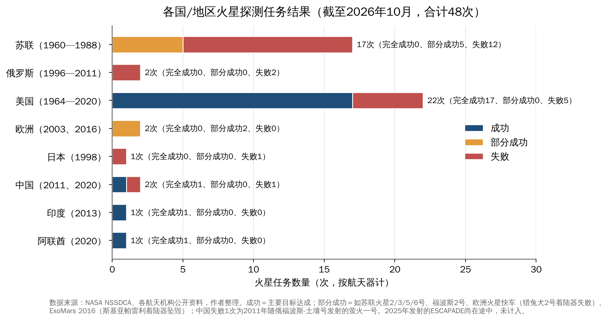
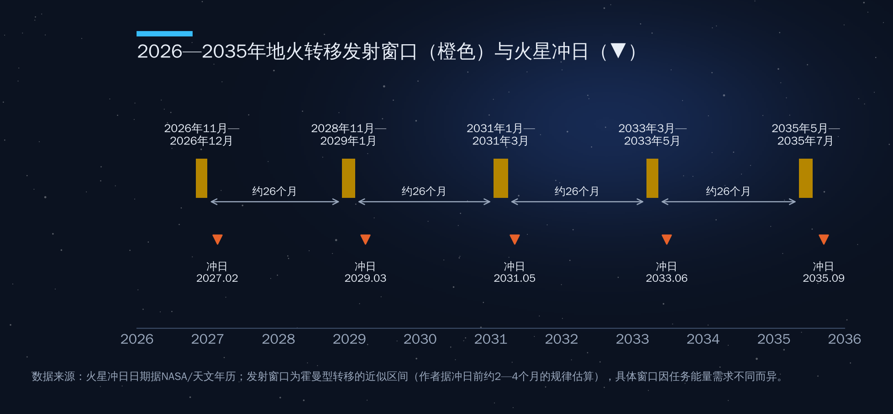
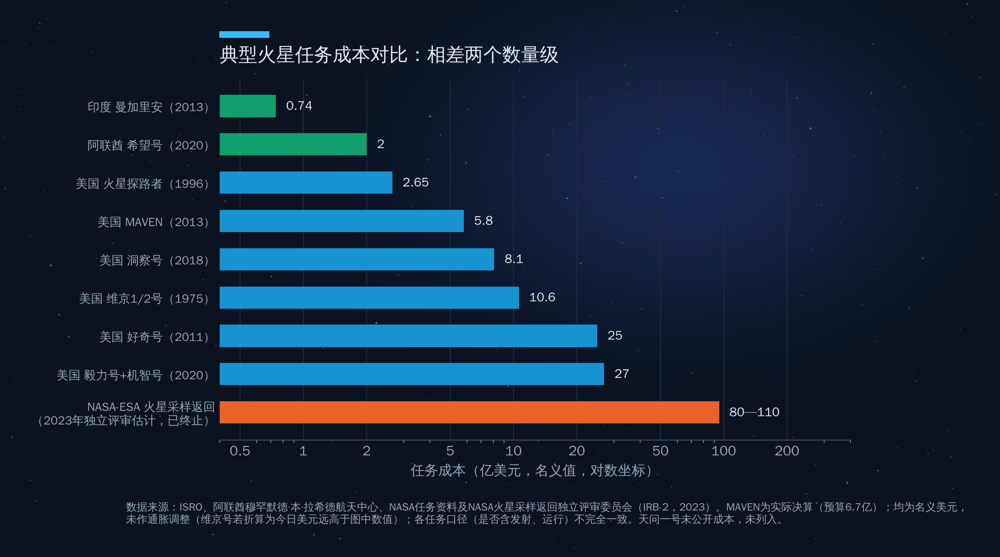

## 第11章　火星开发：历史、现状和未来计划

在火星杰泽罗撞击坑，美国"毅力号"火星车已经工作了五年多，钻取并密封了三十多管经过精心挑选的岩芯和土壤样品，其中一块编号为"蓝宝石峡谷"的岩石样品，被时任NASA代理局长达菲称为"可能是我们在火星上发现过的最清晰的生命迹象"。但这些样品可能很长时间都回不了地球：2026年1月，美国国会通过的2026财年拨款法案明确"不支持现有的火星采样返回计划"。

与此同时，中国的天问三号正按计划准备在2028年前后发射，目标是在2031年前后把火星样品带回地球。SpaceX曾计划在2026年11—12月的火星窗口发射无人星舰，如今重点已经转向月球。

火星是太阳系中除地球之外最可能孕育过生命、也最可能让人类长期生存的行星。本章回答三个问题：过去六十年人类在火星上做了什么、付出了什么代价？今天谁在火星上？未来十年谁会去、怎么去、值不值得去？

### 11.1　火星探测六十年：一部"失败率很高"的历史

#### 苏联：一连串的失败

人类第一次尝试探测火星是在1960年10月，苏联的两个探测器都在发射阶段失败。此后近三十年，苏联共向火星发射了17个探测器，没有一个完全实现预定目标。1971年12月，火星3号着陆器成为第一个在火星表面软着陆的航天器，但只传回了约20秒信号就永久沉默，原因可能是当时正在肆虐的全球性沙尘暴。1988年的福波斯1号、2号也先后失联。苏联解体后，俄罗斯的火星96号（1996年）和福波斯—土壤号（2011年）都未能离开地球轨道，后者搭载的中国第一个火星探测器萤火一号也随之失败。

#### 美国：从飞掠到"空中吊车"

美国的火星探测几乎就是一部教科书。1965年7月，水手4号首次成功飞掠火星，传回21张照片，显示火星表面布满撞击坑，一举打破了"火星运河"和"火星文明"的浪漫想象。1971年，水手9号成为第一个环绕另一颗行星运行的航天器，拍下了奥林匹斯山和水手号峡谷。1976年，海盗1号、2号成功着陆，首次在火星表面开展生命探测实验，结果至今仍有争议。

1990年代，NASA推行"更快、更好、更便宜"的理念。1997年7月，火星探路者用气囊弹跳着陆，带着第一辆火星车"索杰纳"，总成本仅约2.65亿美元。但这一理念也付出了代价：1999年，火星气候轨道器因一个团队使用英制单位、另一个团队使用公制单位而坠毁，火星极地着陆器也在着陆阶段失联。

2004年1月，"勇气号"和"机遇号"双子火星车着陆，设计寿命90个火星日，结果"勇气号"工作了6年，"机遇号"工作了14年多，行驶约45公里，找到了火星曾有液态水的确凿地质证据。2008年，凤凰号在火星北极直接挖到了水冰。2012年8月，重约900公斤的"好奇号"用"空中吊车"方式降落在盖尔撞击坑，证实这里曾是一个可能宜居的古湖泊，并检测到有机分子和甲烷浓度的季节变化。2018年着陆的洞察号记录了1300多次"火震"，第一次揭示了火星的内部结构。

2021年2月18日，"毅力号"降落在杰泽罗撞击坑——一个古代河流三角洲。它携带的"机智号"直升机于2021年4月19日完成人类第一次在另一颗行星上的有动力受控飞行。原计划只飞5次的技术演示机，最终飞了72次，累计飞行约17公里，直到2024年1月旋翼受损才结束任务。2025年9月，NASA公布了对"蓝宝石峡谷"样品的分析：岩石中的"豹纹斑点"状矿物结构可能与微生物活动有关，被称为"潜在生物特征"——当然，最终确认仍需把样品带回地球用最先进的仪器分析。

#### 成功率统计

如图11-1所示，按航天器计，人类迄今共发射约48个火星探测器，完全成功的只有20个左右，失败约21个，其余为部分成功。美国22次任务中17次成功，成功率约77%；苏联和俄罗斯19次任务无一完全成功。值得注意的是，21世纪之后的"新玩家"——印度、阿联酋和中国（天问一号）——都实现了首次独立任务即成功，这说明火星探测的门槛正在从"技术壁垒"转变为"工程和资金门槛"。

火星难在哪里？一是远：地火距离在约5500万公里到4亿公里之间变化，通信单程需要3到22分钟，进入、下降和着陆的"恐怖七分钟"只能完全依靠探测器自主完成。二是大气"不上不下"：火星大气只有地球的约0.6%，不足以像地球那样靠降落伞减速，又厚到会产生严重的气动加热。三是窗口稀缺：每约26个月才有一次发射机会，一旦失败，下一次就要等两年多。

### 11.2　今天谁在火星上：新玩家的崛起

#### 中国：天问一号"绕、着、巡"一次完成

2020年7月23日，天问一号由长征五号火箭在文昌发射，2021年2月10日进入环火轨道，5月15日着陆器携"祝融号"火星车在乌托邦平原南部着陆。中国由此成为第一个在首次火星任务中就同时实现"绕、着、巡"三项目标的国家，也是继美国之后第二个在火星上成功运行火星车的国家。

"祝融号"累计行驶1921米，超额完成了90个火星日的设计寿命。2022年5月，它因火星冬季和沙尘积累进入休眠，此后未能唤醒。基于祝融号次表层雷达和天问一号轨道器的数据，中国科学家发表了着陆区存在多层次表层沉积结构、可能存在古海洋岸线和近期水活动迹象等成果。天问一号环绕器至今仍在轨工作，并承担着中继通信任务。

#### 阿联酋："希望号"与阿拉伯世界的行星际时代

对于多哈的听众来说，最值得讲的火星故事可能来自海湾。2020年7月20日，阿联酋的"希望号"火星探测器由日本H-IIA火箭在种子岛发射，2021年2月9日成功进入环火轨道。它是阿拉伯世界的第一个行星际探测任务，阿联酋也由此成为继美国、苏联、欧洲航天局和印度之后第五个成功把探测器送入火星轨道的国家或机构——而且是首次尝试即成功。

"希望号"的科学定位很巧妙：它运行在约2万×4.3万公里的高椭圆轨道上，约55小时绕火星一圈，能在不同地方时观测整个火星，绘制了第一幅火星大气的"全天候、全球"气象图，并观测到火星离散极光和火卫二的近距离图像。这一观测角度填补了此前各国轨道器的空白，使一个小国的首个行星任务做出了大国任务没有做出的科学贡献。

更值得关注的是它的商业与发展逻辑。"希望号"总投入约2亿美元，从立项到发射约六年。阿联酋没有选择"买一颗探测器"，而是与美国科罗拉多大学博尔德分校大气与空间物理实验室、亚利桑那州立大学、加州大学伯克利分校合作，让阿联酋工程师全程参与设计、制造和测试，以"边做边学"的方式实现知识转移。据项目方介绍，团队以年轻工程师为主，科学团队中女性比例很高。"希望号"的真正产出，与其说是火星数据，不如说是一支能够做深空任务的本国队伍。

"希望号"背后是阿联酋更长远的国家叙事——2017年提出的"火星2117"战略，设想在一百年后在火星上建立人类定居点，并在迪拜规划了模拟火星环境的"火星科学城"。在此基础上，阿联酋又启动了前往小行星带、计划飞掠多颗小行星并在一颗小行星上着陆的"穆罕默德·本·拉希德探索者"任务。对于正在推动经济多元化的海湾国家而言，深空探测是一种"人才和产业发动机"：它的直接经济回报有限，但对理工科教育、高端制造和国家品牌的拉动是实实在在的。

#### 印度与欧洲

印度的"曼加里安"（火星轨道器任务）2013年11月发射，2014年9月24日入轨，使印度成为第一个首次尝试即成功进入火星轨道的国家和亚洲第一个到达火星的国家。它的成本约7400万美元，常被拿来与好莱坞电影《地心引力》的制作预算相比。该探测器在超期服役约8年后于2022年失联。

欧洲的火星快车自2003年起在轨运行至今，是仍在工作的"元老"之一；它携带的英国猎兔犬2号着陆器着陆后未能展开。2016年欧俄合作的ExoMars微量气体轨道器成功入轨，但斯基亚帕雷利着陆演示器坠毁。原定2022年发射的"罗莎琳德·富兰克林"号火星车因俄乌冲突导致欧俄合作中止，目前计划2028年发射、2030年着陆。美国2026财年预算申请曾提议取消对该任务的配套支持，但国会拨款予以保留，NASA于2026年4月重申承诺，提供"猎鹰重型"发射服务、制动发动机和放射性同位素加热单元。这辆火星车能钻取地下2米深处的样品，是寻找古代生命痕迹的重要工具。

**表11-1　火星在轨与地表活跃任务清单（截至2026年10月）**

| 任务 | 国家/机构 | 类型 | 到达时间 | 状态 |
|---|---|---|---|---|
| 火星奥德赛号 | 美国 | 轨道器 | 2001年 | 在轨，服役最久 |
| 火星快车 | 欧洲 | 轨道器 | 2003年 | 在轨 |
| 火星勘测轨道器（MRO） | 美国 | 轨道器 | 2006年 | 在轨，主要中继 |
| MAVEN | 美国 | 轨道器 | 2014年 | 2025年12月失联，2026年6月NASA宣布无法恢复、任务结束 |
| 微量气体轨道器（TGO） | 欧洲 | 轨道器 | 2016年 | 在轨 |
| 希望号 | 阿联酋 | 轨道器 | 2021年 | 在轨 |
| 天问一号环绕器 | 中国 | 轨道器 | 2021年 | 在轨 |
| 好奇号 | 美国 | 火星车 | 2012年 | 工作中 |
| 毅力号 | 美国 | 火星车 | 2021年 | 工作中，持续采样 |
| 祝融号 | 中国 | 火星车 | 2021年 | 2022年5月起休眠 |
| ESCAPADE（双星） | 美国 | 轨道器 | 预计2027年9月 | 2025年11月发射，2026年11月地球借力后奔火 |

### 11.3　未来十年：采样返回、星舰与"百万人城市"

#### 火星采样返回：美国为何放弃

火星采样返回（MSR）曾是美国行星科学界的头号优先事项。原方案由NASA和欧洲航天局合作：毅力号采集样品，NASA的着陆器和火星上升火箭把样品送入火星轨道，欧洲的地球返回轨道器捕获并带回地球。

问题出在成本。2023年9月，NASA的独立评审委员会估算MSR总成本将达80亿—110亿美元，且2030年代前期难以把样品带回，这相当于再造两到三个毅力号。2025年1月，NASA提出两种简化方案，估算成本降至约58亿—77亿美元，样品回到地球的时间推到2035—2039年之间。但政府更替后，2026财年预算申请提出终止MSR；2026年1月，国会通过的拨款法案在解释性声明中写明"如预算所提议，本协议不支持现有的火星采样返回计划"，仅安排1.1亿美元设立"火星未来任务"项目，用于相关技术研发。2026年3月，欧洲航天局成员国也要求取消地球返回轨道器（空客2020年获得的合同价值约4.91亿欧元），ESA转而与空客商讨部分硬件的转用。

毅力号仍在工作、仍在采样，但截至目前，没有任何获批的任务会去取回这些样品。这是一个典型的"成本失控导致战略收缩"的案例，也给了中国一个机会。

#### 天问二号与天问三号：中国的采样返回路线

天问二号于2025年5月29日发射，目标是近地小行星"卡莫奥雷瓦"（2016 HO3）——一颗可能来自月球的"准卫星"。经过约400天、10亿公里的飞行，它于2026年7月抵达小行星附近，开始全球测绘和采样点选择。这颗小行星直径只有几十米，约28分钟自转一周，采样难度很高。天问二号设计了悬停、触碰、附着三种采样方式，目标采集约100克样品，按计划在约一年的近距探测后实施采样，于2027年底释放返回舱送回地球，之后主探测器将继续飞往主带彗星311P。它不是火星任务，却是中国深空采样返回能力的又一次"练兵"。

天问三号是中国的火星采样返回任务，计划2028年前后用两枚长征五号火箭分别发射着陆上升组合体和轨道返回组合体，2031年前后把约500克火星样品带回地球；据工程总设计师介绍，探测器2026年起转入正样研制。如果按计划实施，中国很可能成为第一个从火星表面带回样品的国家。另一个竞争者来自日本：火卫探测任务MMX定于2026年10月20日用H3火箭发射，计划从火卫一采样，并于2031财年返回地球。中国的方案比美国原方案简单：不依赖先期由火星车采样存储，而是"着陆即采样、采样即上升"，以牺牲样品多样性换取工程可行性和成本可控。

#### 火星的"CLPS化"：商业服务能否复制月球模式

MSR的终止并不意味着美国退出火星。一个值得关注的趋势是，NASA正尝试把在月球上验证过的"购买服务"模式移植到火星。2024年5月，NASA选定SpaceX、蓝色起源、洛克希德·马丁、联合发射联盟、Astrobotic、萤火虫等9家公司开展12项概念研究，探讨以商业方式提供火星载荷运输、中继通信和地表成像等服务。2025年7月生效的美国预算调节法案中，还安排了约7亿美元用于以商业方式采购一颗火星通信轨道器——这颗中继卫星将接替日益老化的火星奥德赛号和MRO，为未来的着陆任务提供数据"高速公路"。2026年9月，NASA宣布由蓝色起源以固定总价（最高约7亿美元）承建，基于其"蓝环"平台，要求2028年底前交付、2030年前后在火星投入运行。2025年11月，NASA的ESCAPADE双星任务搭乘蓝色起源"新格伦"火箭发射，单次任务成本不到1亿美元，是"小而快"的火星科学新范式。

如果这一模式成功，火星探测的成本结构可能像月球一样被重塑：国家机构从"造航天器"转向"买数据和服务"，商业公司则用同一套平台服务多个客户。但火星与月球有一个根本区别——26个月一次的窗口使"多次射门"的试错周期拉长了数十倍，商业公司很难承受"失败一次就要再等两年"的现金流压力。这也是为什么火星的商业化会比月球慢得多。

#### SpaceX：从"2026年五艘星舰"到"先去月球"

2016年，马斯克在国际宇航大会上提出"让人类成为多行星物种"，设想用上千艘可重复使用的飞船，在每个发射窗口集中出发，最终在火星建立百万人规模、可以自给自足的城市。2024年9月，他表示首批无人星舰将在2026年的地火窗口发射，此后又提出该窗口发射约5艘；2025年5月，他把这一可能性说成"五五开"，关键制约是在轨推进剂加注。

但到2026年2月，马斯克宣布SpaceX的近期重点转向在月球建设"自我生长的城市"，称月球城市不到10年就可能实现，而火星需要20年以上，并表示将在约5—7年后启动火星城市建设。SpaceX官网对火星货运着陆的表述已改为"不早于2028年"。综合来看，2026年11—12月的火星窗口出现星舰的可能性已经极低——截至本稿写作时，SpaceX尚无正式声明明确放弃该窗口，作者演讲时可根据最新情况更新。

火星窗口的节奏决定了火星开发的节奏。如图11-2所示，地球与火星的会合周期约780天，即每约26个月出现一次最省能量的发射窗口，每次持续一两个月。2026年之后的窗口大致在2028年底到2029年初、2031年初、2033年春和2035年夏。换言之，从现在到2035年，人类只有五次机会。按每个窗口发射一批、每批验证一项关键技术计算，一项新技术从首次试验到载人应用，往往需要三到四个窗口、近十年时间。

#### "百万人城市"的可行性：一个简单估算

不妨做一个粗略估算。假设每位火星定居者需要从地球运去约10吨的物资（居住设施、设备、初期食物和工业"种子"），百万人就需要约1000万吨。即便每艘星舰向火星表面运送100吨，也需要10万艘次着陆；按马斯克设想的每个窗口1000艘计算，需要100个窗口，也就是约200年。即使通过原位资源利用把人均需求降低一个数量级，也需要20年以上的持续高强度投入。这并不是说火星城市不可能，而是说它更像一项跨越几代人的文明工程，而非一个十年期的商业项目。

### 11.4　横亘在面前的四道难题

**表11-2　地球、月球、火星主要环境参数对比**

| 参数 | 地球 | 月球 | 火星 |
|---|---|---|---|
| 与地球距离 | — | 约38万公里 | 约5500万—4亿公里 |
| 单程通信延迟 | — | 约1.3秒 | 约3—22分钟 |
| 表面重力 | 1g | 约0.17g | 约0.38g |
| 大气压 | 1个大气压 | 几乎为零 | 约为地球的0.6% |
| 一天长度 | 24小时 | 约29.5个地球日 | 24小时39分35秒 |
| 一年长度 | 365天 | — | 约687个地球日 |
| 往返发射机会 | — | 随时 | 每约26个月一次 |

#### 第一道难题：通信延迟

地火单程通信延迟在约3分钟到22分钟之间。这意味着火星上的任何操作都无法实时遥控，"有问题打电话问地面"在火星上行不通。每隔约26个月，太阳还会运行到地球与火星之间，形成约两周的"日凌"通信中断期。未来的火星基地必须具备高度的自主决策能力，人工智能和自主机器人将是火星开发的"标配"，这也是火星技术向地球溢出最快的领域之一。

#### 第二道难题：辐射

火星没有全球性磁场，大气稀薄，宇航员将长期暴露于银河宇宙射线和太阳高能粒子之中。好奇号在飞往火星途中搭载的辐射探测器测量显示，按往返各约180天计算，仅航行阶段的累积剂量当量就约为0.66希沃特；火星表面的剂量率约为每天0.64毫希沃特。一次包括约500天火星驻留的典型任务，累计剂量可能接近或超过1希沃特，高于NASA为宇航员设定的职业生涯上限600毫希沃特。屏蔽、更快的推进方式（如核热推进）和地下居住，是可能的应对方向。

#### 第三道难题：原位资源利用

不可能把所有物资都从地球运去，必须"就地取材"。毅力号上的MOXIE实验装置在2021—2023年间进行了16次运行，从火星大气的二氧化碳中累计制取约122克氧气，最高产率约每小时12克，纯度达98%以上，首次证明了在另一颗行星上制氧的可行性。不过，一次载人返回任务所需的上升推进剂氧化剂就要数十吨，产量需要提高数万倍。火星的水资源则相对丰富：中纬度地区存在地下冰，2024年发表的一项研究根据洞察号地震数据推断，火星中地壳11.5—20公里深处可能存在大量液态水，但深度远超工程可及范围。以水和二氧化碳为原料，通过萨巴蒂尔反应制造甲烷和氧气——这正是星舰选择甲烷作为燃料的原因。

#### 第四道难题：火星时间与人体

火星的一天（称为"火星日"，sol）比地球长约39分钟，一年约为687个地球日。毅力号和好奇号的地面团队在任务初期都按"火星时间"作息，每天往后推迟约40分钟，几周后就会出现明显的生物钟紊乱。长期生活在0.38g重力下对人体骨骼、肌肉和心血管的影响，目前几乎没有数据。火星上的时间标准、日历和法律体系，也将是未来"火星社会"必须解决的制度问题。

### 11.5　火星经济学：为什么难以形成"经济"，又为什么值得投资

如图11-3所示，火星任务的成本跨越两个数量级：印度曼加里安约0.74亿美元，阿联酋希望号约2亿美元，美国好奇号和毅力号各约25亿—27亿美元，而被终止的火星采样返回计划估算高达80亿—110亿美元。值得注意的是，成本与成果并非线性关系——小国的轨道器以美国大型火星车十分之一的成本，也能做出独特的科学贡献。

#### 为什么本世纪难以形成"火星经济"

从经济学角度看，一个地区要形成"经济"，至少需要满足以下条件之一：有可以低成本输出的产品，有持续的外部需求，或者有足够大的内部市场。火星目前三者都不具备。第一，火星上没有任何东西值得运回地球——即使发现了贵金属，扣除运输成本后也毫无竞争力。第二，对火星的需求几乎全部来自政府科研预算和少数企业家的个人愿景，没有商业客户。第三，在百万人规模的定居点形成之前，火星"内部市场"不存在。再加上26个月一次的窗口，使任何商业模式都无法按正常节奏迭代。因此，与月球相比，火星在本世纪内更可能是一个"成本中心"，而非"利润中心"。

#### 为什么仍然值得投资

但这并不意味着火星不值得投资。理由有三。

**一是技术溢出。**火星任务对能源、生命保障、自主机器人、精确着陆、闭环生态和原位资源利用提出了极限要求，这些技术一旦成熟，往往会在地球上找到更大的市场：MOXIE所用的固体氧化物电解技术与地球上的绿色制氢同源；闭环水循环和废物再利用技术可以服务干旱地区；火星车的自主导航与地球上的自动驾驶、矿山机器人一脉相承。对于海湾国家而言，沙漠环境下的水资源循环、太阳能利用和极端环境建筑，与火星基地需要的技术高度重叠——"火星科学城"的设想并非偶然。

**二是人才与国家能力。**阿联酋"希望号"和印度"曼加里安"证明，一个中等国家可以用数亿美元的投入，换来一支具备深空任务能力的工程队伍和国际声望。这种"能力投资"的回报不体现在任务本身，而体现在整个高科技产业链上。

**三是"文明保险"。**地球面临小行星撞击、超级火山、全球性核战争或大流行病等低概率、高后果的风险。让人类在另一颗行星上拥有一个能够自我维持的据点，相当于给人类文明买一份保险。当然，也有学者反驳说，火星环境比地球上最糟糕的灾后环境还要恶劣，在地球上建设避难设施要便宜得多。这场争论没有标准答案，但一个简单的事实是：全球每年用于火星探测的公共投入不过数十亿美元，粗略估算还不到全球GDP的十万分之五。用如此小的比例为文明的长期存续购买一个"期权"，并不昂贵。

#### 本章要点

1. 火星探测六十年，人类共发射约48个火星探测器，约一半失败或部分失败；美国成功率约77%，苏联和俄罗斯无一完全成功；21世纪的新玩家——中国、印度、阿联酋——都实现了首次任务即成功。
2. 阿联酋"希望号"（2021年入轨）是阿拉伯世界首个行星际任务，以约2亿美元投入和"合作研制、知识转移"模式培养了本国深空队伍，是中等国家参与深空探测的典范。
3. 美国火星采样返回计划因成本膨胀至80亿—110亿美元，于2026年1月被国会终止；中国天问三号计划2028年前后发射、2031年前后返回，有望率先带回火星样品。天问二号已于2026年7月抵达目标小行星。
4. SpaceX已把近期重点转向月球，2026年火星窗口发射星舰的可能性极低；地火窗口每约26个月一次，到2035年只有五次机会，"百万人火星城市"是跨越几代人的文明工程。
5. 火星在本世纪难以形成自我循环的"经济"，但其技术溢出、人才培养和"文明保险"价值，使之成为一项值得以小比例长期投入的文明级投资。
