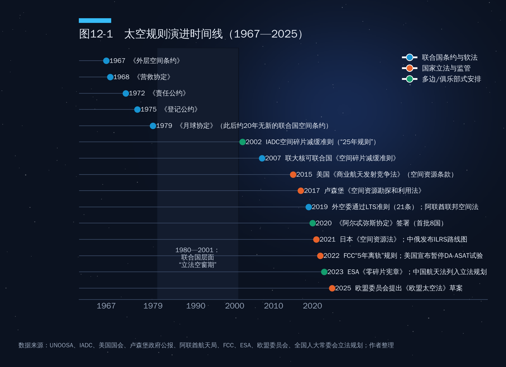
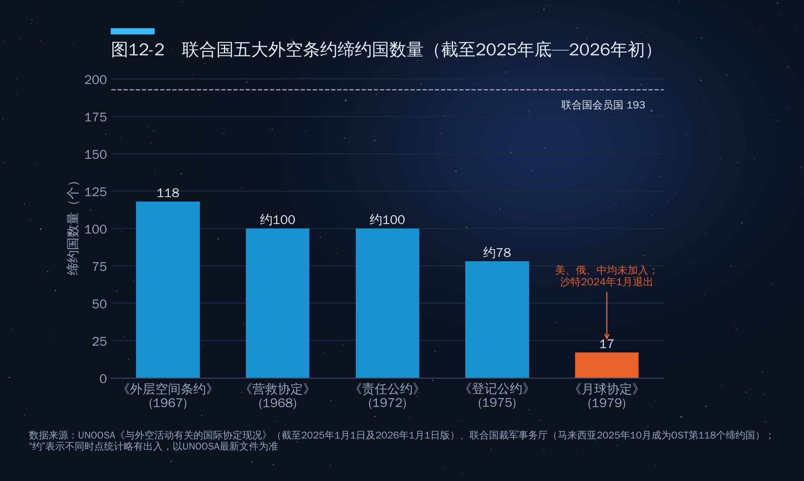
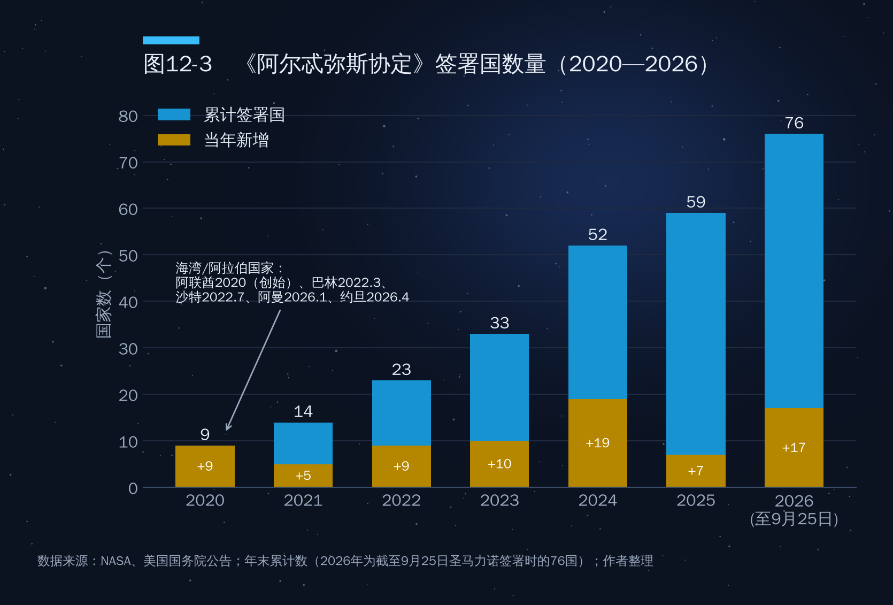
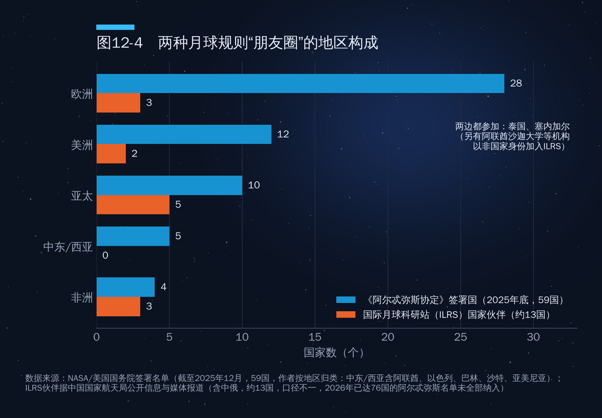

## 第12章　国际空间法体系

2020年12月，美国航空航天局（NASA）宣布与四家公司签订月壤采购合同，金额从1美元到1.5万美元不等。其中科罗拉多州的Lunar Outpost公司报价1美元，日本ispace公司及其欧洲子公司各报价5000美元。合同要求企业在月球上采集少量月壤或岩石，在原地拍照，然后把"所有权"转让给NASA。这笔交易的经济意义几乎为零，法律意义却很大：它第一次在政府合同层面确认，私人企业可以拥有并出售从天体上取得的资源。

这就引出了本章要处理的根本问题：1967年《外层空间条约》规定外层空间"不得据为己有"，那么企业挖出来的月壤能不能归自己？谁来授权，谁来监督，出了事谁来赔？规则由谁来定？要回答这些问题，得先把现行的国际空间法体系梳理清楚。

### 12.1　联合国外空委与"五大条约"

#### 外空委：从24国到110国

国际空间法的主要"立法机关"是联合国和平利用外层空间委员会（COPUOS，简称"外空委"）。1957年苏联发射第一颗人造卫星后，联合国大会于1958年设立特设委员会，1959年改为常设委员会，首批成员24个。外空委下设科学技术小组委员会和法律小组委员会，秘书处由设在维也纳的联合国外层空间事务厅（UNOOSA）承担。

外空委实行协商一致原则。冷战时期这一机制反而促成了五项条约，因为美苏都明白只有彼此能接受的规则才有意义；成员增多以后，门槛也越来越高。2025年外空委有104个成员国；据安全世界基金会（SWF）2026年7月的分析，科特迪瓦、冈比亚、洪都拉斯、马尔代夫、马耳他、津巴布韦6国在2026年加入，成员总数达到110个。太空已不再是少数大国的俱乐部，但要在100多个立场各异的国家之间达成新的有约束力条约，几乎不可能。

#### 五大条约：一张"总表"

1967年到1979年的12年间，外空委先后拟定了五项条约，构成国际空间法的"硬法"核心（表12-1）。

**表12-1　联合国五大外空条约概览**

| 条约（简称） | 开放签署/生效 | 核心内容 | 缔约国（约） |
|---|---|---|---|
| 《外层空间条约》 | 1967年开放签署，1967年10月生效 | 探索利用自由；不得据为己有；禁止在轨部署核武器及大规模毁灭性武器；国家对本国活动负国际责任 | 118 |
| 《营救协定》 | 1968年开放签署，1968年12月生效 | 营救和送回宇航员；送回外空物体 | 约100 |
| 《责任公约》 | 1972年开放签署，1972年9月生效 | 发射国对地面损害负绝对责任，对外空损害负过错责任；索赔程序 | 约100 |
| 《登记公约》 | 1975年开放签署，1976年9月生效 | 发射国建立国家登记册并向联合国秘书长通报 | 约78 |
| 《月球协定》 | 1979年开放签署，1984年7月生效 | 月球及其自然资源为"人类共同继承财产"；未来建立国际开发制度 | 17 |

注：缔约国数据综合UNOOSA截至2025年1月1日的统计及此后的加入情况；马来西亚2025年10月21日成为《外层空间条约》第118个缔约国（联合国裁军事务厅）。

如图12-1所示，五项条约集中在1967—1979年，此后联合国再没有产生新的空间条约，规则供给转向三条渠道："软法"、国家立法和少数国家之间的协定。

#### 《外层空间条约》：太空的"宪法"

《外层空间条约》全文17条，对太空经济影响最大的是以下几条：

- **第一条（自由原则）**：各国可在平等基础上自由探索和利用外空，自由进入天体的一切区域。
- **第二条（不得据为己有）**：外层空间，包括月球和其他天体，"不得由国家通过提出主权主张，通过使用或占领，或以任何其他方法，据为己有"。
- **第四条（部分非军事化）**：不得在绕地球轨道放置携带核武器或任何其他大规模毁灭性武器的物体；月球和其他天体专用于和平目的，禁止建立军事基地。这条并未禁止常规武器和反卫星武器。
- **第六条（国家责任）**：各国对本国在外空的活动负国际责任，"不论这类活动是由政府机构还是非政府实体进行"；非政府实体的活动"应经有关缔约国批准并受其持续监督"。
- **第七、八条（赔偿与管辖）**：发射国对其物体造成的损害负责；登记国对其外空物体保有管辖权，所有权不因进入太空而改变。
- **第九条（适当顾及与协商）**：各国应"适当顾及"他国利益，可能造成有害干扰的活动应事先磋商。

第二条加第六条，就是太空经济的基本法律结构：太空不能被任何国家占有，企业可在国家批准和监督下活动，国家对外"兜底"，类似海洋法中"公海自由"加"船旗国管辖"。

#### 三部配套条约：营救、责任、登记

《营救协定》规定，缔约国应营救遇险宇航员并迅速送回，境内发现的外空物体经请求应予送回，费用由发射当局承担。

《责任公约》是太空经济中最接近"侵权法"的条约，核心有三点：

1. **"发射国"的宽泛定义**：发射物体的国家、促使发射的国家、从其领土发射的国家、从其设施发射的国家，四类都算发射国。一颗由A国企业制造、B国公司运营、在C国发射场升空的卫星，可能对应多个发射国，它们承担连带责任。
2. **双重归责原则**：外空物体对地球表面或飞行中的航空器造成损害，发射国负**绝对责任**，不论有无过错；在地球表面以外（即在太空中）对另一国外空物体造成损害，适用**过错责任**。
3. **索赔程序**：受害国通过外交途径索赔，原则上在损害发生或查明责任国后一年内提出；一年内谈判不成，可设立求偿委员会。委员会的裁决只有在双方事先同意时才有约束力，否则仅具建议性质。

《登记公约》要求发射国建立本国登记册，并向联合国秘书长报送物体名称、编号、发射日期和地点、基本轨道参数和功能。登记看似技术性事务，却是确定管辖权和责任归属的前提：没有登记，就说不清一块碎片属于谁。

#### 《月球协定》：为何只有17个缔约国

如图12-2所示，五大条约中《外层空间条约》缔约国最多，《月球协定》最少，截至目前只有17个缔约国，另有4国（法国、印度、罗马尼亚、危地马拉）签署而未批准。

《月球协定》遇冷，主要在其第十一条。该条宣布"月球及其自然资源均为全体人类的共同财产"（通称"人类共同继承财产"），规定月球表面、表面下层及其自然资源"均不应成为任何国家、政府间或非政府国际组织、国家组织或非政府实体或任何自然人的财产"，并要求缔约国在开发"即将可行时"建立一个"国际制度"，公平分享收益，特别照顾发展中国家的利益和需要。

这套设计与《联合国海洋法公约》的"国际海底区域"制度一脉相承，体现了70年代"国际经济新秩序"思潮，因而遭到美国国会和商业航天界强烈反对：国际开发制度谈出来之前，企业无法确定投资回报。结果，美国、苏联/俄罗斯、中国这三个具备独立载人航天能力的国家都没有加入，欧洲航天大国中只有奥地利、比利时、荷兰批准。

2023年1月，沙特阿拉伯通知退出《月球协定》，退出于2024年1月5日生效，缔约国从18个降到17个。沙特此前已在2022年7月签署《阿尔忒弥斯协定》，这一进一退很能说明问题：当一个国家想在月球资源开发中占有一席之地，"人类共同继承财产"条款就成了包袱。值得注意的是，海湾国家中科威特至今仍是《月球协定》缔约国；澳大利亚、墨西哥、智利、秘鲁、荷兰、比利时、亚美尼亚等国一面是《月球协定》缔约国，一面又签署了《阿尔忒弥斯协定》，两份文件在资源问题上的立场如何调和，国际法学界仍有争论。

#### "不得据为己有"与资源开发的张力

《外层空间条约》第二条禁止的是"国家"据为己有。由此产生两种解释：

- **限制性解释**：既然国家不能占有，国家授权的企业当然也不能占有，任何开采都需要国际制度许可。这种观点在不少发展中国家和部分欧洲学者中有市场，俄罗斯官方也多次在外空委批评单边资源立法。
- **许可性解释**：第二条禁止的是对"领土"的主权主张，并不禁止对"开采出的资源"取得所有权，就像公海不属于任何国家，但渔民可以拥有捕到的鱼。美国、卢森堡、阿联酋、日本的国内立法，以及《阿尔忒弥斯协定》第十条，都采取这种解释。

从实践看，许可性解释正在成为主流：阿波罗月岩、苏联月球号样品、嫦娥五号和六号样品都由各国政府所有并用于交换和展示，苏联月球号样品1993年还曾在苏富比拍卖，从未被视为违反第二条。分歧集中在规模化开采上：如果一家公司在月球南极某个永久阴影坑长期作业，事实上排除了他人进入，这算不算变相"占有"？这个问题的答案，正是12.4节要讨论的"安全区"之争。

### 12.2　国家责任与赔偿

#### 宇宙954号：迄今唯一依《责任公约》正式索赔的案例

1978年1月24日，苏联海洋侦察卫星"宇宙954号"失控再入大气层，碎片散落在加拿大西北地区。这颗卫星搭载一座以浓缩铀为燃料的核反应堆，放射性碎片沿数百公里的轨迹分布在大约12万平方公里的区域内。加拿大与美国随即开展代号"晨光行动"的联合搜寻清理，持续数月。

1979年，加拿大依据《责任公约》和一般国际法原则向苏联提出索赔，金额约604万加元，主要是搜寻、回收和清理费用。苏联最初对部分费用的可赔性有异议，双方经过两年谈判，于1981年4月2日在莫斯科签署议定书，苏联一次性支付300万加元，作为"全部和最终解决"。加拿大外交部后来的分析承认，拿到的赔偿不到索赔额的一半，和解考虑了以往一次性解决的先例、避免谈判久拖不决以及各种政治因素。

这个案例在空间法上有三点启示。第一，《责任公约》的绝对责任条款确实管用，苏联没有否认责任，只是在数额上讨价还价。第二，赔偿最终仍靠外交谈判，求偿委员会机制至今从未启用。第三，近50年来这是唯一一次国家之间依《责任公约》正式索赔并获赔的案例，说明公约实际适用的门槛很高。

此后的坠落事件大多没有走到这一步。1979年美国"天空实验室"坠落在西澳大利亚，当地小镇象征性地向NASA开出400美元的"乱扔垃圾"罚单；2024年3月，国际空间站抛弃的电池托架残骸击穿美国佛罗里达州一户民宅屋顶，因肇事物体与受害人同属美国，适用的是美国国内法。随着再入频次大幅上升，这类事件只会越来越多。

#### 在轨碰撞：过错责任的困境

如果损害发生在太空，《责任公约》要求证明对方"有过错"。问题在于，太空里没有交通规则，也就很难界定什么叫"过错"。

2009年2月10日，美国铱星33号与已失效的俄罗斯宇宙2251号卫星在西伯利亚上空约790公里处相撞，这是首次完整卫星之间的意外碰撞，产生约2000块可编目碎片。事后双方都没有索赔：宇宙2251号早已失效、无法机动，铱星能机动却没有避让义务。没有优先通行规则，就说不清过错在谁。

2021年12月，中国向联合国秘书长提交照会，称中国空间站分别于2021年7月1日和10月21日为规避星链卫星实施了两次紧急避碰机动，要求美方履行条约义务。事件未造成损害，却暴露了第九条"适当顾及"和"事先磋商"义务在星座时代的模糊之处：运营上万颗卫星的企业与载人空间站之间，由谁避让、提前多久通报、通过什么渠道沟通？现行条约没有答案。

#### 第六条：从"国家航天"到"国家监管航天"

《外层空间条约》第六条要求，非政府实体的外空活动"应经有关缔约国批准并受其持续监督"。这条在1967年几乎只是保留措辞，今天却成了太空商业化的法律枢纽。一是各国必须建立许可制度：在美国，私营公司发射卫星至少要过联邦航空局（FAA）的发射许可、联邦通信委员会（FCC）的频率许可，遥感卫星还需商务部许可，监管松紧直接影响企业成本，各国由此展开"监管竞争"。二是国家为企业"兜底"，因而要求企业买保险：美国对商业发射实行"保险加政府赔偿"的分层机制，法国2008年《空间活动法》、英国2018年《航天产业法》也有类似安排。第六条把国际法上的"国家责任"转化为国内法上的"许可加保险"，这正是太空经济商业化运作的制度基础。

### 12.3　国家立法与资源开发权

既然联合国层面迟迟谈不出资源开发规则，一些国家就选择自己先立法。从2015年到2021年，美国、卢森堡、阿联酋、日本四国相继以国内法的形式承认企业对其所获太空资源的权利（表12-2）。

**表12-2　四国空间资源立法比较**

| 国家 | 法律与时间 | 核心规定 | 资格与监管 |
|---|---|---|---|
| 美国 | 《美国商业航天发射竞争法》第四编，2015年11月25日签署 | 从事商业开采的美国公民"有权"取得其获得的小行星资源或空间资源，包括占有、拥有、运输、使用和出售 | 须遵守美国法律和国际义务；明确声明美国不对任何天体主张主权 |
| 卢森堡 | 《空间资源勘探和利用法》，2017年7月20日通过，8月1日生效 | 第一条："空间资源可以被占有" | 须经经济部和主管部长批准；申请者须为在卢森堡注册的公司 |
| 阿联酋 | 2019年第12号联邦法《空间部门监管法》，2019年12月颁布 | 将空间资源的勘探、开采和利用纳入许可范围，规定相关权利义务 | 阿联酋航天局为监管机构，统一管理许可、登记、责任与保险 |
| 日本 | 《促进空间资源勘探和开发相关商业活动法》，2021年6月通过，同年12月生效 | 经许可开采空间资源者，以所有意思占有即取得所有权 | 在2016年《宇宙活动法》框架下由内阁府审批 |

#### 美国：2015年《商业航天发射竞争法》

2015年11月25日，奥巴马总统签署《美国商业航天发射竞争法》。其第四编《空间资源勘探和利用法》首次以国内法形式明确，美国公民对其获得的空间资源享有"占有、拥有、运输、使用和出售"的权利；同时特意写明，美国并不因此对任何天体主张主权或所有权。这就是"许可性解释"的立法版本：天体不能占有，从天体上取下来的东西可以拥有。

2020年4月，特朗普总统签署第13914号行政令，进一步明确美国"不将外层空间视为全球公域"，并表示美国不认为《月球协定》是指导各国开发外空资源的有效或必要文件，要求国务院反对任何国家或组织将该协定视为国际习惯法。几个月后，《阿尔忒弥斯协定》问世。

#### 卢森堡：小国的大战略

卢森堡人口不到70万，却是全球卫星产业的重镇，欧洲最大的卫星运营商SES就诞生于此。2016年2月，卢森堡政府发起"太空资源"计划；2017年7月20日通过的《空间资源勘探和利用法》第一条只有一句话："空间资源可以被占有。"这是欧洲第一部、全球第二部此类法律。

卢森堡的思路是"以法律吸引公司"：在卢森堡注册并获批的企业，无论资本来自哪国，都可依其法律开展资源活动。政府还入股了美国小行星采矿公司"行星资源"和"深空工业"，两家公司在2018—2019年相继被收购或转型，说明立法可以降低制度不确定性，却替代不了技术和市场的成熟。卢森堡随后成立航天局，并与欧洲航天局共建欧洲空间资源创新中心（ESRIC），转向月球资源技术和产业孵化。

#### 阿联酋：海湾国家的第一部综合空间法

2019年12月，阿联酋颁布2019年第12号联邦法《空间部门监管法》，这是海湾地区第一部综合性空间法。该法覆盖空间活动许可、物体登记、责任与保险、空间碎片减缓，也把空间资源的勘探、开采和利用纳入许可管理，由成立于2014年的阿联酋航天局统一监管。

阿联酋的立法有清晰的产业逻辑。2020年7月，"希望号"火星探测器发射，2021年2月进入火星轨道，阿联酋成为第一个探测火星的阿拉伯国家；穆罕默德·本·拉希德航天中心研制的"拉希德"月球车搭载日本ispace公司的着陆器，2023年4月着陆失败，但它表明阿联酋已经进入月球探测的"牌桌"。有了完整的国内法，阿联酋才能为外国企业提供可预期的许可环境，把国家航天计划延伸为产业政策。阿联酋同时是《阿尔忒弥斯协定》的8个创始签署国之一，国内法与国际承诺在资源问题上保持了一致。

#### 日本：2021年《空间资源法》

2021年6月，日本通过《空间资源法》，同年12月生效，成为第四个、亚洲第一个通过此类立法的国家。该法在2016年《宇宙活动法》框架下运作，经许可开采空间资源的企业以所有的意思占有即取得所有权，直接服务于ispace等本国企业。

#### 中国：航天立法的进展

中国是航天大国中少数尚无综合性航天法的国家。现行规范主要是部门规章和规范性文件，例如2001年的《空间物体登记管理办法》、2002年的《民用航天发射项目许可证管理暂行办法》，以及空间碎片减缓、商业运载火箭管理等方面的规定。卫星频率和轨道资源的国际申报与协调，则主要依据《无线电管理条例》及工业和信息化部的配套规定。

航天法的立法已经酝酿多年。2018年，航天法被列入十三届全国人大常委会立法规划的第二类项目；2023年9月公布的十四届全国人大常委会立法规划中，航天法仍列在第二类项目（"需要抓紧工作、条件成熟时提请审议的法律草案"），提请审议机关为国务院和中央军委。中国代表2023年在外空委法律小组委员会上表示，《航天法（草案）》的编写论证"已取得阶段性进展"。截至本文写作时（2026年10月），公开渠道尚未检索到草案提请全国人大常委会初次审议的报道。

在资源问题上，中国没有效仿单边立法，而是强调在外空委框架下多边讨论。对中国商业航天而言，综合性航天法缺位意味着发射许可、在轨责任、保险和资源权利缺乏法律层面的稳定预期，这是规模扩张之后必须补上的"制度短板"。

### 12.4　《阿尔忒弥斯协定》与国际月球科研站：两种规则路径

#### 十大原则与"安全区"

2020年10月13日，美国与澳大利亚、加拿大、意大利、日本、卢森堡、阿联酋、英国共8国签署《阿尔忒弥斯协定》。它不是条约，而是一份不具法律约束力的"政治承诺"，以《外层空间条约》为基础，提出民用太空探索的十项原则：

1. 和平目的；
2. 透明度（公开国家航天政策和计划）；
3. 互操作性（发展通用的基础设施标准）；
4. 紧急援助；
5. 外空物体登记；
6. 公开科学数据；
7. 保护外空遗产（如阿波罗登月点）；
8. 空间资源；
9. 活动冲突消解（即"安全区"）；
10. 轨道碎片减缓。

最具争议的是两条。第十条明确，空间资源的开采和利用"本身不构成"《外层空间条约》第二条所禁止的据为己有，把"许可性解释"写进了多边文件。第十一条（冲突消解）提出"安全区"概念：一国在月球等天体上开展活动时，可以划定一个区域，在该区域内其正常作业或异常事件可能对他国造成有害干扰；签署方应相互通报安全区的位置和范围，安全区应当是临时的、范围合理的，并尊重各国自由进入天体一切区域的权利。

支持者认为，这只是把第九条"适当顾及"义务具体化，如同海上石油平台周围的安全区。批评者指出，月球上真正有价值的地点非常集中，南极永久阴影区的水冰和"永昼峰"屈指可数，先到者划下安全区，就可能构成事实上的"先占先得"。俄罗斯官员曾公开批评该协定是以美国为中心的"圈地"安排，中国官方也强调外空规则应在联合国框架下由各国共同制定。

#### 签署国从8个到76个

如图12-3所示，《阿尔忒弥斯协定》的扩张速度远超外界预期。2020年底有9国（8个创始国加乌克兰），2021年底14国，2022年底23国（尼日利亚、卢旺达成为首批非洲签署国），2023年底33国（含印度、德国），2024年一年新增19国，年底达到52国，2025年底59国。2026年再次加速：阿曼1月26日在马斯喀特签署，成为第61个签署国；约旦4月签署，爱尔兰5月成为第66国，土耳其8月31日成为第71国；9月又有吉布提、阿尔巴尼亚、克罗地亚、科特迪瓦、圣马力诺相继加入。截至2026年9月25日，签署国达到76个，约占全世界国家的四成。

扩张快的原因是门槛低：协定不具约束力，不要求出资，也不要求参与登月计划本身。对很多中小国家，签署是低成本的外交姿态和与NASA合作的入场券；也正因如此，协定的实际约束力有限。

#### 国际月球科研站：另一条路径

2021年3月，中国国家航天局与俄罗斯国家航天集团签署谅解备忘录，宣布共同建设国际月球科研站（ILRS）；同年6月发布路线图和伙伴合作指南。按照公开规划，ILRS分为勘察、建设、利用三个阶段：以嫦娥七号、嫦娥八号等任务为基础，2035年前后建成基本型，2036年以后进入利用阶段。中方提出了"555"目标：吸引50个国家、500个国际科研机构、5000名国外科研人员参与。

据公开资料整理，ILRS的国家伙伴包括中国、俄罗斯、阿塞拜疆、白俄罗斯、埃及、尼加拉瓜、塞尔维亚、巴基斯坦、南非、泰国、委内瑞拉、哈萨克斯坦、塞内加尔，约13国；另有亚太空间合作组织（APSCO）、阿拉伯天文与空间科学联合会等国际组织，以及阿联酋沙迦大学等40多家机构签署合作文件。不同来源的统计口径不一（有资料称已有17国），俄罗斯在项目中的实际角色近年也有一定不确定性。

**表12-3　《阿尔忒弥斯协定》与国际月球科研站对照**

| 维度 | 《阿尔忒弥斯协定》 | 国际月球科研站（ILRS） |
|---|---|---|
| 性质 | 不具约束力的原则性政治承诺 | 具体的工程合作项目，配套政府间协议与机构合作文件 |
| 发起方 | 美国（NASA、国务院） | 中国国家航天局、俄罗斯国家航天集团 |
| 规模 | 76国（2026年9月） | 约13国＋40余家国际机构（目标50国） |
| 资源立场 | 明确开采本身不构成据为己有 | 强调在联合国框架下讨论，未单独表态 |
| 机制特点 | 安全区、互操作标准、首长会议 | 共商共建共享，开放式伙伴关系 |
| 主要吸引力 | 低门槛、与美国合作的入场券 | 实质性任务搭载机会、技术合作 |

图12-4按地区比较了两个"朋友圈"的构成。《阿尔忒弥斯协定》截至2025年底的59个签署国中，欧洲占28个，美洲12个，亚太10个，中东和西亚5个，非洲4个，以欧美盟友体系为骨架，近两年向中东、非洲和东南亚扩展。ILRS伙伴数量少得多，但更集中在"全球南方"，以及与西方关系较为复杂的国家。值得注意的是，泰国和塞内加尔两边都参加，说明对很多中小国家而言，这并不是非此即彼的单选题。

两种路径的差别不只在人数。阿尔忒弥斯是"规则先行"，先就原则达成共识，再在其框架下开展各自的任务；ILRS是"项目先行"，以具体工程吸引伙伴，规则在合作中逐步形成。前者胜在规模和话语权，后者胜在实打实的搭载机会。长期看月球上很可能并存两套操作规范，两者能否在着陆区、通信频率、安全区通报等方面建立最低限度的沟通机制，将决定月球是"合作开发"还是"分区开发"。

#### 海湾国家的选择

海湾国家在两套体系之间的选择，本身就是观察太空地缘政治的一个窗口。

- **阿联酋**是《阿尔忒弥斯协定》创始签署国，2024年1月又宣布为NASA主导的月球门户空间站提供气闸舱，换取未来阿联酋航天员登月轨道站的机会，与美国的绑定在海湾国家中最深。不过阿联酋并未关上对华合作的大门：沙迦大学2023年11月以机构身份加入ILRS。据媒体报道，阿联酋原计划搭载嫦娥七号的月球车合作，2023年因美国出口管制方面的考虑而终止，这显示"两边下注"有现实的技术和法律边界。
- **巴林**于2022年3月、**沙特阿拉伯**于2022年7月签署协定；沙特随后退出《月球协定》，2023年5月两名沙特航天员通过商业载人任务进入国际空间站。另一方面，沙特与中国在月球探测上早有合作：2018年随嫦娥四号任务发射的"龙江二号"微卫星就搭载了沙特阿卜杜勒阿齐兹国王科技城的光学相机。
- **阿曼**于2026年1月签署，成为第61个签署国；阿拉伯世界的**约旦**于2026年4月加入。
- **卡塔尔**和**科威特**截至本文检索时未见签署记录，科威特仍是《月球协定》缔约国。阿拉伯国家中的**埃及**则是ILRS伙伴。

整体看，海湾国家在"规则"层面大多选择阿尔忒弥斯，在"项目"和"机构"层面与中国保持合作空间。这种"规则靠美、合作多元"的格局，既反映与美国的安全关系，也反映避免被单一体系锁定的考虑。中国要在海湾扩大ILRS的吸引力，关键在于提供有分量的搭载机会、联合研制和人才培养，而不只是一纸合作文件。

### 12.5　软法与新议题

#### 长期可持续性准则：21条"软法"

硬法停滞，软法便活跃起来。2019年6月，外空委第62届会议在经历近十年谈判后通过《外空活动长期可持续性准则》（LTS准则），共21条，分为四类：政策和监管框架，空间作业安全，国际合作、能力建设和认识，科学技术研究与开发。准则涵盖国家立法监管、共享空间物体信息、碰撞评估、碎片减缓、空间天气等内容。

LTS准则不具约束力，但它是外空委协商一致取得的为数不多的实质成果，也为新兴航天国家搭建国内监管框架提供了参照清单。

#### 太空资源工作组：多边路径的尝试

面对美、卢、阿、日的单边立法，外空委法律小组委员会于2021年设立"空间资源活动法律问题工作组"，拟订五年工作计划，目标是就空间资源的勘探、开采和利用形成一套初步建议原则。这是联合国框架下首次专门讨论资源开发规则。工作组面临的根本难题与《月球协定》时代并无二致：发展中国家希望写入惠益分享和能力建设，资源开发先行国家希望保留经营自由。工作组能否在2027年前后拿出各方都能接受的原则，将检验联合国在太空规则制定中的剩余影响力。

#### 防止外空军备竞赛：三十年的僵局

太空规则中最难的是安全议题。联大自1981年起几乎每年通过"防止外空军备竞赛"（PAROS）决议，日内瓦裁军谈判会议也曾在1985—1994年设立PAROS特设委员会，但始终没有进入条约谈判。

主要分歧在于"禁止什么"：

- **俄中方案**：2008年俄中向裁军谈判会议提交《防止在外空放置武器、对外空物体使用或威胁使用武力条约》（PPWT）草案，2014年更新，核心是禁止在外空放置任何武器。
- **美西方的反对**：认为PPWT缺乏核查机制、定义模糊，且不禁止地基反卫星导弹，而后者恰恰是已被试验过的现实威胁。
- **"负责任行为"路径**：2020年英国推动联大通过第75/36号决议，主张从"行为规范"入手，据此成立的不限成员名额工作组（2022—2023）最终未能协商一致通过报告。

2024年4月24日，联合国安理会就美国和日本提出的一项决议草案进行表决，草案重申各国不在轨道部署核武器的义务，13票赞成，俄罗斯否决，中国弃权。这一结果说明，连《外层空间条约》第四条早已规定的义务，在今天的大国关系下都难以获得新的政治确认。太空军控的"硬法"进展在可预见的未来不容乐观，现实的进展更可能来自单边承诺与行为规范，例如第13章将讨论的"暂停破坏性直接上升式反卫星试验"。

#### 太空交通管理：最大的制度空白

如果说资源和军控是"未来的问题"，太空交通管理（STM）就是"眼下的问题"。地面有交通法规，民航有国际民航组织（ICAO）的统一规则和空管体系，太空却没有任何国际机构负责交通管理：没有统一的优先通行规则，没有强制性的机动通报义务，也没有权威的统一编目。

目前全球运营者主要依赖美国太空军通过space-track.org免费提供的碰撞预警数据和运营商之间的自主协调。美国2018年决定把民用交通协调职能移交商务部（见第13章TraCSS），欧盟有空间监视与跟踪体系（EU SST），中国国家航天局设有空间碎片监测与应用中心，但这些国家或区域系统的数据标准、预警阈值和协调程序并不统一。

星座时代的运行实践已经远远跑在规则前面。以星链为例，SpaceX向FCC提交的半年度报告显示，其卫星每半年执行的避碰机动已达十万次量级。"谁让谁"若没有共同规则，风险只会累积。太空交通管理是未来十年最迫切、也最可能取得实质进展的领域，因为它关系到所有运营者的商业利益。

### 本章要点

1. **五大条约仍是太空的"宪法"，但已40多年没有新条约。**《外层空间条约》有118个缔约国，"自由探索、不得据为己有、国家负责"三原则依然有效；《月球协定》因"人类共同继承财产"条款只有17个缔约国，沙特2024年退出。
2. **第六条把国家责任转化为"许可加保险"**，这是太空商业化的制度基础。宇宙954号案（索赔约604万加元，获赔300万加元）是迄今唯一依《责任公约》正式获赔的国家间案例；太空中的过错责任因缺乏交通规则而难以适用。
3. **资源规则正由国内法先行。**美国（2015）、卢森堡（2017）、阿联酋（2019）、日本（2021）立法承认企业对所采资源的权利；中国航天法列入十四届人大常委会立法规划第二类项目，尚待提请审议。
4. **月球治理出现两条路径。**《阿尔忒弥斯协定》签署国从2020年的8国增至2026年9月的76国，以"安全区"和资源条款塑造规则；国际月球科研站以工程合作吸引约13国和40余家机构。海湾国家大多在规则层面选择阿尔忒弥斯，同时保持对华项目合作。
5. **软法和单边承诺正在填补空白。**LTS准则（21条）、太空资源工作组、"负责任行为"规范在推进，PAROS和PPWT陷入僵局；太空交通管理是最迫切的制度空白。
