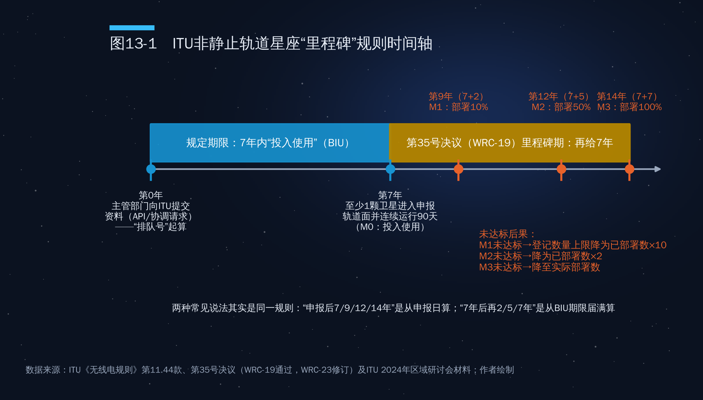
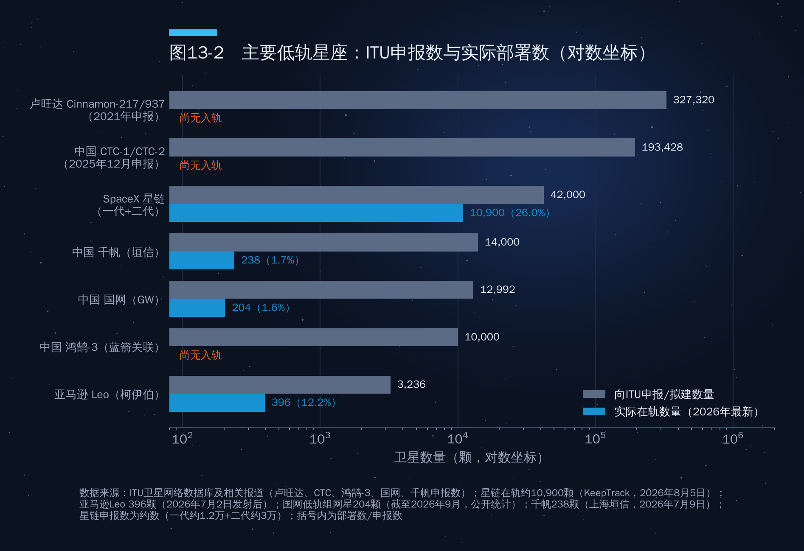
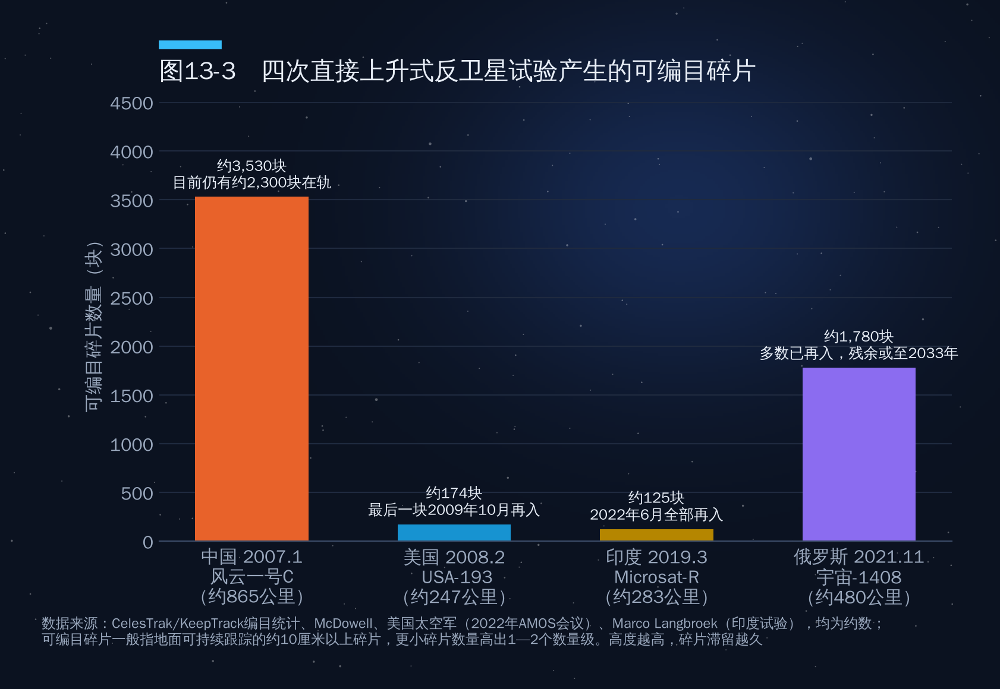
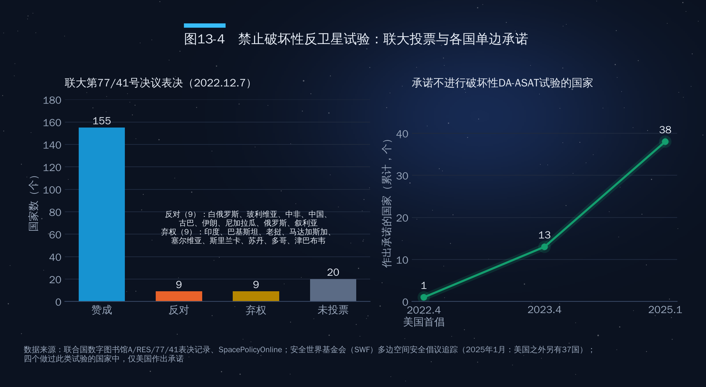

## 第13章　频轨资源、太空交通与碎片治理

2025年12月的最后一周，国际电信联盟（ITU）的卫星网络数据库里出现了一批来自中国的申报，合计超过20万颗低轨卫星。其中，一家无线电频谱开发与技术创新研究机构（英文报道简称RSDTII）申报的CTC-1和CTC-2两个非静止轨道星座各96,714颗，合计193,428颗。作为对照，截至2026年8月，全球规模最大的星链星座在轨卫星约10,900颗。

20万颗卫星短期内显然发射不了。那为什么要申报？答案藏在ITU的规则里。在太空经济中，频谱和轨道才是真正稀缺的"土地"，ITU则是这块土地的"不动产登记处"。本章先拆解这套登记制度的运行逻辑，再讨论太空交通、碎片治理和后发国家的出路。

### 13.1　ITU体系：太空里的"不动产登记处"

#### 为什么频谱和轨道需要国际分配

卫星可以无限制造，但两样东西不能：一是**无线电频谱**，同一频段、同一方向的信号会相互干扰；二是**轨道位置**，地球静止轨道（GSO）只是赤道上空约35,786公里的一个圆环，相邻卫星须保持角度间隔，"车位"有限。低轨看似宽广，上万颗卫星同时运行也面临干扰和碰撞风险。

ITU成立于1865年，现为联合国专门机构，有194个成员国。《国际电信联盟组织法》第44条规定：无线电频率和对地静止卫星轨道是"有限的自然资源"，必须依照《无线电规则》"合理、有效和经济地使用"，使各国"公平地使用"，并考虑发展中国家的特殊需要和某些国家的地理条件。

具体规则写在具有条约效力的《无线电规则》里，每三到四年由世界无线电通信大会（WRC）修订一次，包括频率划分表、协调与登记程序和防止有害干扰的技术限值。

#### 两种分配模式："规划"与"先到先得"

ITU的频轨分配有两种基本模式。

**一是规划模式。**1976年，8个赤道国家发表《波哥大宣言》，主张对本国上空的静止轨道段享有主权。这一主张未获承认，却推动ITU在部分频段建立"规划"：广播卫星业务的附录30/30A和1985、1988年空间业务大会形成的固定卫星业务附录30B，为每个国家预留了至少一个轨道位置和相应频率，不论其是否已有发射能力，体现的是"公平"。

**二是协调模式，即通常所说的"先到先得"。**低轨星座使用的Ku、Ka、V等主力频段都适用协调程序：谁先提交资料，谁就取得优先地位，后来者必须与之协调、保证不造成有害干扰。这种模式效率高，但天然有利于先行者。

#### 申报—协调—登记：一张流程表

一个卫星网络从申报到取得国际保护，大致要经过表13-1所示的几个步骤。

**表13-1　ITU卫星网络申报与登记主要程序**

| 步骤 | 主要内容 | 意义 |
|---|---|---|
| 提前公布（API） | 主管部门（国家）向ITU无线电通信局提交卫星网络的基本信息 | 告知各国，开始排队；非静止系统部分频段仅需提前公布 |
| 协调请求（CR/C） | 提交详细的频率、轨道、波束、功率等参数 | 局收到完整资料的日期确定"优先级"，后来者须与之协调 |
| 协调谈判 | 与可能受影响的各国主管部门逐一协调 | 往往历时数年，是成本最高的环节 |
| 通知与登记 | 协调完成后向ITU通知，经审查登入《国际频率登记总表》（MIFR） | 取得国际承认和保护 |
| 投入使用（BIU） | 自资料收到之日起7年内必须投入使用 | 否则登记被注销 |
| 尽职调查与收费 | 提交卫星制造商、发射合同等"行政应付努力"信息，缴纳成本回收费 | 抑制"纸面卫星" |

需要强调的是，**卫星网络的申报主体是国家主管部门，而不是企业。**企业想在国际上取得频轨资源，必须通过本国政府向ITU申报，国家对其申报承担国际义务。这与《外层空间条约》第六条的"国家责任"逻辑一脉相承。

#### "先申报、先发射、先占用、逾期作废"

作者提纲把ITU规则概括为"先申报、先发射、先占用，并且有严格的部署期限，逾期作废"。这个概括抓住了要害，可以逐一展开：

- **先申报**：优先级以ITU收到完整协调资料的日期为准。早一天是"被保护者"，晚一天就承担"保护他人"的义务，后来者往往要调整频率、功率甚至轨道设计。
- **先发射**：申报之后必须在7年内把卫星送入申报的轨道并投入使用。2019年世界无线电通信大会（WRC-19）以后，对非静止系统的要求是至少一颗卫星进入申报的轨道面并连续运行90天。
- **先占用**：投入使用并完成通知登记后，该卫星网络被载入《国际频率登记总表》，取得国际承认，后来者不得对其造成有害干扰。
- **逾期作废**：7年内未投入使用，登记将被注销；对于大型星座，还要按里程碑分阶段完成部署，否则登记的卫星数量会被削减（见13.2节）。

不过，提纲中"先占永得""这些轨道和频率就长期归申报者使用"的说法需要修正，至少有三点：

1. **登记不等于所有权。**《国际电联组织法》第44条和《外层空间条约》第二条都排除了对频谱和轨道的"占有"。登记取得的是"受国际承认、免受有害干扰的使用权"，而且有有效期（由申报的运营期限决定），到期须续报。
2. **低轨星座并没有被分配"轨位"。**ITU登记的是频率指配及与之关联的轨道特性（高度、倾角、轨道面数），并不排他性地分配某一轨道高度。两个星座使用相近高度是可能的，前提是频率协调和碰撞规避做得到。
3. **优先不等于独占。**非静止系统之间的协调以申报日期确定优先级，但协调的结果通常是双方都做技术调整、共享频段，而不是后来者被完全排除；美国FCC对同一"处理轮次"的非静止系统还有频谱分享规则。

所以，更准确的说法是："先申报者在协调中占据优先地位，先部署者把优先地位变成既成事实，而后来者面对的是越来越高的协调成本和越来越拥挤的轨道。"先发优势是真实的，但它体现为相对优势和谈判筹码，不是"永久产权"。

#### EPFD限值：保护静止轨道的"围栏"

低轨星座与静止轨道卫星在Ku、Ka频段存在共用关系。为防止数量庞大的低轨卫星干扰静止轨道卫星，2000年的世界无线电通信大会在《无线电规则》第22条中设定了"等效功率通量密度"（EPFD）限值，规定非静止系统在地面和静止轨道方向产生的集总干扰不得超过一定水平。

EPFD限值是在20世纪90年代末的技术条件下制定的。低轨运营商认为限值过严、压制容量，静止轨道运营商则担心放宽会损害既有投资。WRC-23上这是最热门的争议之一，但未被列为WRC-27正式议题，只要求ITU-R研究并向WRC-27报告。这是"老玩家"与"新玩家"关于"围栏要多高"的利益之争，海湾地区的静止轨道运营商也身在其中。

### 13.2　里程碑规则：两种说法的真相

#### 第35号决议的准确规定

ITU对大型星座"占而不建"的担忧由来已久。按原有规则，一个申报了数千颗卫星的星座，只要7年内发射一颗卫星就算"投入使用"，理论上可以长期保留全部登记。2019年，WRC-19通过第35号决议，为非静止卫星系统引入分阶段的"里程碑"部署要求，WRC-23又对其作了修订。核心规定如下（图13-1）：

- **M0（投入使用）**：自ITU收到资料之日起7年内（《无线电规则》第11.44款规定的期限），至少一颗卫星进入申报的轨道面，并连续运行90天。
- **M1**：7年期限届满后**2年内**，部署申报卫星总数的**10%**；
- **M2**：7年期限届满后**5年内**，部署**50%**；
- **M3**：7年期限届满后**7年内**，部署**100%**。

未能按期达标的后果，不是整个登记作废，而是**按比例削减**：M1未达标，登记数量上限降为已部署数量的10倍；M2未达标，降为已部署数量的2倍；M3未达标，降为实际部署数量。ITU培训材料举过一个例子：某系统通知登记1500颗卫星，M1阶段应部署150颗，实际只部署了100颗，登记数量便削减为1000颗；没有部署任何卫星的轨道面也会被删除。

对于7年期限在2021年1月1日前已届满的"老"系统，决议设定了固定日期：M1为2023年1月1日，M2为2026年1月1日，M3为2028年1月1日（各另加30天宽限）。

#### 两种说法错在哪里

作者提纲列出了两种时间线：

- 说法A："申报后7年内发射首颗卫星，9年内完成10%部署，12年内过半，14年内全部完成。"
- 说法B："申请后7年内启动发射，2年内完成10%，5年内完成50%，7年内全部部署完。"

核实结果是：**两种说法描述的是同一条规则，只是计时起点不同。**说法A从申报日起算，7+2=9，7+5=12，7+7=14，与第35号决议完全一致。说法B中的"2年、5年、7年"是从7年投入使用期限届满时起算，表述本身没有错，但省略了"7年期限届满后"这个起点，很容易被误读为"申请后2年内完成10%"，那就错了。演讲中建议统一使用说法A，并注明"从ITU收到申报资料之日起算"。

此外，提纲称"逾期作废"，对里程碑阶段而言也不够准确：错过M1、M2、M3不是全部作废，而是按上述比例削减登记数量；真正"作废"的是7年内未能投入使用（M0）的情形。

#### 国家层面的"第二道里程碑"

ITU的里程碑之外，各国监管机构还有自己的部署期限。FCC规定，获得许可的非静止系统须在许可后6年内部署一半、9年内全部部署。亚马逊柯伊伯星座（现名"亚马逊Leo"）2020年7月获FCC批准3236颗卫星，须在2026年7月30日前部署约一半。由于火箭运力不足，亚马逊在2026年初申请延期24个月；FCC在2026年6月5日拒绝延期，改为有条件豁免：7月30日之后发射的卫星暂时失去其2020和2021年许可的频谱优先地位，期限最长20个月，直到2028年3月30日或达到50%部署为止；2029年7月30日全部部署的最终期限不变。截至2026年7月2日，亚马逊Leo已部署396颗。

星链的情况相反。FCC于2022年12月批准其第二代星座7500颗，2026年1月9日再批准7500颗，第二代总授权达1.5万颗，同时搁置了其余14,988颗的申请；SpaceX须在2028年12月1日前部署一半，2031年12月前全部部署。

里程碑规则惩罚的不只是"纸面卫星"，也惩罚运力不足的真实项目。在发射能力成为瓶颈的今天，**掌握火箭的星座运营商在频轨竞争中天然占优。**

### 13.3　"纸面卫星"与先发优势的经济学

#### 从汤加到卢旺达

"纸面卫星"指只在ITU登记、没有实际建造或发射计划的卫星网络。最著名的早期案例是太平洋岛国汤加。1990年，汤加通过Tongasat公司向ITU申报了16个静止轨道位置，几乎是当时剩余可用优质轨位中的相当一部分，并计划以每个轨位每年约200万美元的价格出租。这一做法在国际上引起轩然大波，经过多轮协调，汤加最终只保留了少数轨位。这一事件推动ITU在1997年引入"行政应付努力"（第49号决议）和此后的成本回收收费制度，要求申报方证明确有卫星制造和发射安排。

2021年9月21日，卢旺达向ITU提交CINNAMON-217和CINNAMON-937两个星座的申报，合计327,320颗卫星，分布在550至643公里的27个轨道壳层上。卢旺达航天局表示，申报是为国家未来的卫星活动争取频轨资源。非洲联盟和南非航天机构负责人事后称事先并不知情；后续报道显示，该申报与一家商业公司有关，被视为借助小国主管部门"挂靠"申报的案例。

2025年12月中国多家机构的申报是最新一例。需要说明，这并非"中国一次性申报"，而是多个主体在同一时期分别提交：除上述研究机构的CTC-1、CTC-2外，申报主体还包括中国卫星网络集团（国网）、上海垣信卫星（千帆）、中国移动、中国电信、国电高科等，合计超过20万颗。

图13-2把主要星座的申报数与实际部署数放在一起比较（对数坐标）。星链申报约4.2万颗（一代约1.2万颗、二代约3万颗），在轨约1.09万颗，完成约四分之一，是唯一一个部署规模与申报规模处在同一数量级的星座。亚马逊Leo完成约12%。中国国网（2020年9月申报12,992颗）在轨约204颗，千帆（申报约1.4万颗）在轨238颗，部署率都在2%以下。卢旺达、CTC和蓝箭关联企业的"鸿鹄-3"（2024年5月申报1万颗）尚无卫星入轨。

#### 为什么"多报"是理性的

从经济学角度看，巨型申报是一种成本很低的"期权"：

- **申报成本低。**ITU按资料复杂程度收取成本回收费，相对于星座动辄数百亿元的总投资几乎可以忽略。
- **优先权价值高。**一旦取得优先地位，后来者都要与你协调。在协调谈判中，大规模申报本身就是筹码：可以用来交换对方的让步，或者在本国企业将来扩容时留出余地。
- **惩罚有上限。**按照第35号决议，未达里程碑并不导致全部登记作废，而是削减为已部署数量的10倍或2倍。以CTC星座为例：如果按2025年12月申报计算，投入使用期限约在2032年底，M1约在2034年底，届时需部署约19,343颗；即使届时只部署了1000颗，登记仍可保留1万颗。换句话说，"多报"几乎没有额外的惩罚，"少报"却可能丧失未来扩容的空间。

因此，申报竞赛的本质不是"谁会真的发射20万颗"，而是在规则框架内为未来十到十五年的扩张锁定选项。作者提纲称中国此举"目的就是在规则框架内提前锁定未来可用的轨道位置"，这一判断是成立的；同时也应看到，申报只是"排队号"，真正的竞争最终要落到部署能力上。

#### 先发优势与"公平使用"的冲突

"先到先得"有效率，但它与《国际电联组织法》第44条的"公平使用"原则存在内在冲突。静止轨道时代，ITU用"规划频段"缓解了这一冲突；低轨星座时代，目前还没有类似的制度安排。后发国家面临的是一个"三重劣势"：申报晚，协调成本高；运力弱，难以满足里程碑；市场小，难以支撑独立星座。这一问题已经成为ITU内部"全球南方"国家的重要关切。

### 13.4　国家监管：从FCC到欧盟太空法

#### 美国：FCC事实上的"全球监管者"

FCC的影响力远远超出美国国界。任何希望在美国市场提供服务的外国卫星系统，都必须申请FCC的"市场准入"，并遵守FCC的技术和碎片规则。2023年，FCC专门成立太空局（Space Bureau）。2022年9月29日，FCC以4比0的投票通过"5年离轨规则"：在低地球轨道（2000公里以下）结束任务的卫星，须"尽快、且不晚于任务结束后5年"离轨，取代沿用多年的25年准则。规则对2024年9月29日以后发射的卫星适用，既包括美国许可的卫星，也包括申请美国市场准入的外国卫星。

美国商务部太空商务办公室负责建设的民用太空交通协调系统TraCSS，目标是取代美国太空军，为全球商业运营者提供基础的碰撞预警服务。它是美国把太空交通管理从"军方附带服务"转为"民用公共服务"的关键一步，但前途几经起伏：白宫2026财年预算提出终止TraCSS，国会拨款予以恢复，系统继续以测试版运行；2027财年预算请求再提搁置，众议院拨款委员会则要求继续。

#### 欧盟：《欧盟太空法》提案

2025年6月25日，欧盟委员会提出"太空一揽子计划"，包括《欧盟太空法》草案和《欧洲太空经济愿景》。草案围绕安全、韧性、可持续三大支柱，要求运营者履行碰撞规避、碎片减缓、网络安全和环境足迹评估等义务。和欧盟《通用数据保护条例》一样，它也有明显的域外效力：凡是在欧盟提供太空服务的非欧盟运营者都须遵守，对中小企业则设置了简化制度。

截至2026年10月，草案仍在审议中，尚未进入三方谈判。理事会方面，丹麦和塞浦路斯两任轮值主席国先后于2025年12月和2026年3月提出折中文本，5月又有新的折中文本；欧洲议会方面，工业、研究和能源委员会报告员的报告草案于2026年3月发布，4月提交修正案，在网络安全等问题上与委员会立场分歧明显。美国政府在2025年11月向欧盟委员会提交了评论意见，关注其对美国运营者的影响。可以预期，《欧盟太空法》一旦通过，将与FCC规则一起，成为全球卫星运营者事实上必须满足的"双重标准"。

#### 中国：监管体系逐步完善

中国的卫星频轨资源管理由工业和信息化部（国家无线电管理机构）负责，卫星网络的国际申报、协调和登记维护有专门的管理规定；航天发射许可、空间物体登记和空间碎片管理主要由国家航天局负责。随着国网、千帆进入密集部署期，监管任务正从"管国家任务"转向"管商业星座"：离轨期限、与外国星座的运行协调、参与国际交通管理规则制定，都需要航天法和配套法规系统回答。

### 13.5　碎片治理：从"25年"到"零碎片"

#### 碎片问题有多严重

据欧洲航天局（ESA）《2025年空间环境报告》（数据截至2024年底），空间监视网络持续跟踪的物体约4万个，其中活跃载荷约1.1万个；按模型估算，直径大于10厘米的物体约5.4万个，1—10厘米的约120万个。到2026年7月，ESA统计的被跟踪物体已增至约4.7万个。碎片以每秒数公里的相对速度运动，1厘米的碎片就可能击毁一颗卫星。最令人担心的是"凯斯勒综合征"：当某一轨道高度的物体密度超过临界值，碰撞产生的碎片会引发更多碰撞，形成连锁反应，使该轨道长期无法使用。

#### 规则演进：25年规则与5年规则

国际碎片治理的主线是一系列"软法"：

- **IADC准则**：机构间空间碎片协调委员会成立于1993年，成员包括中国国家航天局、NASA、ESA等十余家航天机构，2002年发布《空间碎片减缓准则》，提出低轨航天器任务结束后应在25年内离轨的"25年规则"。
- **联合国准则**：2007年，联大核可外空委《空间碎片减缓准则》，将IADC准则的主要内容转化为联合国层面的建议。
- **FCC 5年规则**：如前所述，2022年通过、2024年生效，将25年缩短为5年。
- **ESA"零碎片"**：2023年，ESA提出到2030年实现"零碎片"的目标，并发起不具约束力的《零碎片宪章》，各国政府机构、企业和研究机构可自愿签署。

ESA年度报告多次指出，历史上相当比例的低轨航天器没有按25年规则离轨。5年规则的意义在于首次由有执法权的监管机构强制推行，并借市场准入影响外国运营者；对星座而言，这意味着预留更多推进剂或选择更低轨道。

#### 反卫星试验：碎片的"人为灾难"

在所有碎片来源中，破坏性反卫星试验最具争议，因为它是故意制造的。迄今共有四个国家进行过直接上升式反卫星（DA-ASAT）导弹的破坏性试验（图13-3）：

- **中国，2007年1月**：击毁约865公里高度的"风云一号C"气象卫星，产生约3,530块可编目碎片，是有史以来单次产生碎片最多的事件，目前仍有约2,300块在轨，将滞留数十年。
- **美国，2008年2月**：以"燃烧霜冻"行动击毁约247公里高度的失效卫星USA-193，产生约174块可编目碎片，因高度低，数月内全部再入。
- **印度，2019年3月**：以"沙克蒂任务"击毁约283公里高度的Microsat-R，产生约125块可编目碎片，最后一块于2022年6月再入。
- **俄罗斯，2021年11月**：击毁约480公里高度的"宇宙-1408"，产生约1,800块可编目碎片，迫使国际空间站航天员一度进入飞船避险，碎片在2024年前后基本再入。

如图13-3所示，碎片的危害取决于数量，更取决于高度：高度越高，滞留越久。2022年4月，美国宣布单方面承诺不再进行破坏性DA-ASAT导弹试验，并推动联大于2022年12月7日通过第77/41号决议，呼吁各国作出同样承诺。决议以155票赞成、9票反对、9票弃权通过，反对票来自白俄罗斯、玻利维亚、中非共和国、中国、古巴、伊朗、尼加拉瓜、俄罗斯和叙利亚，印度、巴基斯坦等9国弃权（图13-4）。据安全世界基金会统计，截至2025年1月，除美国外另有37个国家作出了类似承诺，合计38国，但在四个做过此类试验的国家中，只有美国作出了承诺。

反对方在联大第一委员会表决时提出，美国已具备反卫星导弹能力，这项决议无助于在防止外空军备竞赛上取得实质进展。中方的一贯立场是，应通过谈判达成有法律约束力的外空军控条约（如PPWT），而不是只针对某一类反卫星手段作政治承诺。这一分歧说明太空安全规则与大国战略关系紧密捆绑。作为2007年试验的实施国，中国在碎片治理上承受更大的声誉压力；同时中国也是潜在的最大受害者之一，空间站和未来数以万计的星座卫星都暴露在碎片风险之下。

#### 主动碎片清除与在轨服务：一个正在形成的市场

如果说规则是"减少新增"，主动碎片清除（ADR）就是"清理存量"。

- **日本Astroscale公司的ADRAS-J**：2024年2月发射，对一枚2009年发射的日本H-IIA火箭上面级进行抵近观测，2024年12月最近接近到约15米，这是商业航天器迄今对太空碎片最近距离的交会。后续任务ADRAS-J2由日本宇宙航空研究开发机构（JAXA）出资，计划捕获并使这枚约3吨重的上面级离轨；2026年9月已与德国Isar Aerospace签订发射合同，目标在日本2027财年（2027年4月至2028年3月）发射。
- **ESA的ClearSpace-1**：2020年ESA与瑞士ClearSpace公司签约，计划捕获并离轨一个"织女星"火箭的载荷适配器。2023年该目标被另一块碎片撞击、碎裂，任务改为捕获ESA已退役的PROBA-1卫星，改由德国OHB公司牵头，ESA目前计划2029年发射。
- **在轨延寿**：美国诺斯罗普·格鲁曼公司的任务延寿飞行器MEV-1、MEV-2分别于2020年和2021年与国际通信卫星公司的静止轨道卫星对接，为其提供姿态和轨道控制。MEV-1服务5年后，于2025年4月把客户卫星送入墓地轨道并分离，可转而服务新客户；MEV-2的5年服务合同按计划在2026年前后到期。中国的实践二十一号卫星在2022年初把一颗失效的北斗二号卫星拖入静止轨道上方的"墓地轨道"。

这一市场的商业模式还在探索之中，大致有三条路：

1. **政府"锚定客户"**：JAXA、ESA等以采购合同支撑早期任务，类似NASA用商业补给合同培育SpaceX。
2. **"离轨保险"**：星座卫星预装对接板，与清除服务商签订"失效即回收"的服务合同。离轨规则越严，需求越大。
3. **"使用者付费"**：有经济学家提出征收"轨道使用费"，把碰撞风险的外部成本内部化，目前仍停留在学术讨论阶段。

只要不清理碎片没有成本，就没有人愿意为清理付费。规则正在把"外部性"变成"市场需求"。

### 13.6　WRC-27与后发国家的路径

#### WRC-27：下一场规则之争

2027年，世界无线电通信大会（WRC-27）将在中国上海举行。根据WRC-23确定的议程，与太空经济相关的重点包括：议题1.13，研究在0.7—2.7吉赫的IMT（地面移动通信）频段为卫星直连手机作出移动卫星业务新划分，这是星链"直连手机"等业务能否在全球合法规模化的关键；议题1.15，为月球表面及月球轨道通信划分频率；第22条EPFD限值虽未列为正式议题，但ITU-R的研究结果将提交WRC-27，围绕是否在下届大会启动修订的较量仍在继续，这直接关系到低轨与静止轨道系统的利益平衡。

这些技术议题背后都是巨大的商业利益：EPFD决定低轨容量上限，直连手机频段决定卫星能否与地面运营商直接竞争，月球频谱关系到月面"基础设施标准"由谁来定。

#### 后发国家的五条路径

对于海湾国家和更广泛的"全球南方"来说，在"先到先得"的格局中并非无路可走。

**第一，用好"规划频段"的存量权利。**附录30、30A、30B为每个国家预留的静止轨道位置和频率是长期有效的"固定资产"。阿拉伯卫星通信组织（Arabsat，1976年成立，总部利雅得）就是阿拉伯国家联合使用静止轨道资源的先例。卡塔尔的Es'hailSat公司运营的Es'hail-1（2013年）和Es'hail-2（2018年）卫星，后者搭载了全球第一个静止轨道业余无线电转发器，展示了中小国家如何在静止轨道上建立自己的存在。

**第二，以市场准入换取合作。**卫星服务落地需要所在国许可，这是后发国家最重要的筹码，可据此要求外国星座在本国设立地面站、开展本地化投资或吸收本国企业参股。

**第三，以主权资本参与"星座股权"。**海湾国家拥有雄厚的主权财富基金。阿联酋2024年将卫星运营商Yahsat与地理空间公司Bayanat合并为Space42，沙特公共投资基金2024年5月成立卫星服务公司Neo Space Group，都表明海湾资本正在从"购买服务"转向"拥有资产"。参与已经取得频轨优先权的星座，比从零开始申报更现实。

**第四，借助区域机制集体发声。**单个小国谈判能力有限，阿拉伯频谱管理组织、非洲电信联盟、亚太电信组织等可以在WRC上形成共同立场，推动新频段的公平使用安排和能力建设援助。

**第五，在规则体系中保持"多边下注"。**如第12章所述，海湾国家在《阿尔忒弥斯协定》与国际月球科研站之间采取"规则靠美、合作多元"的策略；在频轨领域同样可以与美、中、欧的星座运营商分别合作，避免被单一技术和规则体系锁定。

#### 对中国的启示

对中国而言，频轨资源竞争是"大国中的后来者"问题：起步晚于星链，但具备完整的工业体系、发射能力和庞大的国内市场。2025年底的大规模申报为未来锁定了选项，但只有部署能力才能把选项变成现实。关键在于：以可复用火箭提高发射频次，按期满足里程碑；在ITU和外空委就EPFD、直连手机、交通管理、碎片治理提出建设性方案；在碎片减缓和在轨透明度上做出示范。规则竞争的胜负不仅取决于"占了多少"，也取决于"能否让别人接受你的规则"。

### 本章要点

1. **ITU是太空的"不动产登记处"。**频谱和静止轨道是《国际电联组织法》第44条定义的"有限自然资源"；规划频段保障公平，协调频段"先到先得"。"先申报、先发射、先占用、逾期作废"抓住了要害，但登记取得的是受保护的使用权，不是"永久产权"，低轨星座也没有被分配排他性的"轨位"。
2. **里程碑规则两种说法是同一回事。**按WRC-19第35号决议，从申报日起7年内投入使用，此后2年（第9年）、5年（第12年）、7年（第14年）分别部署10%、50%、100%；未达标按"已部署数×10、×2、×1"削减登记数量，而不是全部作废。
3. **"纸面卫星"是理性的期权策略。**卢旺达申报32.7万颗，中国多家机构2025年12月申报合计超过20万颗（CTC-1/2合计193,428颗）；星链申报约4.2万颗、在轨约1.09万颗，是唯一部署与申报同量级的星座。申报锁定的是选项，部署能力决定胜负。
4. **碎片治理从"25年"走向"5年"和"零碎片"。**FCC 5年规则2024年生效，《欧盟太空法》草案仍在审议；四次反卫星试验共产生约5,600块可编目碎片，2022年联大决议以155比9通过，38国承诺不进行破坏性试验。
5. **WRC-27是下一场规则之争**，EPFD、直连手机、月球频谱都牵动巨大利益。后发国家可以通过规划频段、市场准入、主权资本、区域联合和多边下注参与竞争。
