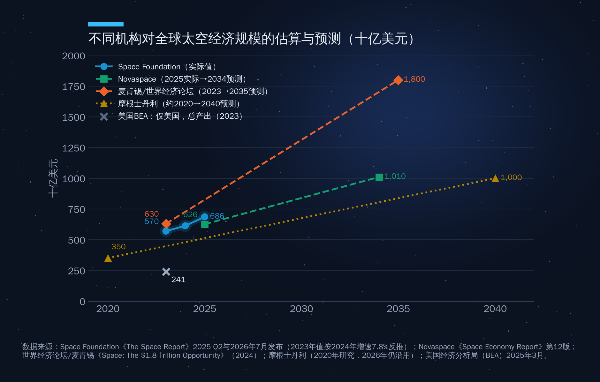
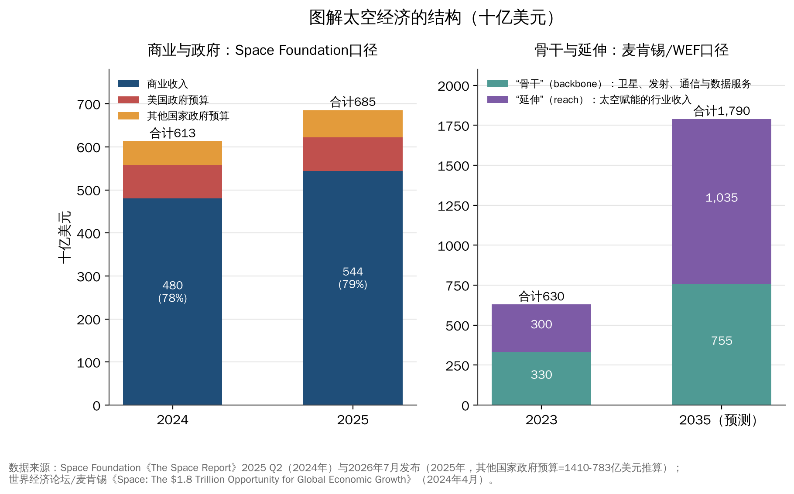
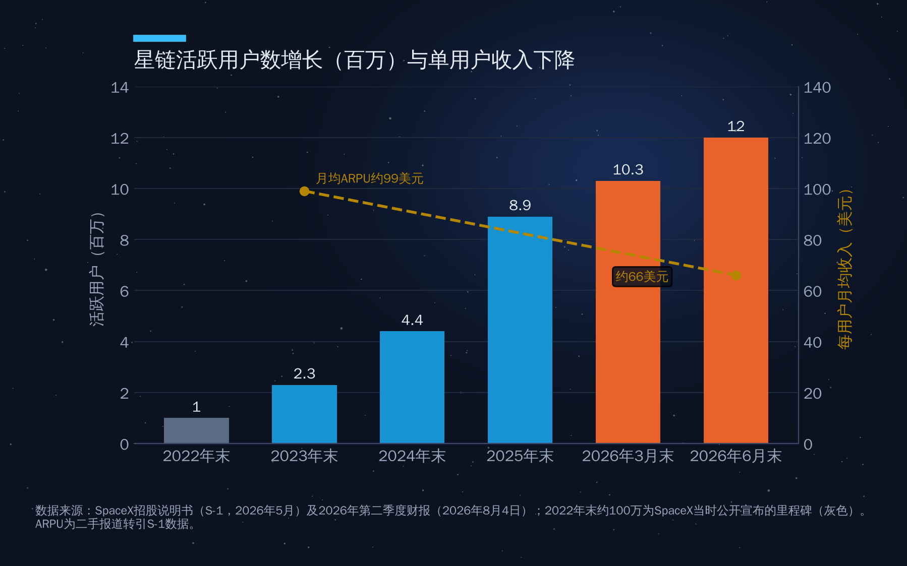
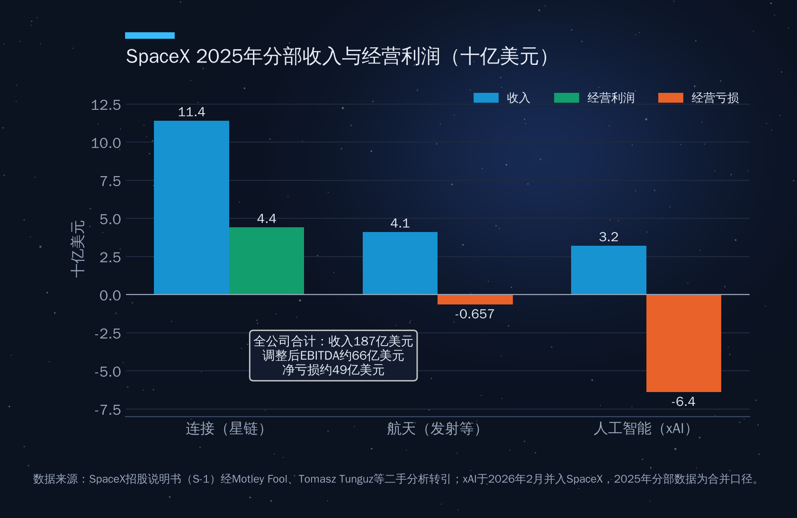
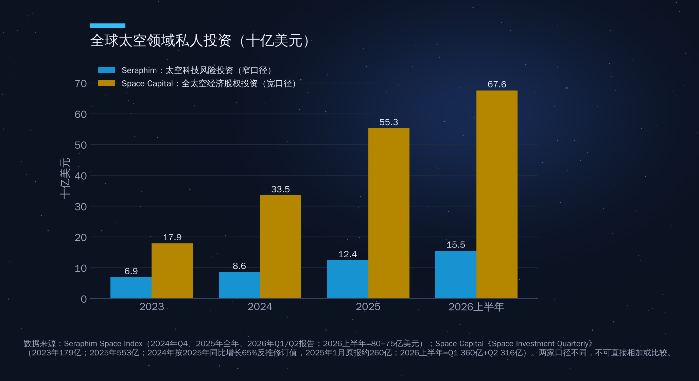

## 第14章　太空产业规模和结构

2026年6月，SpaceX在纳斯达克上市，以每股135美元发行约5.556亿股，募资约750亿美元，按发行价计算估值约1.77万亿美元（据彭博、阿联酋通讯社等报道）。这次募资额是2019年沙特阿美（约294亿美元）的两倍多，成为全球资本市场有史以来最大的一次IPO。一家造火箭、发卫星的公司，市值进入全球前十的量级——这在十年前几乎不可想象。

这件事提出了三个问题：太空经济到底有多大？钱是从哪里赚来的？谁在投资、谁在胜出？本章依次回答。

### 14.1　全球太空经济有多大：一个数字，多种口径

#### 主要机构的估算

关于"全球太空经济规模"，市场上至少有五六个常被引用的数字，相互之间差距可达数千亿美元。表14-1列出了最常用的几种。

**表14-1　主要机构对太空经济规模的估算与预测**

| 机构 | 最新基准值 | 预测 | 口径特点 |
|---|---|---|---|
| Space Foundation《The Space Report》 | 2025年6856亿美元，同比+12% | 有望2032年前后突破1万亿美元 | 商业收入+53国政府航天预算；含卫星电视、GNSS设备等 |
| Novaspace（原Euroconsult）《Space Economy Report》第12版 | 2025年6264亿美元，其中"核心太空市场"约2360亿美元 | 2034年约1.01万亿美元（年均约5.5%） | 区分核心市场与太空赋能服务 |
| 世界经济论坛/麦肯锡 | 2023年约6300亿美元 | 2035年约1.8万亿美元（年均约9%） | "骨干"+"延伸"，后者计入太空赋能的行业收入 |
| 摩根士丹利 | 约3500亿美元（2020年研究基准） | 2040年1万亿美元以上 | 以产业收入为主，卫星宽带贡献约一半增长 |
| 美国经济分析局（BEA）卫星账户 | 2023年美国太空经济增加值1425亿美元（占GDP 0.5%），总产出2409亿美元 | — | 仅美国，按国民账户方法，可区分增加值与总产出 |

（来源：Space Foundation 2026年7月发布；Novaspace 2026年1月新闻稿；WEF/McKinsey 2024年4月报告；Morgan Stanley研究；BEA《Survey of Current Business》2025年3月）

如图14-1所示，若把这些数字放在同一张图上，就会发现：各家对"现在"的估计大致集中在6000亿—7000亿美元之间，分歧主要出在"未来"——到2035年前后，低的估计约1万亿美元，高的估计约1.8万亿美元，相差近一倍。

#### 数字为什么差这么大

差异的根源在于"边界"。太空经济有一个核心和一圈越来越大的外延。

核心部分比较清楚：造卫星、造火箭、发射服务、地面站和终端、卫星通信与遥感服务，加上各国政府的航天预算。Novaspace把这部分称为"核心太空市场"，2025年约2360亿美元。

外延部分则很难划界。最典型的是卫星导航：GNSS芯片装进了几十亿部手机和汽车，网约车、外卖、物流调度都离不开它。如果把这些"依赖卫星信号的经济活动"全部计入，太空经济会迅速膨胀；如果只计算导航芯片和接收机，规模就小得多。麦肯锡与世界经济论坛的报告专门做了区分，把太空经济分为"骨干"（backbone，即卫星、发射、通信与数据服务等直接的太空产品服务）和"延伸"（reach，即太空技术为其他行业创造的收入），2023年两者大致各占一半，分别约3300亿和3000亿美元；到2035年，"延伸"部分预计将增至1万亿美元以上，反超"骨干"的约7550亿美元（见图14-2右图）。

这意味着：**太空经济的增长主要不是来自"太空里面"，而是来自"地面上用太空的人"。**这与互联网的历史一模一样——光缆和路由器的市场从来不是最大的，最大的是在网络上做生意的人。

第二个口径差异来自"政府预算算不算经济"。Space Foundation把53个国家的政府航天预算都计入，2025年合计约1410亿美元，同比增长7.4%，其中美国约783亿美元，占全球政府航天支出的57%；Novaspace统计的2025年全球政府航天支出约1374亿美元，其中**国防占54%（约735亿美元），高于民用（约637亿美元），这已是国防连续第二年超过民用**（2024年同为54%）。政府预算既是需求（采购发射、卫星和数据），也是投资，计入与否会影响总量。

第三个差异来自统计方法：BEA按国民账户区分"增加值"与"总产出"，行业机构普遍用"收入"口径，存在一定重复计算。

结论很简单：**引用太空经济规模时，要说清是谁的口径、哪一年、是否包含下游。**本书以Space Foundation的数字描述"现状"，以麦肯锡/世界经济论坛的数字描述"潜力"。

#### 增长在加速

按Space Foundation口径，全球太空经济2024年约6130亿美元，同比增长7.8%；2025年增至约6856亿美元，同比增长12%，是十年来第二次两位数增长，五年复合增速9.8%。分领域看，2025年增长最快的是卫星制造（收入同比+67.2%）和发射服务（+49.4%）。

这些增速与本书第一部分讲的"非线性增长"相互印证：发射次数爆发（2025年全球入轨发射尝试329次，McDowell统计），卫星批量生产，上游制造与发射收入随之放大。而全球GDP同期增速约3%。**太空经济正以三到四倍于全球经济的速度增长。**

### 14.2　产业链结构：上游、下游与"卫星+"

#### 上游与下游

太空产业链通常分为上游和下游两段。

上游是"把东西送上天"的环节：卫星及其部件制造、运载火箭制造与发射服务、地面站和用户终端等地面设备。上游资本密集、技术门槛高、周期长，过去主要由政府订单驱动。

下游是"用天上的东西赚钱"的环节：卫星通信（广播电视、宽带、移动通信、物联网）、导航定位与授时服务、对地观测数据与分析。下游面向海量用户，规模大、利润率相对高，但对上游能力高度依赖。

长期以来，下游收入远大于上游，卫星电视曾是最大的单项收入。近几年结构正在变化：卫星电视随流媒体兴起而萎缩，低轨宽带让"通信"转向互联网接入，发射与制造则因星座建设而爆发。

#### 商业与政府

如图14-2左图所示，按Space Foundation口径，2024年全球太空经济中商业收入约4803亿美元，占78%；2025年商业收入约5443亿美元，占比升至79%。

商业占近八成，并不意味着政府不重要。恰恰相反，政府在太空经济中扮演三重角色：**最早的投资者**（几乎所有太空技术都源于政府项目）、**最稳定的客户**（军方和情报部门采购遥感数据、通信服务和发射）、**规则的制定者**（频谱、轨道、出口管制）。商业航天的崛起，本质上是政府从"自己造"转向"向企业买"——NASA的商业货运与载人计划、美国国家侦察局向商业遥感公司采购图像、中国把发射任务向商业火箭公司开放，都是这种转变。

#### "卫星+"：太空成为经济的底层设施

太空经济最深刻的变化，是它正在变成其他行业的"底层操作系统"。可以用"卫星+"来概括：

- **卫星+通信**：低轨宽带为偏远地区、航空、航海、能源平台提供互联网；直连手机（direct-to-device）让普通手机在没有地面基站的地方也能发消息、打电话。
- **卫星+导航授时**：从网约车、共享单车到电网调度、证券交易时间戳、移动通信基站同步，都依赖GNSS的精确时间。
- **卫星+遥感**：农业估产、保险定损、碳排放监测、港口和油罐库存分析、灾害应急。
- **卫星+人工智能**：遥感数据要靠AI才能变成洞察；SpaceX与xAI在2026年2月合并，被市场解读为"连接+算力"的一体化布局。

"卫星+"的意义在于，太空经济的天花板不再由航天产业本身决定，而是由它能渗透多少地面行业决定。这也解释了为什么麦肯锡把2035年的"延伸"部分估计得比"骨干"更大。

### 14.3　关键公司与商业模式

#### SpaceX：从发射公司到"太空平台"

SpaceX是理解今天太空经济的钥匙。它的商业模式可以概括为三步：先用可回收火箭把发射成本打下来，再用自己的火箭以接近成本价发射自己的卫星，最后用星链的订阅收入反哺火箭研发。

**发射端的统治地位。**2025年全球入轨发射尝试329次，其中SpaceX共170次（猎鹰9号165次、星舰5次），约占一半（McDowell统计）；按入轨质量计算，SpaceX在2025年送入轨道约2213吨，超过全球总量的80%（SpaceX招股说明书）。这意味着，全世界每送上天5公斤东西，就有4公斤以上是SpaceX送的。

**星链：太空史上第一个大众消费产品。**如图14-3所示，星链活跃用户从2023年末的约230万增长到2024年末的440万、2025年末的890万，2026年3月末达到1030万，覆盖164个国家和地区；2026年6月30日达到1200万，同比翻番（SpaceX 2026年第二季度财报）。支撑这一用户规模的，是约1.11万颗在役星链卫星（2026年9月中旬，McDowell统计；累计发射约1.29万颗）。另据SpaceX 2026年8月发布的内部全员会视频（二手报道），消费者用户已超过1300万。

值得注意的是，用户数翻倍的同时，每用户月均收入（ARPU）从2023年的约99美元降到2026年的约66美元。这不是坏消息，而是商业模式的必然：星链正在从"发达国家偏远地区的高端产品"走向"发展中国家的大众产品"，以价格换规模。

**财务结构。**根据招股说明书，SpaceX 2025年合并收入约187亿美元，同比增长33%；调整后EBITDA约66亿美元，但净亏损约49亿美元。分部数据最能说明问题（见图14-4）：以星链为主的"连接"分部收入约114亿美元，占总收入约61%，同比增长近50%，经营利润约44亿美元；"航天"分部（发射等）收入约41亿美元，因星舰研发经营亏损约6.6亿美元；2026年2月并入的xAI（"人工智能"分部）收入约32亿美元，经营亏损约64亿美元。

换句话说，**星链是SpaceX的"现金牛"，火箭是"护城河"，人工智能是"新赌注"。**2026年第二季度，SpaceX收入约78亿美元，同比增长92%，其中连接分部收入约43亿美元，同比增长66%；企业与政府连接收入约18亿美元，同比增长108%。

**估值与上市进程。**SpaceX的估值在两年内几级跳：2025年末内部股份出售时约8000亿美元，2026年2月与xAI合并时约1.25万亿美元，6月以约1.77万亿美元估值完成IPO，股票代码SPCX。上市后股价波动明显：6月中旬一度冲高至约225美元，7月下旬跌破135美元的发行价，8月初二季度财报因资本开支超预期再度承压；9月以来回升，10月7日收盘约168美元，市值超过2.2万亿美元（以实时行情为准）。马斯克在上市后仍保留约82%的投票权。

**下一代：星舰与星链V3。**2026年9月28日，星舰第14次综合飞行首次进入地球轨道，部署了首批26颗星链V3卫星，每颗设计容量约1Tbps（据Space.com、Interesting Engineering等报道）。如果星舰实现完全复用，单次发射的带宽增量将是猎鹰9号的数十倍，这将再次改写卫星宽带的成本曲线。

#### 追赶者：亚马逊、欧洲与直连手机

**亚马逊Leo（原柯伊伯计划）。**亚马逊规划约3200颗低轨卫星，2025年更名为"Amazon Leo"。截至2026年7月初，在轨约396颗，公司表示将于2026年内在中纬度地区开始初始服务（企业测试版已于4月开放）；美国联邦通信委员会（FCC）原要求2026年7月底前部署约1600颗，亚马逊无法达标，FCC已批准延期（据路透社、Advanced Television等报道）。发射能力是主要瓶颈。亚马逊的优势在于云计算（AWS）客户、零售渠道和资金实力，劣势在于起步晚了约五年。

**欧洲：Eutelsat OneWeb。**欧洲唯一在轨运营的低轨宽带星座OneWeb，现有约650颗卫星。2025年，法国政府牵头对Eutelsat增资约13.5亿欧元，国家持股升至约30%，资金用于降低负债和采购约340颗替换卫星（据路透社报道）。欧盟另有IRIS²主权星座计划。欧洲的逻辑很清楚：**低轨宽带首先是主权问题，其次才是生意。**

**直连手机：AST SpaceMobile与星链直连。**让普通手机直接连接卫星，是下一个可能的"大众市场"。AST SpaceMobile以超大天线阵列卫星（BlueBird）为特色，已获FCC授权在美国提供"来自太空的补充覆盖"商业服务，截至2026年8月已累计发射约13颗BlueBird卫星，仍以2026年底前后在轨约45颗为目标，宣称与近60家移动运营商合作、覆盖超过30亿用户（公司财报及行业媒体报道）。星链则与T-Mobile等运营商合作推出直连短信与数据业务，并于2025年9月宣布以约170亿美元（现金加股票）收购EchoStar的AWS-4与H频段频谱、11月再以约26亿美元追购AWS-3频谱，以强化这一业务（EchoStar公告）。这里的竞争焦点，从"火箭和卫星"转向了"频谱"——这正是第四部分讨论的稀缺资源。

#### 遥感与发射"小巨头"

**Planet Labs**是商业遥感的代表，2026财年（截至2026年1月）收入约3.08亿美元，同比增长约26%，首次实现调整后EBITDA和自由现金流为正；增长最快的是国防与情报业务，全年增长超过50%（公司财报）。这说明遥感的商业模式正在从"卖图片"转向"卖订阅和分析"，而最大的买家仍是各国政府。

**Rocket Lab**被称为"小SpaceX"。2025年收入约6.02亿美元，同比增长38%，电子号火箭全年发射21次；中型可回收火箭"中子号"首飞已推迟到2026年第四季度（公司财报）。Rocket Lab的路径——从小火箭起家，向卫星制造和系统集成延伸——代表了"垂直整合"在中型企业中的复制。

#### 中国：国家队、星座与商业火箭

中国商业航天正在进入规模化阶段。

**发射。**2025年中国完成92次航天发射，创历史新高，其中商业发射50次，占比54%（国家航天局）；2026年上半年完成44次，同比增长约26%，其中商业发射30次，占比68.2%（据行业论坛发言，澎湃新闻报道）。业内预计2026年全年有望首次突破100次。

**星座。**中国有两个万颗级低轨宽带星座在建：

- 中国星网的"国网"（GW）星座，规划约1.3万颗。2024年12月首批组网发射，截至2025年12月26日累计发射136颗；2026年9月17日已完成"低轨25组"发射（新华社、光明网报道），官方目标是2026年底建成骨干网、率先实现全国覆盖。
- 上海垣信卫星的"千帆"星座，规划约1.4万颗。截至2026年7月9日在轨238颗，公司计划2026年底累计在轨324颗（据C114通信网报道）。

与星链相比，中国星座在数量上仍处于起步阶段，但第四部分讨论过的ITU里程碑规则意味着，部署进度直接关系到频轨资源能否保住。这也是中国在2025—2026年显著加快组网节奏的原因。

**商业火箭。**蓝箭航天、星际荣耀、天兵科技、中科宇航、东方空间等民营公司正在冲刺可回收液体火箭。蓝箭航天的朱雀三号于2025年12月首飞入轨，但一级回收未成功；2026年8月19日，朱雀三号遥二火箭将卫星送入轨道后，一子级以着陆支腿方式软着陆于甘肃民勤着陆场，实现中国首次入轨级运载火箭一子级陆地回收（新华社）。蓝箭航天的科创板IPO申请于2025年12月31日获受理，拟募资75亿元，2026年6月更新招股书（2025年营收约5200万元、净亏损约17亿元），截至目前仍在审核中（据界面新闻、华尔街见闻等报道）。

**市场规模：口径同样混乱。**关于"中国商业航天市场规模"，常见说法从1万亿元到近3万亿元不等。赛迪智库《2026年我国商业航天产业发展形势展望》估计，2025年中国商业航天市场规模约2.83万亿元，同比增长21.7%，2026年将达到约3.5万亿元（据多家媒体转引）——这正是常被引用的"3.5万亿元"的出处；而赛迪研究院另一项按"核心产业"口径的估算，2025年仅约1.01万亿元。正如中关村领创商业航天产业联盟人士所说，目前国内对商业航天的统计口径"缺乏统一标准"。**建议引用时说明是"核心产业"还是"全产业链"口径。**主要公司概况见表14-2。

**表14-2　全球主要太空企业概况（截至2026年三季度公开信息）**

| 公司 | 主营 | 关键数据 | 商业模式要点 |
|---|---|---|---|
| SpaceX（美） | 发射、星链、xAI | 2025年收入187亿美元；星链用户1200万（2026年6月）；IPO估值约1.77万亿美元 | 垂直整合：自有火箭发射自有星座 |
| 亚马逊Leo（美） | 低轨宽带 | 在轨约396颗（2026年7月）；FCC批准里程碑延期 | 依托云计算与零售生态 |
| Eutelsat OneWeb（欧） | 高轨+低轨通信 | 低轨约650颗；法国政府牵头约13.5亿欧元增资 | 主权背书的多轨道运营商 |
| AST SpaceMobile（美） | 直连手机 | 已发射约13颗（2026年8月），目标约45颗；近60家运营商伙伴 | 与运营商分成的批发模式 |
| Planet Labs（美） | 对地观测 | 2026财年收入约3.08亿美元；订单约9亿美元 | 数据订阅+分析，政府客户为主 |
| Rocket Lab（美/新西兰） | 小型发射、卫星制造 | 2025年收入约6.02亿美元；21次发射 | 从发射向系统集成延伸 |
| 中国星网（中） | 国网星座 | 2026年9月完成第25组发射 | 国家队主导的骨干网 |
| 垣信卫星（中） | 千帆星座 | 在轨238颗（2026年7月） | 地方国资+市场化，积极出海 |
| 蓝箭航天（中） | 可回收液体火箭 | 朱雀三号一子级陆地回收成功（2026年8月）；科创板IPO审核中，拟募资75亿元 | 民营商业发射 |

（来源：各公司财报与公告、新华社、Advanced Television、Reuters等，详见本部分zz_notes.md）

### 14.4　资本：从风险投资到主权基金

#### 私人投资创新高

太空领域的私人投资在2021年经历第一次高峰（SPAC上市潮），2022—2023年随全球利率上升而回落，2025年起再创新高。由于统计口径差异极大，我们并列两个主流来源（见图14-5）：

- **Seraphim太空指数**（只统计"新一代太空科技"风险投资，窄口径）：2023年约69亿美元，2024年约86亿美元，2025年达到创纪录的124亿美元，同比增长48%，超过2021年峰值；2026年第一季度80亿美元、第二季度75亿美元，上半年已超过2025年全年，过去12个月累计约230亿美元。
- **Space Capital**（统计"太空经济全栈"的股权投资，宽口径）：2023年约179亿美元；2025年约553亿美元、涉及431家公司，同比增长65%，其中"基础设施"层创纪录达222亿美元；2026年第一季度约360亿美元，第二季度约316亿美元。

两组数字相差数倍，但趋势一致：**2025—2026年是太空投资的新一轮高潮，驱动力从"商业故事"转向"国防需求+主权需求+AI"。**Seraphim指出，2025年美国吸引了约73亿美元、占全球约60%，中国约20亿美元，"金穹"等国防项目是重要推手。

#### 海湾主权资本：从旁观者到参与者

海湾国家正在以三种方式进入太空经济。

**第一，投资全球龙头。**沙特公共投资基金（PIF）原本就持有SpaceX不足1%的股份。据路透社报道，2026年4月SpaceX曾与PIF商谈约50亿美元的基石投资；据《金融时报》报道，最终PIF、卡塔尔投资局（QIA）和科威特投资局在SpaceX IPO中各获配超过10亿美元的股份，主权基金和家族办公室获得优先配售。阿布扎比的MGX、阿曼投资局和QIA此前也参与过xAI的融资，而xAI已并入SpaceX。换言之，海湾主权资本已经成为全球最大太空公司的重要股东。

**第二，培育本土"国家冠军"。**PIF于2024年5月成立全资子公司Neo Space Group（NSG），覆盖卫星通信、对地观测、导航与物联网，并设立太空风险投资基金。阿联酋的Space42由Yahsat与Bayanat合并而成，在阿布扎比上市，2024年获得政府一份为期17年、约187亿迪拉姆（约51亿美元）的安全卫星通信合同，在手合同收入约260亿迪拉姆（约71亿美元，公司公告）。

**第三，卫星运营与区域枢纽。**卡塔尔的Es'hailSat于2026年6月30日在多哈与土耳其Turksat签约，联合建造下一代高通量卫星"Es'hail-3/Turksat-Biruni"，由泰雷兹阿莱尼亚宇航公司制造，总投资约2.95亿欧元，计划2030年发射，定点东经50度（卡塔尔通讯社、《海湾时报》报道）。这颗以比鲁尼命名的卫星，是卡塔尔迄今在这一领域最大的单笔投资。

海湾资本的逻辑与欧洲相似但更灵活：**既做财务投资者分享全球增长，又通过本土平台获取主权能力。**对于中国商业航天而言，海湾资本是潜在的"耐心资本"，海湾市场是星座出海和遥感应用的重要场景——千帆星座与多国签署合作协议，已在探索这条路径。

#### 资本市场的"太空板块"

SpaceX上市之后，全球资本市场第一次出现了可与半导体、新能源相提并论的"太空板块"：Rocket Lab、AST SpaceMobile、Planet等美国公司估值大幅上升，中国商业航天概念股随星座建设升温。

但需冷静看待：除SpaceX和少数传统运营商外，多数太空上市公司尚未稳定盈利；SpaceX上市时公开流通股仅约4.9%，内部人士股份正在分批解禁。太空资本市场的成熟，仍需一个完整周期来检验。

### 14.5　本章要点

1. **规模**：2025年全球太空经济约6860亿美元（Space Foundation），商业收入占79%；不同机构对2035年的预测从约1万亿到1.8万亿美元不等，分歧主要在于是否计入"太空赋能"的下游。
2. **结构**：增长重心正从"太空里面"转向"地面上用太空的人"，"卫星+"让太空成为通信、导航、遥感与AI的底层设施；政府预算中国防已超过民用。
3. **公司**：SpaceX以"自有火箭+自有星座+订阅收入"的垂直整合模式统治发射与宽带，2025年收入187亿美元，星链用户1200万，2026年6月以约1.77万亿美元估值完成史上最大IPO。
4. **中国**：2025年发射92次、商业发射占54%，国网与千帆两大星座加速部署；市场规模口径从约1万亿元（核心产业）到2.83万亿元不等，赛迪预计2026年约3.5万亿元，引用需注明口径。
5. **资本**：2025—2026年太空投资再创新高，驱动力转向国防、主权与AI；海湾主权基金既是SpaceX的重要股东，也在培育Space42、NSG、Es'hailSat等本土平台。
