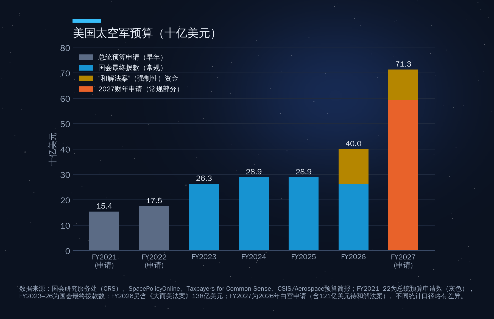
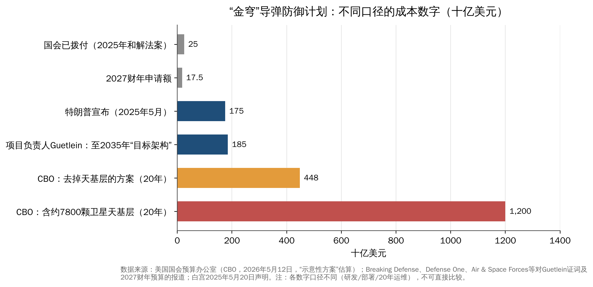
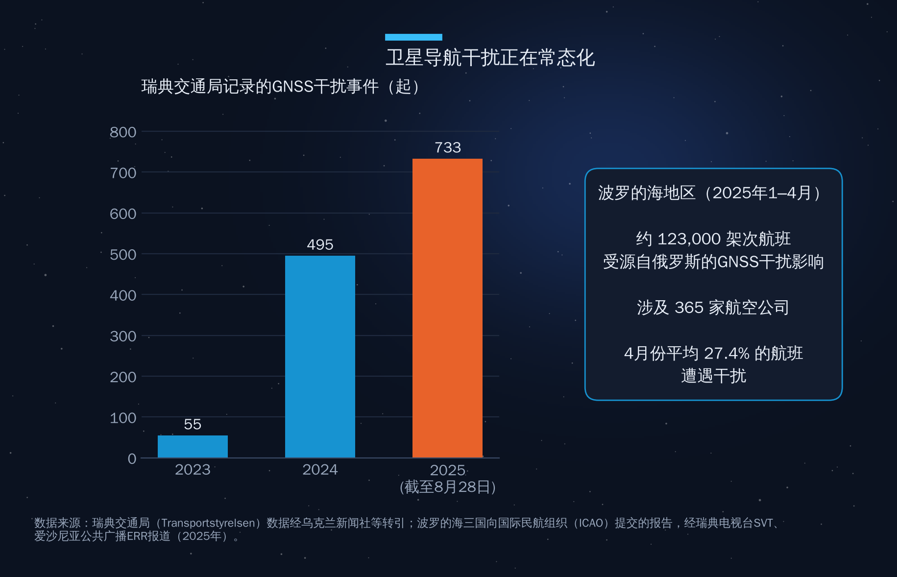
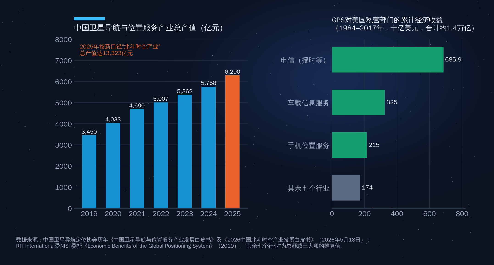

## 第15章　太空技术、经济与战争

2022年2月24日凌晨，俄罗斯军队越境前约一小时，美国卫星运营商Viasat的KA-SAT网络遭到网络攻击，乌克兰及欧洲多地数万个卫星终端瘫痪，连远在德国的约5800台风力发电机都失去了远程监控连接。几天之后，乌克兰副总理在社交媒体上向马斯克求助，星链终端开始运抵乌克兰。

这场战争的第一枪打在太空，而它的通信生命线也来自太空——而且来自一家私营公司。这就是本章的起点：**在今天，太空技术、太空经济与战争已经无法分开讨论。**

### 15.1　军民两用：太空技术的"原罪"与红利

几乎所有太空技术都诞生于军事需求：第一颗人造卫星是洲际导弹竞赛的副产品，GPS最初为精确制导和部队定位而建，遥感卫星的前身是冷战侦察卫星。

军民两用意味着两件事。一方面，军事投入为民用经济创造了巨大的"溢出"——GPS今天每年为全球经济创造的价值远超其建设和维护成本（见15.4节）。另一方面，民用和商业设施在冲突中天然会成为军事资源，进而成为攻击目标。卫星不分"军用频率"和"民用频率"的物理规律，导航信号也不会只服务于和平用途。

随着商业航天崛起，这种两用性正在加深：过去是"军转民"，今天越来越多是"民转军"——军方直接采购商业宽带、商业遥感和商业发射。2024—2025年，国防连续两年占全球政府航天支出的约54%（Novaspace），Planet的国防情报收入增长超过50%，SpaceX企业与政府连接收入在2026年第二季度同比增长108%。**商业太空公司的增长，越来越多地来自安全需求。**

### 15.2　太空成为"作战域"

#### 各大国的制度化

2019年是一个分水岭。这一年，美国重建太空司令部（8月）并成立太空军（12月20日），成为美军第六个军种；法国成立太空司令部（9月）；北约在12月的伦敦峰会上宣布太空为继陆、海、空、网络之后的"新作战域"，北约秘书长同时表示"无意将武器部署到太空"。此后，日本自卫队组建宇宙作战部队，英国2021年成立太空司令部，德国也在2026年被Secure World Foundation列入"正在快速发展反太空能力"的国家。

中国方面，2015年组建战略支援部队，统管航天、网络与电子战力量；2024年4月19日，中国人民解放军调整军兵种结构，撤销战略支援部队，组建航天部队、网络空间部队和信息支援部队，三者直接由中央军委领导。俄罗斯则早在2015年把空军与空天防御兵合并为空天军。

表15-1概括了主要国家的太空军事组织。

**表15-1　主要国家和组织的太空军事机构**

| 国家/组织 | 机构 | 成立/调整时间 | 要点 |
|---|---|---|---|
| 美国 | 太空军（USSF）、太空司令部 | 2019年 | 第六军种；FY2027预算申请约713亿美元 |
| 北约 | 宣布太空为作战域 | 2019年12月 | 盟国可请求成员国提供卫星通信、图像等能力 |
| 法国 | 太空司令部 | 2019年9月 | 欧洲最早成立的太空军事机构之一 |
| 俄罗斯 | 空天军 | 2015年 | 2021年进行直升式反卫星试验 |
| 中国 | 航天部队 | 2024年4月 | 由原战略支援部队调整而来，直属中央军委 |
| 日本 | 宇宙作战部队 | 2020年起 | 重点为空间态势感知 |

（来源：各国国防部公开信息、NATO官网、The Diplomat、C4ISRNet）

#### 军事航天预算：美国一枝独秀

美国是全球军事航天投入最大的国家。如图15-1所示，美国太空军2021财年首次获得单独拨款约152亿美元，2022财年约181亿美元，2023财年约263亿美元，2024财年约289亿美元，2025财年在全年持续决议下大体持平；2026财年常规拨款约261亿美元，另从《大而美法案》（和解法案）获得约138亿美元，合计约400亿美元（国防部口径；空军部图表则显示约320亿美元，差额未有官方解释）；2027财年白宫申请约713亿美元（其中约592亿美元为常规拨款、约121亿美元寄望于新的和解法案），较上一财年接近翻倍。

需要说明的是，太空军预算并不等于美国全部军事航天支出——国家侦察局等情报机构的太空预算是保密的。其他国家的军事航天预算透明度更低，难以精确比较，但从Novaspace"国防占54%"的全球数据可以看出，**全球政府太空支出正在整体"军事化"**，Novaspace预计这一趋势将在2028—2029年前后达到高峰。

#### "金穹"：一个万亿美元级的太空工程

2025年1月27日，特朗普签署行政令，要求建设覆盖美国本土的多层导弹防御体系，后定名"金穹"（Golden Dome）。2025年5月，特朗普宣布其成本约1750亿美元，并希望在任期内投入运行。此后，这个数字不断被改写（见图15-2）：

- 2026年3月，项目负责人、太空军上将迈克尔·格特莱因（Michael Guetlein）称，到2035年完成"目标架构"约需1850亿美元，完工时间较最初设想推迟约7年。
- 2026年5月12日，美国国会预算办公室（CBO）发布估算：按行政令要求建设一个"示意性"体系，20年内研发、部署和运营的成本约1.2万亿美元，其中天基层需要约7800颗卫星；若去掉天基层，成本约4480亿美元，但无法满足行政令要求。
- 资金方面，国会通过2025年和解法案已拨付约250亿美元（约九成已签约）；2027财年申请约175亿美元，但只有约4亿美元在常规预算中，其余依赖新的和解法案，而7月底的缩减版和解方案未列入"金穹"资金，项目面临断供风险。
- 太空军已向12家公司授予20份天基拦截器相关合同，总额上限约32亿美元。但格特莱因也向国会表示，"如果不能以可负担的方式做到，我们就不会进入生产"，天基拦截器能否进入最终方案尚不确定。

"金穹"的经济意义不亚于其军事意义。如果天基层真的需要数千颗卫星，它将成为继星链之后最大的单一卫星采购项目，直接拉动卫星制造、发射和在轨服务产业——这正是2025—2026年美国太空投资暴涨的重要原因。但其战略影响同样深远：天基拦截器会被对手视为对其二次核打击能力的威胁，可能引发新一轮进攻性导弹与反卫星能力的竞赛。

### 15.3　战争中的太空：商业力量参战

#### 星链：一家公司的"战争角色"

俄乌战争是第一场商业太空系统深度参与的大规模战争。星链终端成为乌克兰军队前线通信、无人机操控和指挥协同的骨干。据乌克兰官方2025年9月的说法，乌克兰境内活跃的星链终端超过5万台，其中2.9万多台由波兰提供并支付订阅费；波兰为此在2025年通过立法确保持续付费。

但星链的角色也暴露了一个前所未有的问题：**一家私营公司的商业决策，可以影响战场态势。**2022年以来，SpaceX曾以地理围栏限制星链在克里米亚等地区的服务；俄军则通过第三方渠道获取星链终端，用于前线通信甚至安装在攻击无人机上。2026年2月，乌克兰与SpaceX推出"白名单"制度，未登记终端被屏蔽；乌方称前线俄军使用的星链终端被大面积切断（路透社表示无法独立核实具体规模）。

这一事件说明，商业星座在冲突中既是"基础设施"也是"杠杆"。对各国政府而言，结论是：**要么拥有自己的星座，要么接受对他人星座的依赖。**这正是欧洲推动IRIS²、中国加速国网与千帆星座、海湾国家培育主权卫星运营商的深层原因。

#### 商业遥感：透明化的战场

商业遥感同样深度介入。战争爆发前，Maxar、Planet等公司的商业卫星图像就公开显示了俄军在边境集结；战争期间，商业图像被用于揭示布查事件真相、评估基础设施损毁、追踪粮食运输和战场态势。商业遥感让"战场迷雾"变薄，也让国际舆论第一次可以近乎实时地看见战争。

这种透明化同样存在开关：据多家媒体报道，2025年3月美国暂停对乌情报共享期间，乌方通过美国政府渠道获取商业图像的权限也一度被暂停。商业数据的可得性，最终仍受国家政策约束。

#### 导航干扰与欺骗：看不见的战场

如果说星链和遥感是"商业力量参战"的显性一面，那么GNSS干扰（jamming，压制信号）与欺骗（spoofing，伪造信号）就是隐性一面——而且它已经外溢到民用航空和航运。

波罗的海是记录最完整的地区。如图15-3所示，瑞典交通局记录的GNSS干扰事件从2023年的55起增至2024年的495起，2025年截至8月28日已达733起。瑞典等六国向国际民航组织联合提交的报告显示，2025年1—4月，源自俄罗斯的干扰影响了该地区近12.3万架次航班、涉及365家航空公司，4月份平均27.4%的航班遭遇干扰（据瑞典电视台SVT报道）。立陶宛代表在国际民航组织大会上称，其境内干扰事件约为2024年的20倍。

中东是另一个热点。与波罗的海几乎全部来自俄罗斯不同，中东的干扰与欺骗来源更为复杂，涉及以色列、伊朗等多方；航空业人士形容，导航干扰"过去偶尔发生，现在几乎是常态"（《外交政策》，2026年6月）。国际航空运输协会（IATA）的航班数据显示，全球每千架次航班中的GPS信号丢失事件从2022年的31次升至2025年的约59次（估计值）；2022年IATA航班数据库记录的此类事件中，68.5%发生在中东北非及邻近地区。对于以航空枢纽和能源航运为经济命脉的海湾国家而言，这不是抽象的安全问题，而是直接的经济风险：欺骗比压制更危险，因为驾驶舱显示的位置看似正常、实则错误。

#### 反卫星能力：从"能打"到"常用"

Secure World Foundation每年发布《全球反太空能力》开源评估，2026年版覆盖美、俄、中、印、法、德、英、日、韩、以色列、伊朗、朝鲜、澳大利亚等13个国家，把反太空手段分为共轨、直升式、电子战、定向能和网络五类。其核心判断是：**破坏性的动能反卫星试验在实践中基本被搁置，但电子战和网络攻击已经成为常规战术工具。**

历史上，四个国家进行过产生碎片的直升式反卫星试验：中国（2007年）、美国（2008年）、印度（2019年）和俄罗斯（2021年）。其中俄罗斯2021年11月击毁"宇宙-1408"卫星，产生了上千块可追踪碎片，迫使国际空间站乘员紧急避险。此后，美国于2022年宣布单方面暂停破坏性直升式反卫星试验，联合国大会以压倒性多数通过了呼吁各国作出类似承诺的决议。

新的担忧来自"非动能"和"在轨"领域：电子干扰、激光致盲、抵近操作（俗称"保镖卫星"或"跟踪卫星"）以及关于在轨核武器的指控。2024年4月，俄罗斯否决了联合国安理会一项重申禁止在轨部署核武器的决议草案。

### 15.4　太空技术的经济溢出

讨论太空与战争时，不能忽视另一面：军事航天投入为全人类创造的经济红利。

#### GPS：1.4万亿美元的公共产品

2019年，美国RTI国际研究所受美国国家标准与技术研究院（NIST）委托完成的研究估计：1984—2017年，GPS为美国私营部门创造的经济收益约1.4万亿美元（区间约0.9万亿—1.8万亿美元），其中约90%产生于2010年之后。最大的受益行业是电信（约6859亿美元，主要来自基站和网络的精确授时），其次是车载信息服务（约3250亿美元）和手机位置服务（约2150亿美元）。研究同时估计，若GPS中断，美国每天的经济损失平均约10亿美元；若中断发生在4—5月春播季，损失可能再高约50%（见图15-4右图）。

这项研究揭示了一个容易被忽视的事实：**导航卫星最大的经济价值不在"导航"，而在"授时"。**移动通信、电网、金融交易都需要精确的时间同步，GNSS是最廉价、覆盖最广的时间源——这也是GNSS干扰被视为经济基础设施威胁的原因。

#### 北斗：从"建成好用"到"用好用广"

中国北斗系统2020年完成全球组网，其产业带动效应持续显现。如图15-4左图所示，中国卫星导航与位置服务产业总产值从2019年的3450亿元增至2024年的5758亿元；2025年，按同口径的卫星导航产业产值达6290亿元，同比增长9.24%。2026年5月，中国卫星导航定位协会首次将统计范畴升级为"北斗时空产业"，按新口径2025年总体产值达13323亿元。截至2025年底，具有北斗功能的终端社会总保有量超过22亿台/套（含智能手机），当年国内北斗终端销量超过4.1亿台/套（《2026中国北斗时空产业发展白皮书》）。

北斗也是中阿合作的亮点。中阿北斗合作论坛自2017年起定期举办，位于突尼斯的中阿北斗/GNSS中心为阿拉伯国家提供测试和培训。对海湾国家而言，多系统GNSS（GPS、北斗、伽利略、格洛纳斯）兼容使用，本身就是对抗干扰、提高韧性的现实选择。

#### 天气、农业、金融与技术衍生

太空技术的溢出远不止导航：

- **天气预报**：气象卫星数据是数值天气预报最重要的输入之一，现代天气预报的准确度提升很大程度上来自卫星观测。对农业、航空、能源和防灾而言，这是"看不见的公共品"。
- **精准农业**：卫星导航引导的自动驾驶农机、遥感估产和变量施肥，正在改变大田作物的生产方式。RTI研究中，农业是GPS中断时受冲击最大的行业之一。
- **金融**：交易系统依赖GNSS授时打时间戳；对冲基金用遥感图像分析油罐库存和作物长势。
- **技术衍生**：NASA自1976年起每年出版《Spinoff》，记录太空技术向民用转化的案例，从记忆海绵、数码相机图像传感器到净水技术，已累计收录两千多项。中国空间站的科学实验也已有部分成果进入转化阶段。

### 15.5　太空军备竞赛的风险与"太空威慑"

#### 太空威慑的脆弱逻辑

核时代的稳定，依赖于"相互确保摧毁"的威慑逻辑。太空领域能否形成类似的稳定？很难。原因有三：

第一，**太空资产高度脆弱，而且"先发者占优"。**卫星轨道可预测、难以隐藏、难以修复，对手只需较小成本就能造成重大损失。这种"进攻占优"结构容易诱发先发制人的冲动。

第二，**归因困难。**卫星失效可能来自故障、空间天气、碎片撞击或敌对行动；电子干扰和网络攻击更难确定来源。归因不清，威慑就难以可信。

第三，**碎片的"公地悲剧"。**动能反卫星产生的碎片不分敌我，会长期威胁所有国家的卫星——包括攻击者自己的卫星。这在客观上抑制了破坏性攻击，却也让太空冲突的后果具有全球性和长期性。

商业星座在一定程度上改变了这一格局：当一个星座由数千颗卫星组成时，摧毁少数几颗几乎没有意义，"分布式韧性"本身就构成一种威慑。这是军方热衷于采购商业星座服务、并推动"扩散型低轨架构"的原因。但它也意味着，在冲突中，商业卫星和私营公司更可能被对手视为合法军事目标。

#### 与规则体系的呼应

第四部分讨论过的国际空间法，在这里显示出其现实意义与局限。《外层空间条约》禁止在轨道部署核武器和其他大规模杀伤性武器，但并未禁止常规武器和反卫星能力；"负责任太空行为"的规范仍在联合国框架下讨论；美国倡导的暂停破坏性反卫星试验承诺，已有数十个国家加入，但主要航天国家并未全部参与。

**一个现实的路径是"从行为规范入手"**：先在不产生长期碎片、抵近操作通报、导航信号保护、商业卫星不被当作首要攻击目标等方面形成共识，再逐步讨论能力限制。对中国而言，积极参与并主导部分规则讨论，既是负责任大国的形象需要，也是保护自身日益庞大的在轨资产的现实需要。对海湾国家而言，作为GNSS干扰的直接受害者和日益重要的卫星运营方，推动导航信号保护和空域安全规范，同样符合自身利益。

太空经济的繁荣有一个前提：轨道环境安全、信号可信、规则可预期。**太空军备竞赛是太空经济最大的系统性风险。**

### 15.6　本章要点

1. **军民两用是太空技术的本质**：国防已连续两年占全球政府航天支出的约54%，商业太空公司的增长越来越多地来自安全需求。
2. **太空已成为作战域**：美国太空军2027财年预算申请约713亿美元、接近翻倍；"金穹"计划成本从1750亿美元（白宫）到1.2万亿美元（CBO，20年）不等，天基层可能需要数千颗卫星。
3. **商业力量参战**：星链与商业遥感深度介入俄乌战争，也暴露了"私营公司掌握战场开关"的新问题，推动各国建设主权星座。
4. **导航干扰常态化**：波罗的海2025年1—4月约12.3万架次航班受干扰，中东干扰"几乎成为常态"，对航空与航运构成直接经济风险。
5. **溢出与风险并存**：GPS为美国私营部门累计创造约1.4万亿美元收益，北斗时空产业2025年产值超1.3万亿元；而太空军备竞赛是太空经济最大的系统性风险，需要从行为规范入手建立规则。
