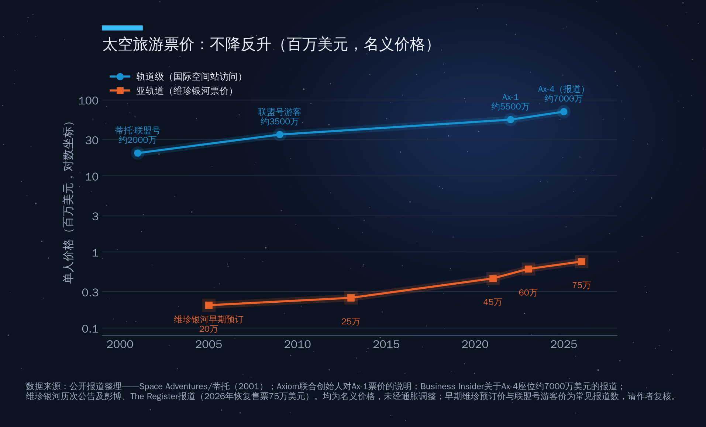

## 第16章　太空文化、文明和太空移民

今晚如果多哈的天空足够晴朗，抬头向东看，会看到夏季大三角中的两颗亮星：织女星和牛郎星。在中国，它们是七夕传说里隔着银河相望的恋人；而在全世界的天文星图上，它们的名字是Vega和Altair——分别源自阿拉伯语的"俯冲之鹰"（al-nasr al-wāqi'）和"飞翔之鹰"（al-nasr al-ṭā'ir）。同一片星空，在东方是爱情故事，在阿拉伯是两只鹰。

这正是本章的起点：太空经济算的是账，但人类走向太空的动力，从来不只是账。

### 16.1　太空与人类文化

#### 中国：从神话到工程命名

中国的太空想象源远流长。嫦娥奔月的故事见于汉代典籍；屈原的《天问》向天发出一百七十多个问题；敦煌莫高窟中的"飞天"形象，以飘带而非翅膀飞翔，是人类对无重力状态最浪漫的艺术想象之一。明代"万户"乘坐绑着火箭的椅子飞天的传说，虽然史料出处存疑，却被国际天文学联合会用来命名月球背面的一座环形山（Wan-Hoo）。

当代中国航天把这些文化符号系统地写进了工程命名：探月工程叫"嫦娥"，月球车叫"玉兔"，中继卫星叫"鹊桥"，火星探测叫"天问"，火星车叫"祝融"，空间站叫"天宫"，载人飞船叫"神舟"，导航系统叫"北斗"。这种命名不只是修辞，它让航天成为全民共享的文化叙事，为长期、高额的公共投入提供了社会认同的基础。

#### 阿拉伯—伊斯兰天文学：夜空中的阿拉伯语

在多哈谈太空文化，绕不开阿拉伯—伊斯兰天文学的黄金时代。

公元9世纪，阿拔斯王朝哈里发马蒙在巴格达扩建"智慧宫"，组织学者翻译和校订托勒密的《天文学大成》（其阿拉伯语译名"Almagest"至今仍是西方对这部书的通称），并建立天文台进行实测。此后数百年间，从巴格达、大马士革、开罗到撒马尔罕，伊斯兰世界的天文学家修正古希腊星表，改进星盘，编制了大量天文历表。

几位代表人物值得一提：

- **苏菲**（'Abd al-Raḥmān al-Ṣūfī，903—986），在约964年完成《恒星之书》（Kitāb ṣuwar al-kawākib），系统整理星座与恒星亮度，书中对仙女座"小云"的记载，被认为是人类对河外星系——仙女座星系——的最早文字记录。
- **比鲁尼**（al-Bīrūnī，973—约1050），百科全书式的学者，用山顶观测地平线俯角的方法估算地球半径，并讨论过地球自转的可能性。卡塔尔Es'hailSat的下一代卫星以他命名，正是对这份遗产的致敬。
- **巴塔尼**（al-Battānī）、**兀鲁伯**（Ulugh Beg）等人的星表和观测，后来通过西班牙和拉丁世界传入欧洲，成为哥白尼等人工作的基础之一。

这份遗产今天仍然写在夜空中。表16-1列出了几颗最常见的阿拉伯语来源星名。

**表16-1　源自阿拉伯语的常见星名**

| 西文星名 | 中文名 | 阿拉伯语来源与含义 |
|---|---|---|
| Aldebaran | 毕宿五 | al-dabarān，"追随者"（追随昴星团） |
| Altair | 河鼓二（牛郎星） | al-nasr al-ṭā'ir，"飞翔之鹰" |
| Vega | 织女一（织女星） | al-nasr al-wāqi'，"俯冲之鹰" |
| Betelgeuse | 参宿四 | 源自yad al-jauzā'，"猎户（巨人）之手"，传抄中讹变 |
| Rigel | 参宿七 | rijl，"脚" |
| Deneb | 天津四 | dhanab，"尾巴" |
| Fomalhaut | 北落师门 | fam al-ḥūt，"鱼之口" |

（来源：国际天文学联合会星名工作组公布的星名及通行天文学词源资料）

对多哈的听众，这是一个值得强调的连接点：**阿拉伯世界不是太空时代的"新来者"，而是"归来者"。**阿联酋"希望号"2021年2月进入火星轨道，阿联酋宇航员苏尔坦·奈亚迪2023年完成约六个月的国际空间站长期驻留，沙特宇航员拉雅娜·巴尔纳维和阿里·卡尔尼2023年随Ax-2任务进入太空——这些都是一千年前那条天文学传统在现代的延续。中国嫦娥七号任务将搭载埃及与巴林联合研制的月表物质超光谱成像仪，则是中阿在深空探测上合作的新起点。

#### 科幻：想象力的经济价值

科幻作品是太空文化中最具经济影响力的一支。1968年的《2001太空漫游》塑造了几代人对太空站和人工智能的想象；2014年的《星际穿越》邀请物理学家基普·索恩担任科学顾问，其黑洞视觉效果后来还产出了学术论文。

中国科幻在过去十年完成了从小众到主流的跨越。刘慈欣的《三体》2015年获得雨果奖最佳长篇小说奖；Netflix版《三体》2024年3月上线，首季预算约1.6亿美元，开播11天累计观看约2660万人次；电影《流浪地球2》2023年票房约40.29亿元。据《2026中国科幻产业报告》，2025年中国科幻产业总营收约1261亿元，同比增长15.7%，连续三年突破千亿元。

科幻的经济作用不止于票房，它影响年轻人的职业选择、公众对航天预算的支持，乃至工程师的设计。**想象力是太空经济最上游的"原材料"。**

### 16.2　总观效应与"暗淡蓝点"

1968年平安夜，阿波罗8号宇航员比尔·安德斯拍下了"地出"（Earthrise）：一颗蓝白相间的地球从荒凉的月平线上升起。1972年，阿波罗17号拍下了完整的地球照片"蓝色弹珠"。1990年2月14日，旅行者1号在约60亿公里外回望，地球只是一个不到一个像素的光点。卡尔·萨根称之为"暗淡蓝点"："那里是家园，那里是我们。"

1987年，美国作家弗兰克·怀特在访谈数十位宇航员后提出了"总观效应"（Overview Effect）：从太空看到地球的人，常常会经历一种认知上的转变——国界消失，大气层薄得令人担忧，人类作为整体的命运变得具体可感。截至2026年初，进入太空的人类总数约在640—680人之间（取决于对太空边界的定义），总观效应仍是极少数人的体验。

总观效应提供了一种与"太空竞争"并行的"太空共同体"叙事：气候变化监测、国际空间站二十多年的多国合作，都建立在"同一个地球"的认知之上。

#### 太空教育与青少年STEM

太空也是最有效的科学教育素材之一。中国的"天宫课堂"由在轨航天员面向全国青少年授课；阿联酋把"希望号"和宇航员计划与国家教育体系结合。对于推动经济多元化、急需理工科人才的海湾国家，以及走向"创新大国"的中国，**太空教育是回报周期最长、但可能最重要的一笔投资。**

### 16.3　太空旅游与商业载人

#### 价格不降反升

很多人以为，随着发射成本下降，太空旅游的价格会像航空票价那样迅速下降。现实恰好相反。如图16-1所示：

- **轨道级**：2001年丹尼斯·蒂托搭乘俄罗斯联盟号访问国际空间站，花费约2000万美元；此后联盟号游客价格升至约3500万美元；2022年Axiom公司首次全私人空间站任务Ax-1，每人约5500万美元；据报道，Ax-4任务的一个座位约7000万美元（含约一年的训练）。
- **亚轨道**：维珍银河早期预订价约20万美元，此后提高至25万、45万、60万美元；2026年恢复售票时价格为每座75万美元，首批限售50张。

价格上涨的原因在于：发射成本只是太空旅游成本的一部分，载人安全认证、训练、生命保障和保险的成本难以快速下降；更重要的是，供给极度稀缺，而全球富裕人群的需求相对充足。目前，太空旅游仍是"奢侈品"而非"大众消费品"。

#### 供给的波折

2025—2026年的太空旅游市场经历了明显波折。蓝色起源的新谢泼德号累计完成38次飞行、搭载98人次（92人）进入太空后，于2026年1月30日宣布暂停至少两年，把资源转向月球着陆器；维珍银河在2023年后暂停太空船二号飞行，新一代"德尔塔"级飞船的首飞已推迟（据Aviation Week报道，商业运营可能推迟至2027年）。轨道级方面，Axiom公司依托SpaceX龙飞船，自2022年以来已执行Ax-1至Ax-4共四次私人空间站任务，乘员中既有富豪个人，也有沙特、印度、波兰、匈牙利等国政府付费选派的宇航员。

太空旅游真正的转折点，可能取决于两件事：星舰这样的完全可复用载人系统能否把单座成本降一个数量级；国际空间站2030年前后退役后，商业空间站能否接续。中国空间站已表示将适时开展国际合作与商业应用，未来是否开放商业载人旅游，值得关注。

### 16.4　太空移民的可行性

#### 目的地：月球、火星与"自由空间"

人类在地球之外长期居住，有三类候选方案：

- **月球基地**：距离近（约38万公里、3天航程、通信延迟约1.3秒），可利用极区水冰，是中美两国月球计划的共同目标。但月球重力只有地球的约1/6，没有大气和磁场保护。
- **火星**：有大气（虽然稀薄）、水冰和约0.38倍地球重力，是最常被讨论的移民目标。但单程需6—9个月，发射窗口约每26个月一次，通信延迟约3—22分钟。马斯克多次表示希望在火星建立百万人规模的自给城市。
- **自由空间栖居地**：物理学家杰拉德·奥尼尔在1970年代提出建造巨型旋转圆柱体（"奥尼尔圆柱"），以旋转产生人工重力。其设想中的"岛三号"直径约8公里、长约32公里，可容纳数百万人。这一方案避开了行星重力井，但所需的工程规模远超当今能力。

#### 五大障碍

**表16-2　太空长期居住面临的主要挑战**

| 挑战 | 核心问题 | 已知数据/现状 |
|---|---|---|
| 辐射 | 银河宇宙射线与太阳粒子事件，增加癌症和中枢神经损伤风险 | 好奇号测得，往返火星的巡航段累计剂量约0.66希沃特（Zeitlin等，《科学》2013） |
| 低重力/微重力 | 骨密度流失、肌肉萎缩、视力受损、体液再分布 | 长期失重下骨量每月流失约1%—1.5%；0.38g或1/6g的长期影响尚无人体数据 |
| 心理与社会 | 长期隔离、狭小空间、通信延迟下的自主决策 | "生物圈2号"（1991—1993）暴露了封闭生态系统和群体心理的困难 |
| 生命保障与资源 | 氧气、水、食物、能源的闭环与原位资源利用 | 国际空间站水回收率已达较高水平，但完全闭环尚未实现 |
| 生育与世代 | 低重力和辐射下的妊娠、儿童发育 | 几乎没有人体数据，涉及深刻伦理问题 |

（来源：NASA人类研究计划公开资料；Zeitlin et al., Science, 2013；公开文献整理）

在这些障碍中，辐射和低重力最为根本——它们无法靠"更便宜的火箭"解决，需要医学、材料和生物学上的突破。2023年出版的《火星上的城市》（A City on Mars）一书，系统梳理了这些困难，其结论是：太空移民并非不可能，但远比大众想象的遥远和复杂。

#### 伦理与治理：谁能去，谁来管

即使技术问题得到解决，治理问题依然存在：

- **谁能去？**如果移民名额由支付能力决定，太空可能复制甚至放大地球上的不平等；如果由国家选拔，则涉及代表性和公平性。
- **谁来管？**《外层空间条约》禁止国家对天体主张主权，但没有规定一个自给自足的火星社区如何治理。私营公司建立的定居点，其居民享有怎样的权利？
- **对当地环境的责任。**如果火星存在微生物生命，人类的到来可能造成不可逆的"正向污染"。行星保护原则如何与移民目标平衡？

这些问题与第四部分讨论的太空资源规则、阿尔忒弥斯协定和国际月球科研站的治理框架一脉相承。**太空移民首先是一个治理问题，其次才是一个工程问题。**

#### 卡尔达肖夫等级与"多行星物种"之争

1964年，苏联天文学家卡尔达肖夫提出用能源利用规模划分文明等级：Ⅰ型文明能利用其行星接收的全部能量，Ⅱ型能利用其恒星的全部能量，Ⅲ型能利用整个星系的能量。按卡尔·萨根提出的插值方法，人类目前约处于0.7级左右，尚未达到Ⅰ型。

"多行星物种"论的支持者认为，地球面临小行星撞击、超级火山、核战争等灭绝风险，人类只有在多个星球上生存才能确保文明延续——这是马斯克等人的核心论据。反对者则指出：火星比地球上任何遭受灾难后的环境都更恶劣，花同样的资源保护地球的性价比更高；"B计划"叙事可能削弱对地球环境的责任感；而且在可预见的未来，火星定居点不可能脱离地球补给而独立存在。

比较中肯的看法或许是：**太空移民是一个以世纪为单位的长期目标，而太空经济是以十年为单位的现实进程。**前者为后者提供愿景和人才吸引力，后者为前者积累技术和资本。在相当长的时间里，人类在太空中最重要的"定居点"，仍将是围绕地球运行的数万颗卫星和少数几座空间站。

### 16.5　本章要点

1. **太空是文明的镜子**：从嫦娥、飞天到阿拉伯语星名，太空文化为航天投入提供了社会认同；海湾国家是太空时代的"归来者"。
2. **想象力是经济资源**：2025年中国科幻产业营收约1261亿元，科幻影响人才、公众支持和工程设计。
3. **太空旅游仍是奢侈品**：轨道座位价格从2001年约2000万美元升至约5500万—7000万美元，亚轨道票价升至75万美元；供给端经历波折。
4. **太空移民道阻且长**：辐射、低重力、心理、生命保障和治理是五大障碍，太空移民首先是治理问题，其次才是工程问题。
5. **下一个十年**：太空经济将在2030年代初突破1万亿美元，低轨形成"中美双极、多国补充"格局，国防与AI成为新驱动力；中国与海湾在制造能力与资本、区位上高度互补。

### 16.6　结语：太空经济的下一个十年

回顾全书，我们沿着一条主线走了一遍：

**成本下降**——可回收火箭和批量化卫星制造，把进入太空的门槛降低了一个数量级，2025年SpaceX一家就送入了全球80%以上的入轨质量；
**规模爆发**——2025年全球入轨发射尝试329次，星链用户突破千万，中国两大星座加速组网；
**资源稀缺**——近地轨道和无线电频谱成为"用一点少一点"的战略资产；
**规则竞争**——从国际电联的"先到先得"到阿尔忒弥斯协定和国际月球科研站，规则成为新的竞争场；
**格局重塑**——太空经济规模接近7000亿美元，一家太空公司估值接近2万亿美元，太空成为大国安全的核心领域，也成为海湾主权资本和中国商业航天的新战场。

太空，正在从"国家工程"变成"经济体系"。站在2026年的多哈，我对2026—2035年有以下七个判断。

**判断一：太空经济将在2030年代初突破1万亿美元，增长主要来自"连接"。**按Space Foundation近五年约10%的增速推算，全球太空经济将在2030—2032年前后跨过1万亿美元；摩根士丹利认为卫星宽带将贡献约一半的增长。低轨宽带和直连手机，将把太空变成像电力、光纤一样的通用基础设施。

**判断二：完全可复用火箭将再次改写成本曲线，"发射"将不再是瓶颈。**星舰已在2026年9月首次入轨，中国商业火箭也在密集攻关回收技术。十年内，发射成本有望再降一个数量级，瓶颈将从"送上去"转向"轨道、频谱和在轨运维"。

**判断三：低轨将形成"中美双极、多国补充"的格局。**星链凭借先发优势和资本市场支持将继续领先；中国国网与千帆星座将完成骨干组网，成为唯一在规模上可与之比较的体系；欧洲、亚马逊以及海湾、印度等将以主权需求为基础形成补充。"星座即主权"将成为普遍共识。

**判断四：国防将长期是太空经济的"压舱石"，太空军备控制将成为最紧迫的规则议题。**全球政府太空支出已经以国防为主，"金穹"等项目可能带来数千颗卫星的需求。如何避免太空冲突、保护导航信号和商业卫星，将从学术议题变成大国谈判的核心内容。

**判断五：太空与人工智能深度融合，"太空算力"成为新赛道。**遥感数据需要AI才能产生价值，AI需要太空网络实现全球覆盖；在轨数据处理乃至太空数据中心的探索，将让"连接+算力+数据"成为太空经济新的增长极。

**判断六：资本市场的"太空板块"将经历一次完整周期。**SpaceX上市开启了太空资产的大规模定价，但多数太空公司尚未稳定盈利。未来十年可能出现估值的剧烈波动和行业整合，真正的赢家是拥有规模、成本和频轨资源的少数公司。

**判断七：人类将重返月球并开始建设长期设施，但火星移民仍是下一个世纪的事。**2030年前后，中美都可能实现载人登月；月球南极的科研站和资源利用试验将启动。火星载人任务或许会在2030年代被认真规划，但大规模移民仍将远远超出这个十年。

#### 中国与海湾：互补的机会

在这个十年里，中国与海湾地区有天然的互补性。

**中国拥有完整的航天工业链和规模化制造能力**：从火箭、卫星到地面终端，成本和交付速度具有竞争力；北斗系统已向全球提供服务；两大低轨星座需要海外市场和落地合作伙伴。

**海湾国家拥有资本、区位和雄心**：主权基金能够提供耐心资本，海湾地处欧亚非交汇的中心，是天然的地面站和区域枢纽；阿联酋、沙特、卡塔尔都在培育本土太空平台，希望把太空作为经济多元化和人才培养的支柱。

合作的方向可以很具体：卫星互联网与北斗服务在海湾和更广泛中东、非洲地区的落地；遥感数据在城市规划、能源、水资源和农业中的应用；联合研制卫星和科学载荷（如嫦娥七号搭载埃及—巴林载荷的模式）；海湾资本参与中国商业航天的股权投资；在导航信号保护、太空交通管理等规则议题上开展对话。

一千年前，巴格达智慧宫的学者们翻译了希腊人的星表，再把改进后的知识传给欧洲；今天的太空经济同样需要不同文明之间的交流与合作。**太空的终极意义，不在于谁先到达，而在于人类能否以一个共同体的身份到达。**

这是太空经济的下一个十年，也是人类文明的下一个起点。
